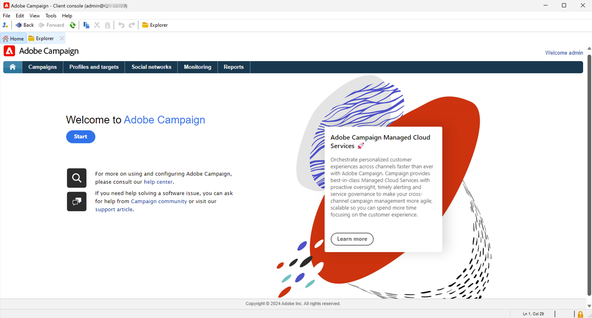

# Introducción para administradores y desarrolladores {#acs-gs-admin}

Esta página ofrece información general sobre la funcionalidad clave de administración y administración de datos de Campaign v8. Está dirigido a administradores y especialistas en marketing técnico que realizan la transición de Campaign Standard a Campaign v8.

El cambio más importante para usted es la introducción de la consola de cliente, la aplicación nativa que se comunica con el servidor de aplicaciones de Adobe Campaign.

La consola del cliente de Campaign centraliza todas las funcionalidades y configuraciones. Se sincroniza con la interfaz de usuario web de Campaign, lo que garantiza la coherencia en ambos entornos.

{zoomable="yes"}

[Obtenga más información acerca de la interfaz de usuario de la consola del cliente de Adobe Campaign v8](https://experienceleague.adobe.com/es/docs/campaign/campaign-v8/new/campaign-ui#ui-access){target="_blank"} .

## Arquitectura de la versión 8 de Campaign {#acs-gs-admi-archi}

La arquitectura de Campaign se detalla en la documentación de Campaign v8 (consola). Aprenda los conceptos básicos en [esta página](https://experienceleague.adobe.com/en/docs/campaign/campaign-v8/config/architecture/general-architecture){target="_blank"}.

Vínculo útil para empezar:

* Los componentes de Adobe Campaign y la arquitectura global se describen en [esta página](https://experienceleague.adobe.com/es/docs/campaign/campaign-v8/new/ac-components){target="_blank"}.

* Consulte [Introducción a la arquitectura de Campaign](https://experienceleague.adobe.com/en/docs/campaign/campaign-v8/config/architecture/architecture){target="_blank"} para comprender la arquitectura de Campaign antes de comenzar a estructurar la instancia.

<!--Two deployment models are available: **Campaign FDA deployment** (P1-P3) and **Campaign Enterprise (FFDA)** deployment (P4). As a customer transitioning from Campaign Standard, your deployment model is **Campaign FDA**.-->

* La mensajería transaccional (Centro de mensajes) es el módulo de Campaign v8 diseñado para administrar mensajes activados. Se basa en un modelo de arquitectura específico que se detalla en [esta sección](https://experienceleague.adobe.com/en/docs/campaign/campaign-v8/config/architecture/architecture#transac-msg-archi){target="_blank"}.

## Consola del cliente de Campaign {#acs-gs-console}

### Instalación de la consola de cliente {#acs-gs-admin-console}

Las tareas de administración y configuración se realizan en la consola del cliente. El primer paso es configurar su entorno.

La consola del cliente de Campaign es una aplicación nativa que se comunica con el servidor de aplicaciones de Adobe Campaign a través de protocolos de Internet estándar, como SOAP y HTTP. La consola del cliente de Campaign centraliza todas las funcionalidades y configuraciones y requiere un ancho de banda mínimo, ya que depende de una caché local. Diseñada para facilitar su implementación, la consola de cliente de Campaign se puede implementar desde un explorador de internet, se puede actualizar automáticamente y no requiere ninguna configuración de red específica porque solo genera tráfico HTTP(S).

En el siguiente vídeo se explica cómo descargar e instalar la consola del cliente de Adobe Campaign y administrar la conexión con la instancia.

>[!VIDEO](https://video.tv.adobe.com/v/3449884?captions=spa&quality=12&learn=on){transcript=true}

Para obtener más información, consulte [Conectarse a Campaign con la consola del cliente](https://experienceleague.adobe.com/es/docs/campaign/campaign-v8/new/connect){target="_blank"}.

Tenga en cuenta que la consola de cliente debe instalarse en un entorno compatible. Obtenga más información en [Matriz de compatibilidad de Campaign v8 (consola)](https://experienceleague.adobe.com/es/docs/campaign/campaign-v8/releases/compatibility-matrix#ClientConsoleoperatingsystems){target="_blank"}.

### Descubra la interfaz de la consola del cliente  {#acs-gs-ui}

Obtenga información acerca de la interfaz de usuario de Adobe Campaign v8 y cómo navegar por las funciones principales con este vídeo tutorial.

>[!VIDEO](https://video.tv.adobe.com/v/3426436?captions=spa&quality=12&learn=on){transcript=true}

Consulte [Trabajar con la consola del cliente](https://experienceleague.adobe.com/es/docs/campaign/campaign-v8/new/campaign-ui){target="_blank"} para obtener más información.

## Administrar el entorno {#acs-gs-admin-env}

Una vez instalada la consola de cliente, siga los pasos de esta documentación para crear la conexión con el servidor de aplicaciones: [Conexión con la documentación del servidor de aplicaciones](https://experienceleague.adobe.com/es/docs/campaign/campaign-v8/new/connect#create-your-connection){target="_blank"}.

Las prácticas de seguridad están profundamente arraigadas en nuestros procesos y herramientas de desarrollo interno de software y operaciones, y son seguidas rigurosamente por nuestros equipos interfuncionales para prevenir, detectar y responder a los incidentes de manera oportuna. Obtenga más información en [Prácticas recomendadas de seguridad de Campaign](https://experienceleague.adobe.com/es/docs/campaign/campaign-v8/privacy/security){target="_blank"}.

### Derechos y permisos de acceso {#acs-gs-admin-rights}

Adobe Campaign permite definir y administrar los derechos asignados a los usuarios. Estos permisos se definen combinando permisos de grupos de operadores, derechos asignados y permisos en carpetas.

Como usuario de Campaign Standard que está realizando la transición a la versión 8 de Campaign, sus permisos y derechos de acceso siguen siendo los mismos. Adobe ha movido los grupos de seguridad a los grupos de operadores de Campaign v8 y los permisos por unidades organizativas se han trasladado a permisos de carpeta. Los usuarios de Campaign utilizan su Adobe ID para conectarse a Campaign v8 y, a continuación, pueden utilizar el mismo inicio de sesión y contraseña que en Campaign Standard.

Las [carpetas](https://experienceleague.adobe.com/es/docs/campaign/campaign-v8/config/configuration/folders-and-views){target="_blank"} de la campaña son nodos en el árbol del explorador de la consola del cliente. Según su tipo, contienen ciertos tipos de datos. Los programas se materializan mediante carpetas en Campaign v8. Puede crear carpetas y administrar permisos para restringirles el acceso. [Más información](https://experienceleague.adobe.com/es/docs/campaign/campaign-v8/admin/permissions/folder-permissions){target="_blank"}.

Obtenga más información en la [documentación de permisos de usuario](https://experienceleague.adobe.com/es/docs/campaign/campaign-v8/admin/permissions/gs-permissions){target="_blank"}.

### Panel de control de Campaign {#acs-gs-admin-cp}

En cuanto a Campaign Standard, puede utilizar el Panel de control de Campaign para administrar su entorno. Tenga en cuenta que para la versión 8, el Panel de control de Campaign proporciona funciones adicionales.

El Panel de control de Campaign le ayuda a aumentar la eficacia de su trabajo como administrador de productos de Adobe Campaign, lo que le permite administrar la configuración y rastrear los usos de cada una de sus instancias. Su intuitiva interfaz le permite supervisar fácilmente el uso de recursos clave, así como realizar tareas administrativas como adición direcciones IP a listas de permitidos, supervisión de almacenamiento SFTP, administración de claves, etc.

Obtenga más información en los [tutoriales del Panel de control](https://experienceleague.adobe.com/es/docs/control-panel-learn/tutorials/control-panel-overview){target="_blank"} y en la [documentación del Panel de control](https://experienceleague.adobe.com/docs/control-panel/using/control-panel-home.html?lang=es){target="_blank"}.

* **Agregar direcciones IP**: el Panel de control de Campaign de trabajo de Campaign le permite configurar nuevas conexiones a las instancias agregando rangos de direcciones IP a la lista de permitidos. Obtenga más información en la [documentación de la lista de IP permitidas](https://experienceleague.adobe.com/es/docs/control-panel/using/instances-settings/ip-allow-listing-instance-access){target="_blank"}

* **Configuración de subdominios**: puede configurar una subsección de su dominio (técnicamente, una &quot;zona DNS&quot;) para usarla con Adobe Campaign.
Obtenga más información en la [documentación de delegación de subdominios](https://experienceleague.adobe.com/es/docs/control-panel/using/subdomains-and-certificates/subdomains-branding){target="_blank"}

* **Administrar servidores SFTP**: en el Panel de control de Campaign, puede interactuar con todos los servidores SFTP conectados a instancias de Campaign a las que tiene acceso. Obtenga más información en la [documentación de administración de SFTP](https://experienceleague.adobe.com/es/docs/control-panel/using/sftp-management/about-sftp-management){target="_blank"}

### Pista de auditoría {#acs-gs-admin-audit-trail}

Como ya está disponible en Campaign Standard, la pista de auditoría se puede utilizar en Campaign v8 para acceder al historial completo de cambios realizados en la instancia.

En la interfaz de usuario web de Adobe Campaign, la función Pista de auditoría proporciona a los usuarios una visibilidad completa de todas las modificaciones realizadas en entidades importantes de su instancia, normalmente las que afectan significativamente al funcionamiento sin problemas de la instancia. Obtenga más información en la [documentación de pista de auditoría](../../v8/reporting/audit-trail.md)

### Paquetes de datos {#acs-gs-admin-audit-packages}

De forma similar a lo que se puede lograr en Campaign Standard, los administradores pueden definir paquetes para intercambiar recursos entre diferentes instancias de Adobe Campaign a través de archivos XML estructurados. Pueden ser datos o parámetros de configuración.

Puede utilizar paquetes de datos para exportar e importar la configuración y los datos personalizados de la plataforma. Un paquete puede contener diferentes tipos de configuraciones y componentes, filtrados o no. Aprenda a trabajar con paquetes de datos en Campaign v8 en [esta documentación](https://experienceleague.adobe.com/es/docs/campaign/campaign-v8/developer/packages){target="_blank"}.

<!--
MISSING LINKS: 

- System options
- Data Encryption/Decryption
-->

### Personalización de la interfaz de usuario {#acs-gs-admin-ui}

Hay varias opciones disponibles para personalizar la interfaz de usuario en la consola del cliente, como:

* **Lista y visualización de datos**: las directrices para administrar la configuración de la interfaz de usuario, como listas, unidades o visualización de datos, están disponibles en este documento: [Documentación sobre la configuración de la interfaz de usuario](https://experienceleague.adobe.com/es/docs/campaign/campaign-v8/config/configuration/ui-settings){target="_blank"}

* **Administración de carpetas**: las carpetas son objetos de Adobe Campaign que le permiten organizar los componentes y los datos. También se utilizan para administrar permisos. Aprenda a [trabajar con carpetas](../../v8/get-started/work-with-folders.md).

* **Campos personalizados**: Los campos personalizados son atributos adicionales agregados a los esquemas predeterminados a través de la consola de Adobe Campaign. Estos campos personalizados se muestran en varias pantallas, por ejemplo, los detalles de un perfil o un perfil de prueba. Obtenga más información en la [documentación de configuración de campos personalizados](../../v8/administration/schemas-custom-fields.md).

## Configuración de la marca {#acs-gs-admin-branding}

Cada empresa tiene directrices de marca que definen tanto elementos visuales como detalles técnicos. En cuanto a Adobe Campaign Standard, Adobe Campaign v8 le ayuda a administrar estas directrices de forma centralizada, para que pueda presentar una imagen de marca coherente a sus clientes en todo lo que haga, desde logotipos en correos electrónicos hasta URL y dominios utilizados en sus campañas. Como administrador técnico, puede crear y administrar varias marcas en Adobe Campaign.

Obtenga más información en la [documentación de promoción de marca](../../v8/administration/branding/branding-gs.md)

## Comprender la creación del modelo de datos {#acs-gs-admin-data-model-creation}

Al igual que Campaign Standard, Adobe Campaign v8 viene con su modelo de datos predefinido. Adobe Campaign se basa en una base de datos en la nube que contiene tablas vinculadas entre sí. Obtenga más información en la [documentación del modelo de datos](https://experienceleague.adobe.com/es/docs/campaign/campaign-v8/developer/datamodel){target="_blank"}.

Un esquema es un documento XML asociado a una tabla de una base de datos. Define la estructura de datos y describe la definición SQL de la tabla. Consulte la [documentación de creación de esquemas](https://experienceleague.adobe.com/en/docs/campaign/campaign-v8/developer/shemas-forms/schemas){target="_blank"}

Obtenga información sobre cómo crear un esquema y cómo ampliar uno existente en Campaign v8 en este vídeo:

>[!VIDEO](https://video.tv.adobe.com/v/337939?quality=12&learn=on){transcript=true}

De forma similar a las capacidades disponibles en Campaign Standard, puede crear recursos personalizados. EN la versión 8 de Campaign, los recursos personalizados son **esquemas** personalizados o ampliados.

* Aprenda a trabajar con el esquema en [esta página](https://experienceleague.adobe.com/en/docs/campaign/campaign-v8/developer/shemas-forms/schemas){target="_blank"}.

* Aprenda a ampliar un esquema existente en [esta página](https://experienceleague.adobe.com/en/docs/campaign/campaign-v8/developer/shemas-forms/extend-schema){target="_blank"}.

* Aprenda a crear un nuevo esquema en [esta página](https://experienceleague.adobe.com/en/docs/campaign/campaign-v8/developer/shemas-forms/create-schema){target="_blank"}.

* Al crear o ampliar un esquema, debe crear o modificar los formularios de entrada asociados para que los usuarios finales puedan ver esos cambios. Un formulario de entrada permite editar una instancia asociada a un esquema de datos desde la consola del cliente de Adobe Campaign. El formulario se identifica con su nombre y área de nombres. Consulte la [documentación de creación de formularios de entrada](https://experienceleague.adobe.com/en/docs/campaign/campaign-v8/developer/shemas-forms/forms){target="_blank"}.

## Flujos de trabajo y administración de datos {#acs-gs-admin-data-management}

Al igual que con Adobe Campaign Standard, Adobe Campaign v8 incluye un módulo de flujo de trabajo que le permite organizar la gama completa de procesos y tareas en los distintos módulos del servidor de aplicaciones. Este entorno gráfico completo permite diseñar procesos que incluyen la segmentación, la ejecución de campañas, el procesamiento de archivos, la participación humana, etc. El motor de flujo de trabajo se ejecuta y rastrea estos procesos. Obtenga información sobre cómo iniciar flujos de trabajo en Campaign v8 en [esta documentación](https://experienceleague.adobe.com/en/docs/campaign/campaign-v8/data/workflows){target="_blank"}.

Consulte los vínculos a otros recursos útiles a continuación:

* Descubra cuáles son las dimensiones de segmentación y las tablas de trabajo, y cómo administra Adobe Campaign los datos en diferentes fuentes de datos en este vídeo:

  >[!VIDEO](https://video.tv.adobe.com/v/3452595?captions=spa&quality=12&learn=on){transcript=true}

* Campaign le ayuda a añadir contactos a la base de datos de Cloud. Puede cargar un archivo, programar y automatizar varias actualizaciones de contacto, recopilar datos en la web o introducir información de perfil directamente en la tabla de destinatarios.  Obtenga más información en la [documentación sobre importación de datos (consola)](https://experienceleague.adobe.com/es/docs/campaign/campaign-v8/data/import){target="_blank"}.

* Puede exportar fácilmente los distintos informes al formato PDF o CSV, lo que le permite compartirlos, manipularlos o imprimirlos. Obtenga más información en la [Documentación de exportación de datos](../../v8/reporting/export-reports.md).

## API de REST {#acs-gs-admin-apis}

Las API de REST de Campaign están destinadas a permitirle crear integraciones para Adobe Campaign y construir su propio ecosistema al interconectar Adobe Campaign con el panel de tecnologías que utiliza.

Como usuario de Campaign Standard que está realizando la transición a la versión 8 de Campaign, puede disponer de las API de REST.

Obtenga más información en la [Documentación de la API de REST](https://experienceleague.adobe.com/docs/campaign/campaign-v8/developer/apis/get-started-apis.html?lang=es){target="_blank"}.

Tenga en cuenta que algunas recomendaciones y limitaciones se aplican a las API de REST al realizar la transición de Campaign Standard a Campaign v8. Están listados en [esta página](https://experienceleague.adobe.com/es/docs/campaign/campaign-v8/developer/apis/limitations){target="_blank"}. También se aplican restricciones específicas al realizar la transición a Campaign v8, como se indica en la Nota de disponibilidad siguiente:

>[!AVAILABILITY]
>
>* Los valores de PKEY cambian entre la instancia de Campaign Standard existente y la instancia de Campaign v8 migrada. En caso de que las PKEY se almacenen en una base de datos externa, la implementación debe cambiar de forma que necesite llamar a las API principales de Adobe Campaign v8, que proporciona vínculos pkeys/hrefs con PKEY y llamadas de API subsecuentes deben formarse dinámicamente consumiendo las claves /hrefs de llamadas de API anteriores&#x200B;
>
>* En Campaign v8, para el mismo cuerpo donde el vehículo se vinculó al perfil&#x200B; se obtendría un error si la propiedad firstName no es válida para `cusVehicle`, pero un cuerpo de solicitud con solo los atributos sin vínculo funciona bien. `{ "vehicleNumber": "20009", "vehicleName": "Model E", "vehicleOwner":{   "firstName":"tester 11", "lastName":"Smith 11" } }&#x200B;`
>
>* La zona horaria se muestra al usuario como parte de la llamada a la API REST `profileAndServicesExt/profile` y no como la llamada a la API REST `profileAndServices/profile`, ya que se está agregando en un esquema extendido como parte de la migración de datos&#x200B;
>
>* `ccpaOptOut` solo se muestra al usuario como parte de la llamada a la API REST `profileAndServicesExt/profile` y no como la llamada a la API REST `profileAndServices/profile`, ya que se está agregando en un esquema extendido como parte de la migración de datos.
>

<!--
## Working with templates - TO REMOVE?

Workflow templates contain pre-configured settings and activities which can be reused for creating new workflows.
[Workflow template documentation](../../v8/workflows/create-workflow.md)

You choose a built-in template when you create a landing page, then design the content. See [Create and publish a landing page](../../v8/landing-pages/create-lp.md) and [Learn through use cases](../../v8/landing-pages/lp-use-cases.md).

Each event can trigger a personalized message. For this to happen, you need to create a message template to match each event type. Templates contain the necessary information for personalizing the transactional message. See the [Transactional messaging template documentation](https://experienceleague.adobe.com/es/docs/campaign/campaign-v8/send/real-time/transactional-template)

Using a workflow template is a best practice if you need to regularly import files with the same structure. See the [Import template documentation](https://experienceleague.adobe.com/es/docs/campaign/automation/workflows/use-cases/data-management/recurring-import-workflow){target="_blank"}
-->

## Privacidad y consentimiento

Al pasar de Campaign Standard a Campaign v8, es importante revisar cómo afectan las regulaciones de privacidad a las operaciones de datos. Según su empresa y las jurisdicciones en las que opera, los clientes pueden tener el derecho legal de acceder a los datos que posee sobre ellos o solicitar su eliminación.

En Campaign v8, todas las solicitudes de privacidad deben administrarse a través de la integración de **Adobe Privacy Service**. Obtenga más información en la [documentación de la versión 8 de Campaign (consola)](https://experienceleague.adobe.com/es/docs/campaign/campaign-v8/privacy/privacy).

Tenga en cuenta que el entorno de Campaign Standard permanece activo durante un periodo después de la transición. Durante este tiempo, las solicitudes de privacidad pueden llegar a ambos sistemas. Para garantizar el cumplimiento y evitar lagunas, debe coordinarse con el administrador de transición de Adobe para gestionar correctamente las solicitudes en ambos entornos.

## Servicios de suscripción {#acs-gs-admin-sub}

Al igual que en Campaign Standard, como administrador, puede crear servicios de suscripción y los especialistas en marketing pueden enviar mensajes a sus suscriptores. Los pasos de las implementaciones y los conceptos clave están alineados con Campaign Standard. Puede encontrar vínculos útiles y vídeos a continuación.

Aprenda a configurar y administrar suscripciones, y a segmentar suscriptores.

>[!VIDEO](https://video.tv.adobe.com/v/3426556?captions=spa&quality=12&learn=on){transcript=true}

* Consulte la [documentación de la interfaz de usuario web](../../v8/audience/manage-subscribers.md) de los servicios de suscripción.

* Consulte también la documentación para establecer servicios de suscripciones en la consola del cliente en [esta sección](https://experienceleague.adobe.com/es/docs/campaign/campaign-v8/audience/subscriptions){target="_blank"}.

## Mensajes y envíos{#acs-gs-msg}

### Configuración de canales de envío {#acs-gs-admin-channels}

Como Campaign Standard, Adobe Campaign v8 le ayuda a enviar campañas en canales múltiples, incluidos correos electrónicos, SMS, notificaciones push y correo postal, y a medir su eficacia mediante varios informes dedicados. Estos mensajes están diseñados y enviados por medio de envíos y pueden personalizarse para cada destinatario. Las funciones principales incluyen direccionamiento, definición y personalización de mensajes, ejecución de comunicaciones y los informes operativos asociados. El punto de acceso funcional principal es el asistente de entrega. Este punto de acceso lleva a varias funciones incluidas en Adobe Campaign.

Como administrador, debe definir las configuraciones de canal. Consulte los vínculos siguientes para obtener más información.

* **Correo electrónico**: la configuración de correo electrónico se detalla en [esta página](https://experienceleague.adobe.com/es/docs/campaign/campaign-v8/send/emails/email-parameters){target="_blank"}.
* **SMS**: aprende a configurar tu canal SMS en [esta documentación](https://experienceleague.adobe.com/es/docs/campaign/campaign-v8/send/sms/sms){target="_blank"}.
* **Notificaciones push**. Los pasos para configurar el canal de notificaciones push se detallan [en esta sección](https://experienceleague.adobe.com/es/docs/campaign/campaign-v8/send/push/push-data-collection){target="_blank"}.
* **Mensajería transaccional**. Los pasos para configurar [Mensajería transaccional](https://experienceleague.adobe.com/es/docs/campaign/campaign-v8/send/real-time/transactional){target="_blank"} en Campaign v8 se detallan [en esta sección](https://experienceleague.adobe.com/en/docs/campaign/campaign-v8/config/configuration/transactional-msg-settings)

### Cuentas externas {#acs-gs-ext-accounts}

Como administrador, es responsable de configurar y mantener las cuentas externas de Campaign. Al igual que en Campaign Standard, las cuentas externas se utilizan en procesos técnicos como flujos de trabajo técnicos o flujos de trabajo de campañas.

El proceso de transición a Campaign v8 se encarga de las cuentas externas de Campaign Standard existentes.

Obtenga más información en la [documentación de cuenta externa](../../v8/administration/external-account.md).

<!--
**Email**

MISSING LINKS :
- general email channel parameters 
- email routing accounts 
- email processing rules 
- email properties
-->

<!--
MISSING LINKS: 
- Setting external account 
- Adding vender details etc. 
-->

<!--
**Mobile app**
MISSING LINKS: 
- Configuring a mobile application using AEP SDKs 
- Sync Mobile app AEPSDK  
- Setting up your application in Adobe Campaign 
- Channel-specific application configuration
-->

### Contenido dinámico {#acs-gs-dyn-content}

Utilice Campaign para crear contenido dinámico y enviar mensajes personalizados. Las funcionalidades de personalización se pueden combinar para mejorar sus mensajes y crear una experiencia de usuario personalizada.

Con Campaign v8, como administrador, puede definir bloques de contenido dinámico y cómo utilizarlos para personalizar el contenido de su envío de correo electrónico en este vídeo:

>[!VIDEO](https://video.tv.adobe.com/v/3449009?captions=spa&quality=12&learn=on){transcript=true}

Vínculos útiles:

* [Introducción a la personalización](https://experienceleague.adobe.com/es/docs/campaign/campaign-v8/send/personalize/personalize){target="_blank"}
* [Utilizar bloques de personalización](https://experienceleague.adobe.com/es/docs/campaign/campaign-v8/send/personalize/personalization-blocks){target="_blank"}
* [Creación de contenido condicional](https://experienceleague.adobe.com/es/docs/campaign/campaign-v8/send/personalize/conditions){target="_blank"}
* [Fuentes de datos de Personalization](https://experienceleague.adobe.com/es/docs/campaign/campaign-v8/send/personalize/personalization-data){target="_blank"}

### Plantillas de envíos {#acs-gs-templates}

El uso de plantillas de envío es un requisito en Campaign v8, como en Campaign Standard.

Para un proceso de diseño acelerado y mejorado, cree plantillas de envío para reutilizar fácilmente el contenido y la configuración personalizados en sus campañas. Esta funcionalidad le permite estandarizar la apariencia creativa para ejecutar y lanzar las campañas con mayor rapidez. Aprenda a crear plantillas de envío en la [interfaz de usuario web de Campaign](../../v8/msg/delivery-template.md). Consulte también cómo crear plantillas de envío en la consola del cliente en [esta sección](https://experienceleague.adobe.com/es/docs/campaign/campaign-v8/send/create-templates){target="_blank"}.

### Reglas de tipología {#acs-gs-admin-rules}

Como administrador, es responsable de crear y mantener reglas de tipología para las entregas. Al igual que en Adobe Campaign Standard, en Campaign v8, las reglas de tipología son reglas empresariales que le permiten realizar comprobaciones y filtrados en el mensaje antes de enviarlo.

Al realizar la transición a Campaign v8 desde un entorno de Campaign Standard, las reglas de tipografía se mueven a Campaign v8.

En Campaign v8, las reglas de tipología incluyen un complemento de optimización de campaña específico. Este módulo permite controlar, filtrar y monitorizar la entrega de envíos. Para evitar conflictos entre campañas, Adobe Campaign puede probar distintas combinaciones mediante la aplicación de reglas de restricción específicas. Esto garantiza que los mensajes enviados respondan de la mejor forma a las necesidades y expectativas de los clientes, de acuerdo con las políticas de comunicación de la compañía. Obtenga más información en la [Documentación de reglas de tipología](https://experienceleague.adobe.com/es/docs/campaign/automation/campaign-optimization/campaign-typologies){target="_blank"}.

### Administración de cuarentena {#acs-gs-admin-quarantine}

Todas las direcciones en cuarentena y las reglas de cuarentena se han migrado del entorno de Campaign Standard a Campaign v8. No se necesita ninguna acción específica para la administración de la cuarentena.

Como administrador, familiarícese con la administración de cuarentena en Campaign v8 a partir de [esta página](../../v8/audience/quarantine.md). Consulte también la documentación detallada de la consola del cliente sobre la administración de cuarentena en [esta sección](https://experienceleague.adobe.com/en/docs/campaign/campaign-v8/send/failures/quarantines#access-quarantined-addresses){target="_blank"}.

## Administración de integraciones de Adobe Campaign {#acs-gs-integrations}

Puede conectar la instancia de Campaign con las soluciones de Adobe Experience Cloud para combinar funciones. Adobe Campaign incluye varios conectores que le permiten comunicarse con aplicaciones externas, conectarse a motores de base de datos, compartir y sincronizar datos. Aprenda a combinar sus soluciones en [esta documentación](https://experienceleague.adobe.com/es/docs/campaign/campaign-v8/connect/integration){target="_blank"}.

Como usuario de Campaign Standard que migra a Campaign v8, le sucede lo siguiente:

* Si utilizaba estas integraciones con Campaign Standard, Adobe ha migrado sus datos y configuraciones de **Adobe Analytics** y **Audience Manager**.
* Si su entorno de Campaign Standard se ha integrado con **Adobe Experience Manager**, Adobe le recomienda pasar a **Adobe Experience Manager as a Cloud Service** para que pueda utilizar esta capacidad al diseñar correos electrónicos en la interfaz de usuario web de Campaign y facilitar la administración optimizada del contenido de envío de correo electrónico y los formularios directamente en su entorno de Adobe Experience Manager. Obtenga más información en [esta página](../../v8/integrations/aem-content.md).
Tenga en cuenta que Campaign también se puede integrar con Adobe Experience Manager 6.5. Para configurar esta integración, consulte [esta documentación](https://experienceleague.adobe.com/es/docs/campaign/campaign-v8/connect/ac-aem){target="_blank"}.
* Si su entorno de Campaign Standard se integró con **Déclencheur**, debe configurar esta integración en Campaign v8 como se detalla en [esta página](https://experienceleague.adobe.com/es/docs/campaign/campaign-v8/connect/ac-triggers){target="_blank"}.
* Si su entorno de Campaign Standard se integró con **Adobe Target**, debe configurar esta integración en Campaign v8 como se detalla en [esta página](https://experienceleague.adobe.com/es/docs/campaign/campaign-v8/connect/ac-at){target="_blank"}.
