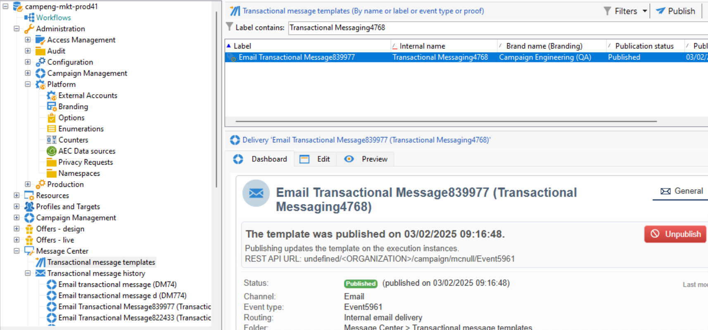

# Asignar su marca {#branding-assign}

## Vinculación de una marca a una plantilla {#linking-a-brand-to-a-template}

Para utilizar los parámetros definidos para una marca, debe estar vinculada a una plantilla de envío. Para ello, debe crear o editar una plantilla.

La plantilla se vinculará a la marca. En el editor de correo electrónico, los elementos como la **dirección de correo electrónico del remitente predeterminado**, el **nombre del remitente predeterminado** o el **logotipo** utilizan los datos de marca configurados.

>[!BEGINTABS]

>[!TAB Web de Adobe Campaign]

Para crear una plantilla de envíos, puede duplicar una plantilla integrada, convertir un envío existente en una plantilla o crear una plantilla de envíos desde cero. [Más información](../../msg/delivery-template.md)

Una vez creada la plantilla, puede vincularla a una marca. Para ello:

1. Vaya a la ficha **[!UICONTROL Plantillas]**, en el menú izquierdo de **[!UICONTROL Envíos]**, y seleccione una plantilla de envío.

   

1. Haga clic en **[!UICONTROL Configuración]**.

   

1. En la ficha **[!UICONTROL Envío]**, acceda al campo **[!UICONTROL Marca]** y seleccione la marca que desee vincular a la plantilla.

   

1. Confirme la selección y guarde el flujo de trabajo.

Ahora puede utilizar esta plantilla para realizar envíos.

>[!TAB Adobe Campaign V8]

Para crear una plantilla de envíos, puede duplicar una plantilla integrada, convertir un envío existente en una plantilla o crear una plantilla de envíos desde cero. [Más información](https://experienceleague.adobe.com/docs/campaign/campaign-v8/send/create-templates.html?lang=es)

Una vez creada la plantilla, puede vincularla a una marca. Para ello:

1. Vaya a **[!UICONTROL Recursos]** `>` **[!UICONTROL Plantillas]** `>` **[!UICONTROL Plantillas de envío]** en el explorador de Adobe Campaign.

1. Seleccione una plantilla de envío o duplique una existente.

   

1. Acceda a las **[!UICONTROL propiedades]** de la plantilla de envíos seleccionada.

   

1. En la ficha **[!UICONTROL General]**, seleccione su marca en la lista desplegable **[!UICONTROL Marca]**.

   

1. Una vez configurado, seleccione **Aceptar**.

Ahora puede utilizar esta plantilla para realizar envíos.

>[!ENDTABS]

## Asignar una marca al envío {#assigning-a-brand-to-an-email}

>[!BEGINTABS]

>[!TAB Web de Adobe Campaign]

Para crear un nuevo envío independiente, siga los pasos a continuación.

1. Vaya al menú **[!UICONTROL Envíos]** en el carril izquierdo y haga clic en el botón **[!UICONTROL Crear envío]**.

   

1. Seleccione Notificación por correo electrónico o push como canal y elija una plantilla de envío en la lista.

1. Haga clic en el botón **[!UICONTROL Crear envío]** para confirmar.

1. En la página **[!UICONTROL Propiedades]**, haga clic en **[!UICONTROL Configuración]**.

   

1. Desde la ficha **[!UICONTROL Envío]**, acceda al campo **[!UICONTROL Marca]**.

   

1. Seleccione la marca que desea vincular a la plantilla.

   

1. Personalice aún más las entregas. Para obtener más información sobre cómo crear un correo electrónico, consulte la sección [Crear su primer correo electrónico](../../email/create-email.md).

>[!TAB Adobe Campaign V8]

Para crear un nuevo envío independiente, siga los pasos a continuación.

1. Para crear un envío nuevo, vaya a la pestaña **[!UICONTROL Campañas]**.

1. Haga clic en **[!UICONTROL Envíos]** y haga clic en el botón **[!UICONTROL Crear]** situado encima de la lista de envíos existentes.

   

1. Seleccione una plantilla de envíos.

1. Acceda a las **[!UICONTROL propiedades]** de la plantilla de envíos seleccionada.

   

1. En la ficha **[!UICONTROL General]**, seleccione su marca en la lista desplegable **[!UICONTROL Marca]**.

   

1. Una vez configurado, seleccione **Aceptar**.

1. Personalice aún más las entregas. Para obtener más información sobre cómo crear un correo electrónico, consulte la sección [Diseñar y enviar correos electrónicos](../../email/create-email.md).

1. También puede añadir información de marca con los campos personalizados. Vaya a **[!UICONTROL Personalización de marca]** y seleccione los bloques de personalización relacionados con la marca que desee insertar (como nombre de la marca, URL del logotipo, URL del sitio web, información del remitente, etc.).

>[!ENDTABS]

## Comprobar la marca asociada a los mensajes transaccionales {#check-branding-transactional}

>[!IMPORTANT]
>
>Esta sección se aplica solo a los mensajes transaccionales (Centro de mensajes).
>
>Aunque las funcionalidades transaccionales están disponibles en la interfaz de usuario web de Campaign, los pasos de verificación siguientes deben realizarse en la consola del cliente de Campaign v8 (instancia de control).

Los envíos transaccionales sincronizados desde instancias de ejecución en tiempo real (RT) a la instancia de control no replican propiedades como enrutamiento o marca. Estos envíos sincronizados se generan semanalmente a partir de la misma plantilla para devolver los indicadores de envío en la instancia de control.

Debido a esto, la instancia de control muestra la marca predeterminada. La marca real y la configuración de enrutamiento utilizada durante la ejecución del mensaje se definen en la plantilla de mensaje transaccional de la instancia de control.

Para verificar qué marca se utilizó para un mensaje transaccional:

1. Identifique el nombre interno de la plantilla transaccional publicada en tiempo real (por ejemplo, `TransactionalMessaging4768`).

   

1. En la instancia de control, busque este nombre interno en **Plantillas de mensajes transaccionales**.

   

1. Abra la plantilla para ver la marca y otras propiedades relacionadas.
