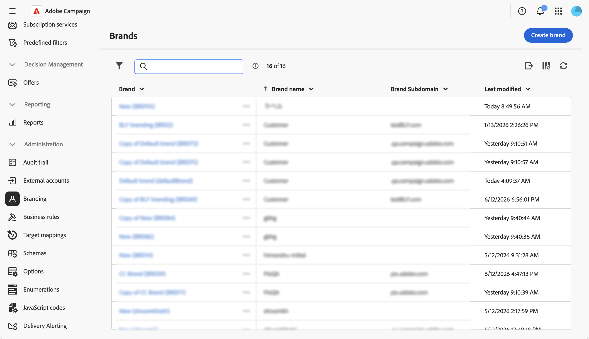
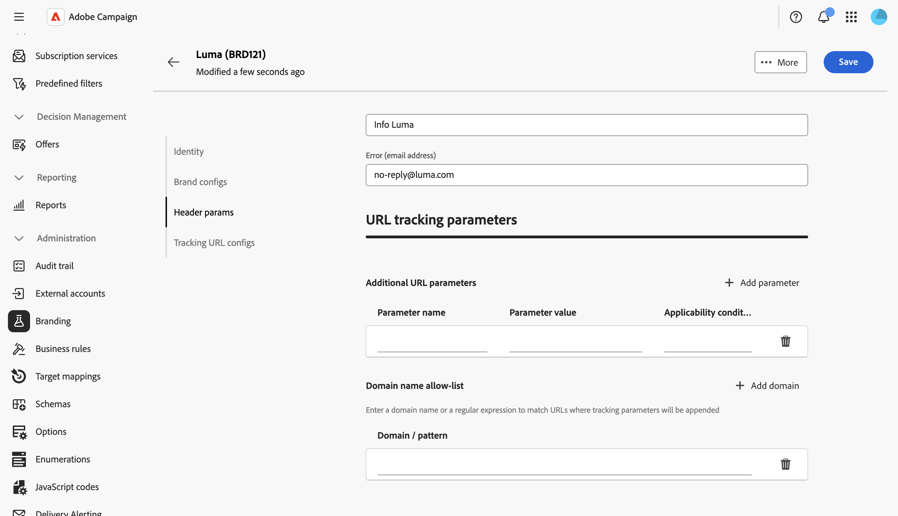

# Configurar marcas {#branding-configure}

Los administradores técnicos pueden crear y administrar varias marcas directamente desde la interfaz de usuario web. Esto le permite definir todos los elementos que componen su identidad de marca, incluidos los logotipos e incluso la configuración del seguimiento de correo electrónico.

>[!NOTE]
>
>Esta capacidad requiere el paquete de promoción de la marca en su instancia. Póngase en contacto con su representante de Adobe si no ve el menú **Marca**.

## Crear o editar una marca {#create-edit-brand}

>[!CONTEXTUALHELP]
>id="acw_branding_create"
>title="Crear una marca"
>abstract="Haga clic en **Crear marca** para definir una nueva identidad de marca. Rellene los detalles de marca en las fichas de configuración y haga clic en **Crear marca** para guardar. La marca está disponible para vincularse a plantillas de envío y envíos independientes."

Para crear una nueva marca, siga estos pasos:

1. Vaya a **[!UICONTROL Administración > Marca]** desde el menú de la izquierda o a **[!UICONTROL Administración > Plataforma > Marca]** desde el **[!UICONTROL Explorador]**.

1. Haga clic en el botón **[!UICONTROL Crear marca]** situado encima de la lista.

   

1. Rellene los detalles de marca en las diferentes secciones. Cada campo se describe en la sección [Atributos de marca](#brand-attributes) a continuación.

   

1. Haga clic en **[!UICONTROL Crear marca]** para guardar. La marca ya está disponible para vincularse a plantillas de envío y envíos independientes. [Aprenda a asignar una marca](branding-assign.md).

Para editar una marca existente, selecciónela en la lista, actualice los campos y guarde los cambios.

## Atributos de marca {#brand-attributes}

Una **[!UICONTROL marca]** está configurada en cuatro secciones: **[!UICONTROL Identidad]**, **[!UICONTROL Configuraciones de marca]**, **[!UICONTROL Parámetros de encabezado de correo electrónico]** y **[!UICONTROL Parámetros de seguimiento de URL]**.

### Identidad {#identity}

La sección **[!UICONTROL Identidad]** le permite definir y personalizar su marca.

Esta sección contiene los campos siguientes:

* **[!UICONTROL Nombre de marca]**: El nombre de su marca. Este campo es obligatorio.
* **[!UICONTROL Etiqueta]**: La etiqueta visible en la interfaz.
* **[!UICONTROL ID]**: El identificador interno generado automáticamente. Puedes cambiarlo... Solo se permiten letras, dígitos y guiones bajos. Los caracteres especiales se sustituyen por guiones bajos.
* **[!UICONTROL URL del logotipo]**: URL de la imagen del logotipo de la marca.
* **[!UICONTROL Dirección URL del sitio web]** y **[!UICONTROL Etiqueta del sitio web]**: La dirección URL del sitio web y la etiqueta asociadas con la marca.

### Configuraciones de marca {#brand-configs}

En la sección **[!UICONTROL Configuraciones de marca]**, define los protocolos de subdominio y URL utilizados para el seguimiento y el acceso a la página de aterrizaje.

Esta sección contiene los campos siguientes:

* **[!UICONTROL Subdominio de marca]**: URL del subdominio específica de esta marca, solicitada para delegación desde Adobe.
* **[!UICONTROL Protocolo de URL de seguimiento]**, **[!UICONTROL Protocolo de URL de página espejo]** y **[!UICONTROL Protocolo de URL de aplicación]**: El protocolo usado para cada tipo de URL (por ejemplo, **Segura (https)**).

>[!NOTE]
>
>La configuración de los servidores de seguimiento, réplica y aplicaciones se almacena en cuentas externas independientes asociadas con el enrutamiento. Esta configuración se aplica durante el aprovisionamiento y no debe modificarse. Para mostrar las direcciones URL, acceda a la pestaña **[!UICONTROL Prefijos de marca]** desde su cuenta externa.

### Parámetros de encabezado de correo electrónico {#header-param}

Los **[!UICONTROL parámetros de encabezado de correo electrónico]** le permiten personalizar lo que los destinatarios verán en la sección de encabezado de sus campañas.

Esta sección contiene los campos siguientes:

* **[!UICONTROL Remitente (dirección de correo electrónico)]**: La dirección de correo electrónico de la marca.
* **[!UICONTROL Remitente (nombre)]**: El nombre de la marca.
* **[!UICONTROL Responder a (dirección de correo electrónico)]**: La dirección de correo electrónico a la que el cliente puede responder.
* **[!UICONTROL Responder a (nombre)]**: El nombre para mostrar de las respuestas.
* **[!UICONTROL Error (dirección de correo electrónico)]**: La dirección de correo electrónico que se usará en caso de error.

<!--
>[!IMPORTANT]
>
>After having updated the header parameters of the emails, if the name and email address of the sender have not changed in the email created from the template, check the template's advanced settings.
-->

### Parámetros de seguimiento de URL {#tracking-param}

En la sección **[!UICONTROL parámetros de seguimiento de URL]**, puede mejorar el seguimiento de URL definiendo parámetros adicionales para la integración con herramientas de Web Analytics como Adobe Analytics y Google Analytics.

Esta sección contiene los campos siguientes:

* **[!UICONTROL Parámetros de URL adicionales]**: Agregue parámetros como pares clave-valor junto con sus condiciones de aplicabilidad. Cada nombre de parámetro debe ser único y no vacío, y cada valor de parámetro no debe estar vacío. La condición de aplicabilidad puede estar vacía, pero ninguno de estos valores puede incluir etiquetas JST.

* **[!UICONTROL Lista de permitidos de nombres de dominio]**: agregue nombres de dominio o expresiones regulares para que coincidan con las direcciones URL a las que se agregarán parámetros de seguimiento.

**Ejemplo:** Una dirección URL rastreada como `https://www.luma.com` pasará a ser `https://www.luma.com/?age=21&deliveryName=DM101` cuando los parámetros adicionales `age=21` y `deliveryName=DM101` estén configurados para ese dominio.

## Configuración de la marca para la mensajería transaccional {#branding-transactional-config}

>[!IMPORTANT]
>
>Esta sección se aplica solo a los mensajes transaccionales (Centro de mensajes).
>
>Aunque las funcionalidades transaccionales están disponibles en la interfaz de usuario web de Campaign, los pasos siguientes deben realizarse en la consola del cliente de Campaign v8 (instancia de control).

Si utiliza mensajes transaccionales (centro de mensajes) con marca, se requiere una configuración adicional.

### Seguimiento de fórmulas para instancias en tiempo real

Cuando la promoción de la marca se activa en una instancia de control en tiempo real (RT), se utilizan opciones de seguimiento específicas para administrar las fórmulas de seguimiento. Estas fórmulas se configuran de forma centralizada en la instancia de control de RT en lugar de individualmente en cada instancia de ejecución de RT.

Las siguientes opciones definen las fórmulas de seguimiento utilizadas por los envíos RT:

* **`NmsTracking_RT_ClickFormula`**: especifica la fórmula utilizada para el rastreo de clics en instancias RT

* **`NmsTracking_RT_OpenFormula`**: especifica la fórmula utilizada para el seguimiento de aperturas en instancias RT

Si su implementación requiere fórmulas de seguimiento personalizadas para la mensajería transaccional, utilice la siguiente opción:

* **`Branding_RT_ListXtkOptions_toPublish`**: enumere aquí los nombres de las opciones XTK para las fórmulas personalizadas (separados por comas). Esto garantiza que los envíos de RT puedan aplicar las fórmulas de seguimiento personalizadas.
