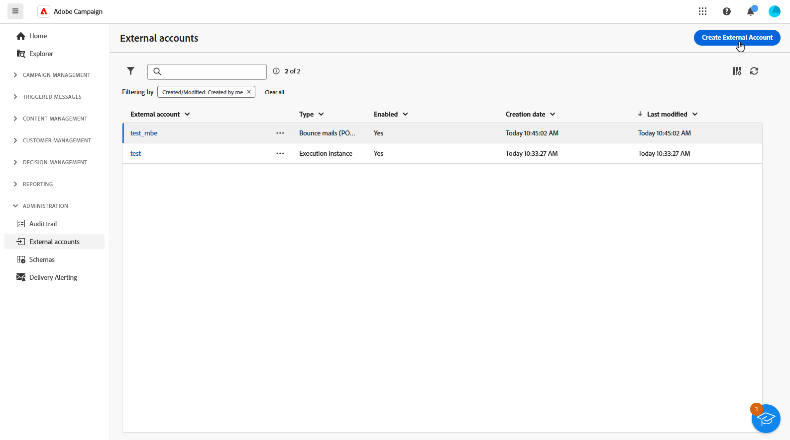
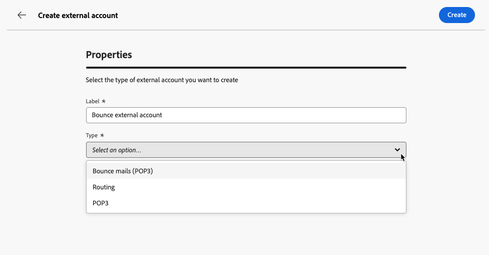
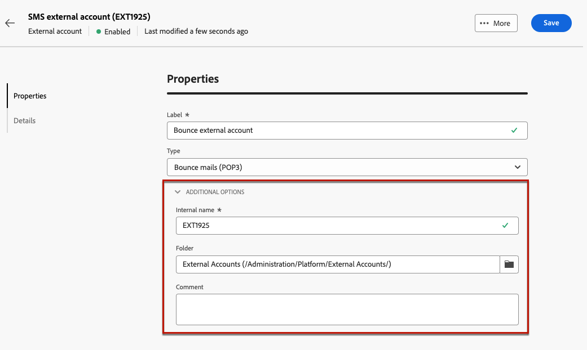
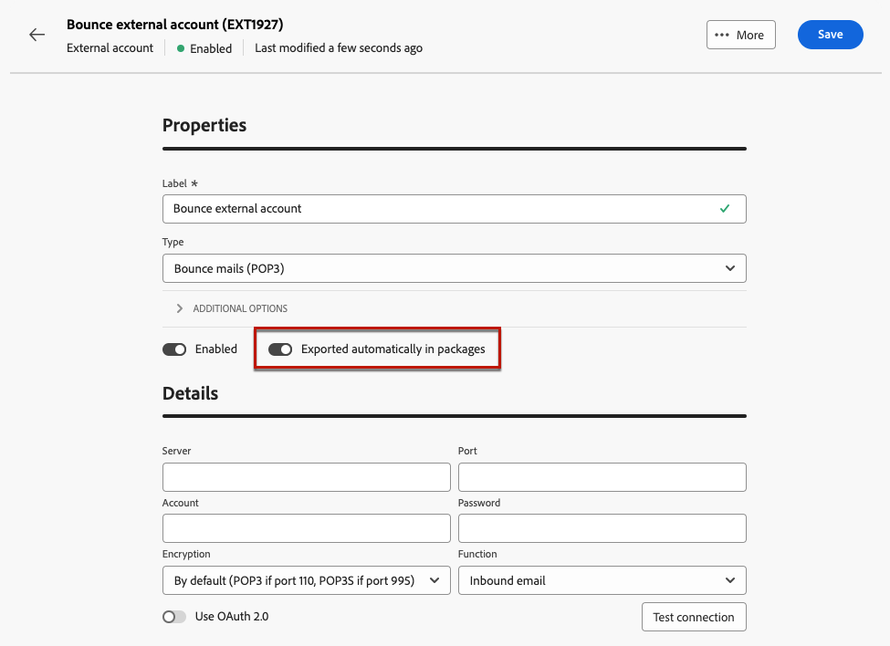
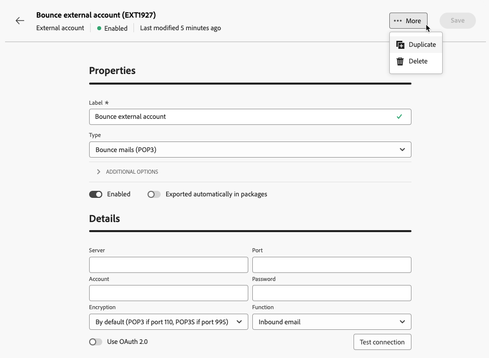

# Creación de una cuenta externa {#create-external-account}

Para crear una nueva cuenta externa, siga los pasos descritos a continuación. Las opciones de configuración específicas dependen del tipo de cuenta externa que esté creando.

1. En el menú del panel izquierdo, seleccione **[!UICONTROL Cuentas externas]** en **[!UICONTROL Administración]**.

1. Haga clic en **[!UICONTROL Crear cuenta externa]**.

   

1. Escriba su **[!UICONTROL Etiqueta]** y seleccione la cuenta externa **[!UICONTROL Tipo]**.

   * [Tipos específicos de campaña](external-account.md)
   * [Integración de Adobe Solution](integration-external-account.md)
   * [Transferir datos](transfer-external-account.md)
   * [Base de datos externa](external-account-database.md)

   

1. Haga clic en **[!UICONTROL Crear]**.

1. En la lista desplegable **[!UICONTROL Opciones adicionales]**, cambie la ruta de acceso **[!UICONTROL Nombre interno]** o **[!UICONTROL Carpeta]** si es necesario.

   

1. Habilite la opción **[!UICONTROL Exportado automáticamente en paquetes]** para exportar automáticamente los datos administrados por esta cuenta externa. <!--Exported where??-->

   

1. En la sección **[!UICONTROL Detalles]**, configure el acceso a la cuenta especificando las credenciales según el tipo de cuenta externa elegida. [Más información](#bounce)

1. Haga clic en **[!UICONTROL Probar conexión]** para comprobar que la configuración es correcta.

1. En el menú **[!UICONTROL Más...]**, duplique o elimine la cuenta externa.

   

1. Una vez completada la configuración, haz clic en **[!UICONTROL Guardar]**.
