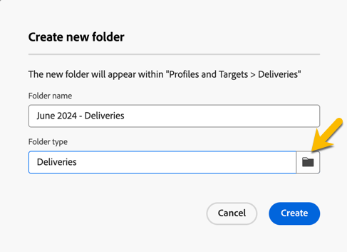

# Crear y administrar una carpeta

En Adobe Campaign, puede crear nuevas carpetas para administrar el árbol de navegación. En **[!UICONTROL Explorer]**, vaya a la carpeta en la que desea crear una nueva.

En el botón **[!UICONTROL ...]**, seleccione **[!UICONTROL Crear nueva carpeta]**.

{zoomable="yes"}

Cuando crea una carpeta nueva, el tipo de carpeta predeterminado es el tipo de la carpeta principal.\
En este ejemplo, se crea una carpeta en la carpeta **[!UICONTROL Envíos]**.

{zoomable="yes"}

Para cambiar el tipo de carpeta, haga clic en el icono Folder type y seleccione un tipo en la lista presentada.

{zoomable="yes"}

Configure el tipo de carpeta haciendo clic en el botón **[!UICONTROL Confirmar]**.

Para crear una carpeta sin un tipo específico, seleccione el tipo **[!UICONTROL Carpeta genérica]**.

En la consola de Adobe Campaign, el proceso para crear y administrar carpetas se explica [aquí](https://experienceleague.adobe.com/es/docs/campaign/campaign-v8/config/configuration/folders-and-views). También puede configurar permisos para carpetas. [Más información](https://experienceleague.adobe.com/es/docs/campaign/campaign-v8/admin/permissions/folder-permissions).