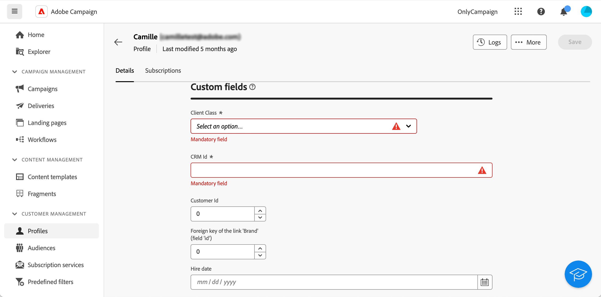

# Configuración de los campos personalizados {#custom-fields}

>[!CONTEXTUALHELP]
>id="acw_homepage_welcome_rn4"
>title="Campos personalizados"
>abstract="Los campos personalizados son atributos adicionales añadidos a los esquemas predeterminados a través de la consola de Adobe Campaign. Ahora están disponibles en la interfaz de usuario web."
>additional-url="https://experienceleague.adobe.com/docs/campaign-web/v8/release-notes/release-notes.html?lang=es" text="Consulte las notas de la versión"

Los campos personalizados son atributos adicionales añadidos a los esquemas predeterminados a través de la consola de Adobe Campaign. Obtenga más información en la [documentación de Adobe Campaign v8](https://experienceleague.adobe.com/docs/campaign/campaign-v8/developer/shemas-forms/extend-schema.html){target="_blank"}

Estos campos personalizados se muestran en varias pantallas, por ejemplo, los detalles de un perfil o un perfil de prueba.

En la interfaz de usuario web, no se pueden crear campos personalizados, pero se puede modificar la forma en que se muestran. Las modificaciones se aplican a todos los usuarios de Campaign.

>[!NOTE]
>
>Debe tener derechos de administrador para modificar los campos personalizados.

Los campos personalizados están disponibles en los siguientes esquemas:

* Destinatarios (nms)
* Campañas (nms)
* Envíos (nms)
* Direcciones semilla (nms)

Para configurar los campos personalizados, siga estos pasos:

1. En **Administración**, haga clic en **Esquemas**.

   {zoomable="yes"}

1. Busque el esquema deseado; por ejemplo, el esquema **Destinatarios (nms)**.

   {zoomable="yes"}

1. Haga clic en el botón **Más acciones** y seleccione **Editar detalle personalizado**.

   {zoomable="yes"}

   La pantalla **Editar detalle personalizado** muestra todos los campos personalizados y su tipo.

   {zoomable="yes"}

   Esta pantalla le permite realizar las siguientes acciones:

   * cambie el orden de los diferentes campos mediante las flechas arriba y abajo.
   * haga el campo obligatorio: marque la casilla **Obligatorio**.
   * haga el campo visible u ocultarlo: haga clic en el botón **Visible**.
   * agregue una condición de visibilidad: haga clic en el botón **Visible if** y escriba la expresión xtk mediante las funciones xtk disponibles.

1. Vaya a la pantalla que muestra el campo personalizado. En nuestro ejemplo, es la pantalla de detalles del perfil.

   {zoomable="yes"}
