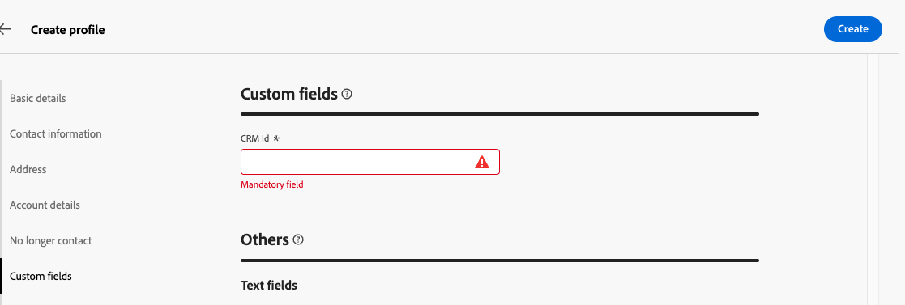
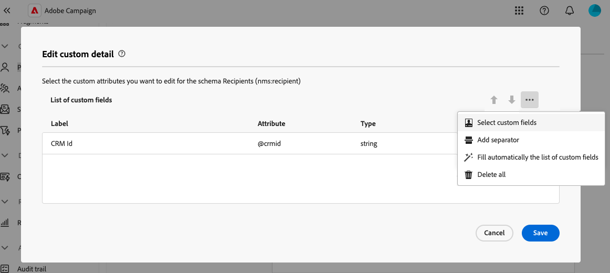

# Configuración de los campos personalizados {#custom-fields}

>[!CONTEXTUALHELP]
>id="acw_schema_editcustomfields"
>title="Editar detalle personalizado"
>abstract="Se muestran todos los campos personalizados en la interfaz para el esquema seleccionado. Puede cambiar el orden en que aparecen en la interfaz mediante las flechas arriba y abajo, y agrupar los campos en subsecciones añadiendo separadores. Para eliminar un campo personalizado o editar la configuración, como las condiciones de visibilidad, haga clic en el botón de los tres puntos."

>[!CONTEXTUALHELP]
>id="acw_schema_editcustomfields_settings_general"
>title="General"
>abstract="Defina la configuración general del campo personalizado. Si no se proporciona ninguna etiqueta, se mostrará la etiqueta definida en el esquema. Utilice el campo **Visible si** para definir una condición utilizando una expresión xtk que controle cuándo se muestra el campo. También puede marcar el campo como obligatorio o de solo lectura en la interfaz."

>[!CONTEXTUALHELP]
>id="acw_schema_editcustomfields_settings_link"
>title="Propiedades del vínculo"
>abstract="Utilice el modelador de consultas para especificar reglas para mostrar un campo personalizado de tipo vínculo. Por ejemplo, restrinja los valores de lista en función de la entrada de otro campo."

>[!CONTEXTUALHELP]
>id="acw_schema_editcustomfields_settings_layout"
>title="Diseño"
>abstract="De forma predeterminada, los campos personalizados se muestran en la interfaz en dos columnas. Active esta opción para mostrar el campo personalizado en todo el ancho de la pantalla en lugar de en dos columnas."

>[!CONTEXTUALHELP]
>id="acw_schema_editcustomfields_separatorproperties"
>title="Propiedades de separadores"
>abstract="Especifique el nombre que se mostrará en la interfaz para la subsección."

<!-- NOT USED IN THE UI?-->

>[!CONTEXTUALHELP]
>id="acw_schema_editcustomfields_settings"
>title="Configuración de atributos"
>abstract="Configuración de atributos"

Los campos personalizados son atributos adicionales añadidos a los esquemas predeterminados a través de la consola de Adobe Campaign. Permiten personalizar esquemas incluyendo nuevos atributos para adaptarlos a las necesidades de la organización. Obtenga información sobre cómo ampliar un esquema en la [documentación de Adobe Campaign v8](https://experienceleague.adobe.com/docs/campaign/campaign-v8/developer/shemas-forms/extend-schema.html){target="_blank"}.

Los campos personalizados se pueden mostrar en varias pantallas, como los detalles del perfil, en la interfaz web de Campaign. Los administradores pueden controlar qué campos son visibles y cómo aparecen. Estos cambios se aplican a todos los usuarios de Campaign.

>[!NOTE]
>
>Debe tener derechos de administrador para administrar campos personalizados.

Los campos personalizados están disponibles para los siguientes esquemas:

* Campañas (nms)
* Planes (nms)
* Programas (nms)
* Destinatarios (nms)
* Direcciones semilla (nms)
* Envíos (nms)

## Añadir campos personalizados a la interfaz {#add}

Para mostrar campos personalizados en la interfaz, siga estos pasos:

1. Vaya al menú **[!UICONTROL Esquemas]** en el panel de navegación izquierdo y busque el esquema deseado.

   Utilice el filtro **[!UICONTROL Editable]** del panel de filtros para identificar rápidamente esquemas con campos personalizados.

   

1. Seleccione el nombre del esquema en la lista para abrirlo. Una vista de esquema detallada muestra [Más información sobre los detalles del esquema](../administration/schemas.md). Haga clic en el botón **[!UICONTROL Editar detalle personalizado]** para acceder a los campos personalizados. En este ejemplo, queremos agregar campos para el esquema **[!UICONTROL Recipients]**.

   

1. Se muestra la lista de campos personalizados en la interfaz para la visualización del esquema. En este caso, el campo &quot;CRM Id&quot; es visible en la pantalla de detalles de los perfiles y se ha marcado como obligatorio.

   | Configuración de campos personalizados | Procesamiento en la interfaz |
   |  ---  |  ---  |
   | {zoomable="yes"} | {zoomable="yes"} |

1. Para añadir un campo personalizado a la interfaz, haga clic en el botón de puntos suspensivos y elija una de las siguientes opciones:

   * **[!UICONTROL Seleccionar campos personalizados]**: seleccione uno o varios campos personalizados para mostrarlos en la interfaz.
   * **[!UICONTROL Rellenar automáticamente la lista de campos personalizados]**: agregue todos los campos personalizados definidos para el esquema a la interfaz.

   

1. Una vez añadidos los campos personalizados, puede:

   * **Reordenar campos**: utilice las flechas arriba y abajo.
   * **Hacer los campos obligatorios**: Seleccione la casilla de verificación **Obligatorio**.
   * **Editar configuración de campos**: haga clic en el botón de puntos suspensivos y elija **[!UICONTROL Editar]**. [Más información](#settings)
   * **Eliminar campos**: haga clic en el botón de puntos suspensivos y elija **[!UICONTROL Eliminar]**.
   * **Organice los campos en subsecciones en la interfaz**: haga clic en el botón de los tres puntos situado junto a las flechas arriba y abajo y elija **[!UICONTROL Agregar separador]**. [Más información](#separator)

## Configuración de campos personalizados {#settings}

Para configurar opciones específicas para cada campo personalizado, haga clic en el botón de puntos suspensivos situado junto al campo deseado y seleccione **[!UICONTROL Editar]**.

Los ajustes disponibles son:

* **[!UICONTROL Atributo]**: Nombre del campo personalizado.
* **[!UICONTROL Etiqueta (personalizada)]**: La etiqueta que se mostrará en la interfaz. Si no se proporciona ninguna etiqueta, se mostrará la etiqueta definida en el esquema.
* **[!UICONTROL Visible si]**: defina una condición con una expresión xtk que controle cuándo se muestra el campo. Por ejemplo, oculte este campo si hay otro campo vacío.
* **[!UICONTROL Obligatorio]**: haga que el campo sea obligatorio en la interfaz.
* **[!UICONTROL Solo lectura]**: convierta el campo en de solo lectura en la interfaz. Los usuarios no podrán editar el valor del campo.
* **[!UICONTROL Configuración del filtro]** (para campos de tipo de vínculo): use el modelador de consultas para especificar reglas para mostrar un campo personalizado de tipo de vínculo. Por ejemplo, restrinja los valores de lista en función de la entrada de otro campo.

  También puede hacer referencia al valor introducido en otros campos de las condiciones mediante la sintaxis `$(<field-name>)`. Esto le permite hacer referencia al valor actual de un campo tal como se introduce en el formulario, aunque aún no se haya guardado en la base de datos.

  En el ejemplo siguiente, la condición comprueba si el valor del campo @ref coincide con el valor introducido en el campo @refCom. Por el contrario, si se usa `@refCom` en lugar de `$(@refCom)`, se hará referencia al valor del campo @ref tal como existe en la base de datos.

  +++Ver ejemplo

  

+++

* **[!UICONTROL Abarcar dos columnas]**: de forma predeterminada, los campos personalizados se muestran en la interfaz en dos columnas. Active esta opción para mostrar el campo personalizado en todo el ancho de la pantalla en lugar de en dos columnas.

## Organizar campos personalizados en subsecciones {#separator}

La interfaz de usuario web de Campaign le permite añadir separadores para agrupar campos personalizados en la interfaz y mejorar así la legibilidad. Para ello, siga estos pasos:

1. Haga clic en el botón de los tres puntos situado junto a las flechas arriba y abajo y seleccione **[!UICONTROL Agregar separador]**.

1. Se agrega a la lista una nueva línea que representa el separador. Haga clic en el botón de los tres puntos y elija **[!UICONTROL Editar]** para asignar un nombre a la subsección.

1. Utilice las flechas arriba y abajo para mover el separador a la ubicación deseada. Los campos enumerados debajo del separador se agrupan debajo de él.

   En este ejemplo, los campos &quot;Colecciones interesadas&quot; y &quot;Marca&quot; se agrupan en una subsección &quot;Colección&quot;.

   | Configuración de campos personalizados | Procesamiento en la interfaz |
   |  ---  |  ---  |
   | {zoomable="yes"} | {zoomable="yes"} |
