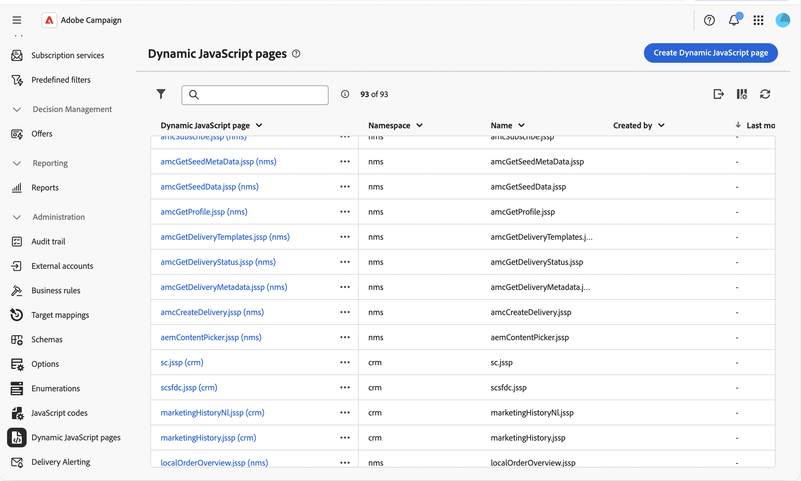

# Trabajar con páginas dinámicas de JavaScript {#dynamic-javascript-pages}

>[!CONTEXTUALHELP]
>id="acw_dynamic_javascript_pages_list"
>title="Páginas dinámicas de JavaScript"
>abstract="Las páginas dinámicas de JavaScript (JSSP) le permiten crear páginas del lado del servidor que generan contenido dinámico cuando se accede a ellas a través de una dirección URL, como API personalizadas, exportaciones o lógica de aplicación web. Desde esta lista, puede crear, modificar, duplicar o eliminar una página dinámica de JavaScript."

>[!CONTEXTUALHELP]
>id="acw_dynamic_javascript_pages_create"
>title="Crear una página de dinámica de JavaScript"
>abstract="Defina un espacio de nombres, un nombre y una etiqueta para su página dinámica de JavaScript y, a continuación, escriba su contenido con el código JavaScript. Una vez creados, el espacio de nombres y el nombre no se pueden modificar."

## Acerca de las páginas dinámicas de JavaScript {#about}

Las páginas dinámicas de JavaScript (JSSP) le permiten crear páginas del lado del servidor que generan contenido dinámico cuando se accede a ellas a través de una dirección URL, como API personalizadas, exportaciones o lógica de aplicación web. Estas páginas se almacenan en el menú **[!UICONTROL Administración]** > **[!UICONTROL Páginas dinámicas de JavaScript]** del panel de navegación izquierdo.

Desde la lista de páginas dinámicas de JavaScript, puede:

* **Duplicar o eliminar una página**: haga clic en el botón de puntos suspensivos y seleccione la acción que desee.
* **Modificar una página**: haga clic en el nombre de una página para abrir sus propiedades, realizar los cambios y guardar.
* **Crear una nueva página dinámica de JavaScript**: haga clic en el botón **[!UICONTROL Crear página dinámica de JavaScript]**.

<!--
>[!NOTE]
>
>In the Campaign console, dynamic JavaScript pages are available under **[!UICONTROL Administration]** > **[!UICONTROL Configuration]** > **[!UICONTROL Dynamic JavaScript pages]**. Although the menu location differs from the Web user interface, the list is identical and operates like a mirror.
-->

## Creación de una página dinámica de JavaScript {#create}

Para crear una página de JavaScript dinámica, siga estos pasos:

1. Vaya al menú **[!UICONTROL Páginas dinámicas de JavaScript]** y haga clic en el botón **[!UICONTROL Crear página dinámica de JavaScript]**.

1. Defina las propiedades de la página:

   * **[!UICONTROL Espacio de nombres]**: especifique el espacio de nombres relevante para los recursos personalizados. De forma predeterminada, el área de nombres es &quot;cus&quot;, pero puede variar según la implementación.
   * **[!UICONTROL Nombre]**: El identificador único usado para hacer referencia a la página.
   * **[!UICONTROL Etiqueta]**: etiqueta descriptiva que se muestra en la lista de páginas dinámicas de JavaScript.

   

   >[!NOTE]
   >
   >Una vez creados, los campos **[!UICONTROL Namespace]** y **[!UICONTROL Name]** no se pueden modificar. Para realizar cambios, duplique la página y actualice según sea necesario.

1. Haga clic en el botón **[!UICONTROL Crear código]** para definir el contenido de la página y, a continuación, escriba el código JSSP con las directivas de `<%@ page %>` y las llamadas de `NL.require()` para cargar las bibliotecas principales.

   

1. Haga clic en **[!UICONTROL Confirmar]** para guardar el código.

1. Cuando su página dinámica de JavaScript esté lista, haga clic en **[!UICONTROL Crear]**. Ahora se puede obtener acceso a la página desde una dirección URL creada a partir del espacio de nombres y el nombre, con el formato `https://<your-instance>/<namespace>/<name>`. Por ejemplo, se puede obtener acceso a una página denominada `recipientAPI.jssp` en el espacio de nombres `cus` en `https://<your-instance>/cus/recipientAPI.jssp`.

Para obtener más información sobre las funciones reutilizables de JavaScript, consulte [Trabajar con códigos JavaScript](javascript-codes.md).
