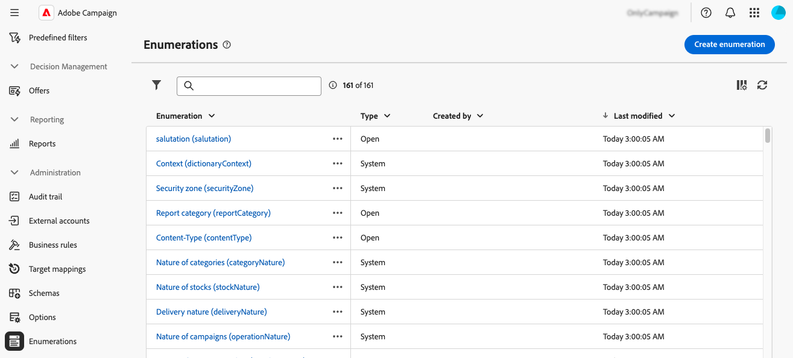

# Administración de enumeraciones {#enumerations}

>[!CONTEXTUALHELP]
>id="acw_homepage_welcome_rn4"
>title="Creación de enumeraciones"
>abstract="Ahora puede crear enumeraciones directamente mediante la interfaz de usuario de Adobe Campaign Web. Una enumeración es una lista de valores sugeridos por el sistema para rellenar campos. "
>additional-url="https://experienceleague.adobe.com/docs/campaign-web/v8/release-notes/release-notes.html?lang=es" text="Consulte las notas de la versión"

>[!CONTEXTUALHELP]
>id="acw_enumerations_list"
>title="Enumeraciones"
>abstract="Una enumeración es una lista de valores sugeridos por el sistema para rellenar los campos. Utilice las enumeraciones para estandarizar los valores de estos campos, facilitar la introducción de datos o utilizarlas en las consultas."

>[!CONTEXTUALHELP]
>id="acw_enumerations_properties"
>title="Propiedades"
>abstract="Defina las propiedades de la enumeración, como su nombre, nombre interno y tipo. Las enumeraciones **[!UICONTROL Cerradas]** tienen una lista fija de valores que solo se pueden modificar desde el menú **[!UICONTROL Enumeraciones]**. Las enumeraciones **[!UICONTROL Abiertas]** permiten a los usuarios añadir nuevos valores directamente en los campos basándose en esta enumeración. Las enumeraciones del **[!UICONTROL Sistema]** están asociadas a campos del sistema. Las enumeraciones de tipo **[!UICONTROL Emoticono]** se usan para actualizar la lista de emoticonos."

>[!CONTEXTUALHELP]
>id="acw_enumerations_values"
>title="Lista de valores de enumeración"
>abstract="Para añadir un valor a la enumeración, haga clic en el botón **[!UICONTROL Añadir valor]** y configúrelo según sea necesario."

## ¿Qué son las enumeraciones? {#about}

Una enumeración es una lista de valores sugeridos por el sistema para rellenar los campos. Utilice enumeraciones para estandarizar los valores de estos campos, ayudar con la entrada de datos o utilizar en las consultas. La lista de valores aparece como una lista desplegable desde la que puede seleccionar el valor que se va a introducir en el campo. La lista desplegable también permite la entrada predictiva: introduzca las primeras letras y la aplicación rellena el resto.

Los valores de este tipo de campo se definen mediante el menú **[!UICONTROL Administración]** / **[!UICONTROL Enumeraciones]** en el panel de navegación izquierdo.

## Creación de una enumeración {#create}

Para crear una enumeración, siga estos pasos:

1. Vaya al menú **[!UICONTROL Enumeraciones]** y, a continuación, haga clic en el botón **[!UICONTROL Crear enumeración]**.

1. Escriba una **[!UICONTROL Etiqueta]** y un **[!UICONTROL Nombre interno]** para la enumeración.

   

1. Seleccione la enumeración **[!UICONTROL Type]**:

   * Las enumeraciones **[!UICONTROL Cerradas]** tienen una lista fija de valores, que solo se pueden modificar desde el menú **[!UICONTROL Enumeraciones]**.
   * Las enumeraciones **[!UICONTROL Open]** permiten a los usuarios agregar nuevos valores directamente en los campos basándose en esta enumeración.
   * Las enumeraciones **[!UICONTROL System]** están asociadas a campos del sistema.
   * Las enumeraciones de tipo **[!UICONTROL Emoticono]** se usan para actualizar la lista de emoticonos.

1. Haga clic en **[!UICONTROL Crear]**. Se muestran los detalles de la enumeración, lo que le permite agregar valores a la lista.

   

1. Para agregar un valor, haga clic en el botón **[!UICONTROL Agregar valor]** y, a continuación, configúrelo según sea necesario:

   * **[!UICONTROL Etiqueta]**: etiqueta que se mostrará en la enumeración.
   * **[!UICONTROL Nombre interno]**: El nombre interno del valor (para enumeraciones del sistema).
   * **[!UICONTROL U+ (nombre interno)]** (enumeraciones de emoticonos): El código Unicode para el emoticono (para enumeraciones de emoticonos).

   

1. Guarde los cambios. La enumeración se actualiza en las pantallas donde se utiliza.

## Caso de uso: Adición de valores predefinidos a una enumeración {#uc}

De forma predeterminada, el campo &quot;Origen&quot; en la pantalla de detalles del perfil permite a los usuarios introducir cualquier valor libremente.

Cada vez que un usuario introduce un valor para el campo, el valor se añade automáticamente a la enumeración &quot;Origen&quot;. Esto puede generar valores redundantes, incoherentes o erróneos a lo largo del tiempo en la lista de valores.

Para garantizar la coherencia de los datos y guiar a los usuarios al rellenar el campo, defina un conjunto de valores predefinidos. Siga estos pasos:

1. Vaya al menú **[!UICONTROL Enumerations]** y abra la enumeración &quot;Origin&quot;.

2. Revise la lista de valores introducidos por el usuario y límpiela. Haga clic en el botón de los tres puntos situado junto a un valor para eliminarlo. Si la lista contiene demasiadas incoherencias, elimine toda la enumeración y vuelva a crearla desde cero.

   

3. Añada valores predefinidos. Para ello, haga clic en el botón **[!UICONTROL Agregar valor]** e introduzca los valores predefinidos que los usuarios deben seleccionar.

   

4. Para aplicar coherencia, cambie el tipo de lista desglosada a **[!UICONTROL Cerrada]**, que restringe a los usuarios a valores predefinidos. Si se necesita flexibilidad, manténgala **[!UICONTROL Abierta]** para permitir nuevas entradas de usuario.

5. Vuelva a la pantalla de detalles del perfil. El campo &quot;Origen&quot; ahora muestra los valores predefinidos para la selección.

   