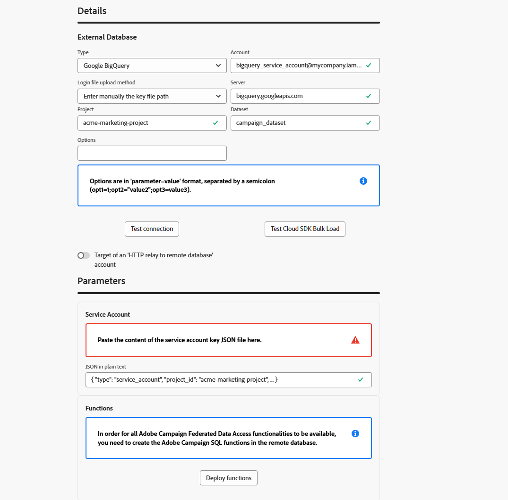
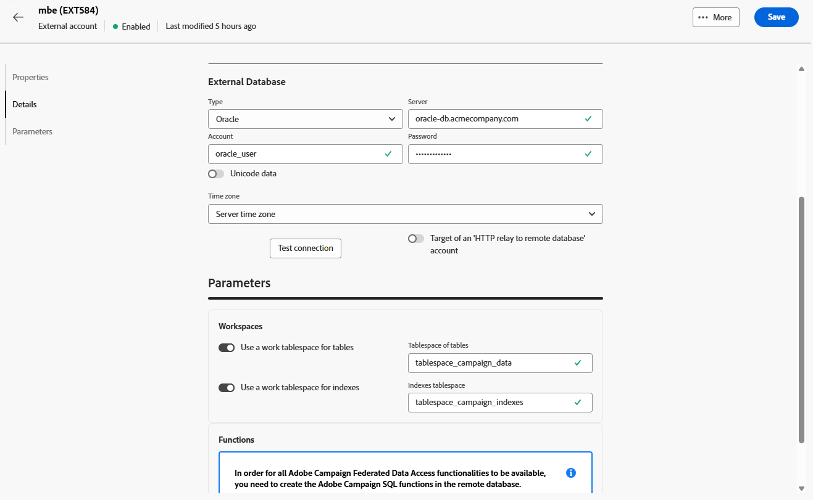

# Cuentas de base de datos externas {#external-accounts}

Utilice una cuenta externa de tipo Base de datos externa para conectar Adobe Campaign a una base de datos de terceros.

Los ajustes de configuración de la cuenta externa varían según el motor de base de datos al que se conecte. Puede encontrar instrucciones detalladas para cada base de datos admitida en las secciones siguientes.

## Amazon Redshift

La cuenta externa Amazon Redshift permite conectar la instancia de Campaign a la base de datos externa Amazon Redshift.

En la interfaz de usuario web de Adobe Campaign, configure la cuenta externa Amazon Redshift.

1. [Cree su cuenta externa](external-account.md) y seleccione **[!UICONTROL Base de datos externa]** como **[!UICONTROL Tipo]** de su cuenta externa y Amazon Redshift como **[!UICONTROL Tipo de proveedor]**.

1. Haga clic en **[!UICONTROL Crear]**.

1. Para configurar la cuenta externa **[!UICONTROL Amazon Redshift]**, rellene los campos siguientes:

   * **[!UICONTROL Tipo]**: Amazon Redshift

   * **[!UICONTROL Servidor]**: Escriba el nombre DNS de su servidor Redshift.

   * **[!UICONTROL Cuenta]**: proporcione el nombre de usuario Redshift que se utilizará para la autenticación.

   * **[!UICONTROL Contraseña]**: escriba la contraseña asociada a la cuenta de usuario.

   * **[!UICONTROL Base de datos]**: especifique el nombre de la base de datos si aún no está definido en el DSN. Deje este campo vacío si el DSN incluye la base de datos.

   * **[!UICONTROL Esquema de trabajo]**: escriba el nombre del esquema donde funcionará Adobe Campaign.

   * **[!UICONTROL Opciones]**: agregue cualquier opción de configuración avanzada que su entorno pueda requerir.

   * **[!UICONTROL Zona horaria]**: seleccione o introduzca la zona horaria del servidor para garantizar operaciones precisas basadas en la hora.

   

1. Después de configurar la conexión, cree las funciones SQL de Adobe Campaign en la base de datos Redshift remota. Una vez que estas funciones estén disponibles, haga clic en **[!UICONTROL Implementar funciones]** para activarlas.

1. Vincule su **[!UICONTROL cuenta de almacenamiento]** para optimizar el rendimiento y permitir procesos de carga de datos más rápidos entre Adobe Campaign y Amazon Redshift.

1. Escriba su **[!UICONTROL función de cuenta]** que determina los permisos que Adobe Campaign usará al interactuar con su entorno Redshift.

## Amazon Redshift (heredado)

La cuenta externa Amazon Redshift (heredada) permite conectar la instancia de Campaign a la base de datos externa Amazon Redshift.

En la interfaz de usuario web de Adobe Campaign, configure su cuenta externa Amazon Redshift (heredada).

1. [Cree su cuenta externa](external-account.md) y seleccione **[!UICONTROL Base de datos externa]** como **[!UICONTROL Tipo]** de su cuenta externa y Amazon Redshift (heredado) como **[!UICONTROL Tipo de proveedor]**.

1. Haga clic en **[!UICONTROL Crear]**.

1. Para configurar la cuenta externa **[!UICONTROL Amazon Redshift (heredada)]**, rellene los campos siguientes:

   * **[!UICONTROL Tipo]**: Amazon Redshift (heredado)

   * **[!UICONTROL Servidor]**: Escriba el nombre DNS de su servidor Redshift.

   * **[!UICONTROL Cuenta]**: proporcione el nombre de usuario Redshift que se utilizará para la autenticación.

   * **[!UICONTROL Contraseña]**: escriba la contraseña asociada a la cuenta de usuario.

   * **[!UICONTROL Base de datos]**: especifique el nombre de la base de datos si aún no está definido en el DSN. Deje este campo vacío si el DSN incluye la base de datos.

   * **[!UICONTROL Esquema de trabajo]**: escriba el nombre del esquema donde funcionará Adobe Campaign.

   * **[!UICONTROL Zona horaria]**: seleccione o introduzca la zona horaria del servidor para garantizar operaciones precisas basadas en la hora.

   

1. Después de configurar la conexión, cree las funciones SQL de Adobe Campaign en la base de datos Redshift remota. Una vez que estas funciones estén disponibles, haga clic en **[!UICONTROL Implementar funciones]** para activarlas.

## Azure Synapse Analytics

La cuenta externa Azure Synapse Analytics permite conectar la instancia de Campaign a la base de datos externa Azure Synapse.

En la interfaz de usuario web de Adobe Campaign, configure la cuenta externa de Azure Synapse Analytics.

1. [Cree su cuenta externa](external-account.md) y seleccione **[!UICONTROL Base de datos externa]** como **[!UICONTROL Tipo]** de su cuenta externa y Amazon Redshift como **[!UICONTROL Tipo de proveedor]**.

1. Haga clic en **[!UICONTROL Crear]**.

1. Para configurar la cuenta externa **[!UICONTROL Azure Synapse Analytics]**, rellene los campos siguientes:

   * **[!UICONTROL Tipo]**: Azure Synapse Analytics

   * **[!UICONTROL Servidor]**: escriba la dirección URL del servidor de Azure Synapse.

   * **[!UICONTROL Cuenta]**: Proporcione el nombre de usuario que se autenticará con la base de datos Synapse.

   * **[!UICONTROL Contraseña]**: escriba la contraseña asociada a la cuenta.

   * **[!UICONTROL Base de datos]**: especifique la base de datos de destino a la que desea conectarse Adobe Campaign.

   * **[!UICONTROL Prefijo de tablas y funciones]**: De forma predeterminada, se establece en el nombre de cuenta. Puede ajustarlo si prefiere utilizar un prefijo diferente para identificar objetos relacionados con Campaign.

   * **[!UICONTROL Opciones]**: agregue cualquier opción de configuración avanzada que su entorno pueda requerir.

   * **[!UICONTROL Zona horaria]**: seleccione o introduzca la zona horaria del servidor para garantizar operaciones precisas basadas en la hora.

   

1. Puede optar por habilitar la opción **[!UICONTROL Usar un tablespace de trabajo para tablas]** y, a continuación, especificar el **[!UICONTROL Tablespace de tablas]** donde se almacenarán las tablas de trabajo.

1. Si es necesario, habilite la opción **[!UICONTROL Usar un tablespace de trabajo para los índices]** y, a continuación, proporcione el **[!UICONTROL tablespace de índices]**.

   

1. Después de configurar la conexión, cree las funciones SQL de Adobe Campaign en la base de datos remota de Azure Synapse Analytics. Una vez que estas funciones estén disponibles, haga clic en **[!UICONTROL Implementar funciones]** para activarlas.

## Databricks

La cuenta externa Databricks permite conectar la instancia de Campaign a la base de datos externa Databricks.

En la interfaz de usuario web de Adobe Campaign, configure la cuenta externa de Databricks.

1. [Cree su cuenta externa](external-account.md) y seleccione **[!UICONTROL Base de datos externa]** como **[!UICONTROL Tipo]** de su cuenta externa y Databricks como **[!UICONTROL Tipo de proveedor]**.

1. Haga clic en **[!UICONTROL Crear]**.

1. Para configurar la cuenta externa **[!UICONTROL Databricks]**, rellene los campos siguientes:

   * **[!UICONTROL Tipo]**: Databricks

   * **[!UICONTROL Servidor]**: escriba el nombre DNS de su servidor de Databricks.

   * **[!UICONTROL Cuenta]**: Proporcione el nombre de usuario de Databricks que se utilizará para la autenticación.

   * **[!UICONTROL Contraseña]**: escriba la contraseña asociada a la cuenta de usuario.

   * **[!UICONTROL Catálogo]**: especifique el catálogo que desea utilizar.

   * **[!UICONTROL Esquema de trabajo]**: escriba el nombre del esquema donde Adobe Campaign creará y administrará sus objetos de trabajo.

   * **[!UICONTROL Opciones]**: agregue cualquier opción de configuración avanzada que su entorno pueda requerir.

   

1. Después de configurar la conexión, cree las funciones SQL de Adobe Campaign en la base de datos remota de Databricks. Una vez que estas funciones estén disponibles, haga clic en **[!UICONTROL Implementar funciones]** para activarlas.

1. Vincule su **[!UICONTROL cuenta de almacenamiento]** para optimizar el rendimiento y permitir procesos de carga de datos más rápidos entre Adobe Campaign y Databricks.

## Google BigQuery

La cuenta externa Google BigQuery permite conectar la instancia de Campaign a la base de datos externa Google BigQuery.

En la interfaz de usuario web de Adobe Campaign, configure la cuenta externa de Google BigQuery.

1. [Cree su cuenta externa](external-account.md) y seleccione **[!UICONTROL Base de datos externa]** como **[!UICONTROL Tipo]** de su cuenta externa y Google BigQuery como **[!UICONTROL Tipo de proveedor]**.

1. Haga clic en **[!UICONTROL Crear]**.

1. Para configurar la cuenta externa **[!UICONTROL Google BigQuery]**, rellene los campos siguientes:

   * **[!UICONTROL Tipo]**: Google BigQuery

   * **[!UICONTROL Cuenta]**: Escriba el nombre de usuario o la cuenta de servicio que Adobe Campaign usará para conectarse a BigQuery.

   * **[!UICONTROL Método de carga del archivo de inicio de sesión]**: elija cómo proporcionar la clave de la cuenta de servicio introduciendo manualmente la ruta de acceso del archivo de clave o cargando el archivo de clave directamente en el servidor.

   * **[!UICONTROL Servidor]**: Si selecciona la opción de entrada manual, proporcione la URL del servidor.

   * **[!UICONTROL Proyecto]**: especifique el ID de proyecto de Google Cloud asociado a su instancia de BigQuery.

   * **[!UICONTROL Conjunto de datos]**: escriba el nombre del conjunto de datos donde Adobe Campaign almacenará y consultará los datos.

   * **[!UICONTROL Opciones]**: agregue cualquier opción de configuración avanzada que su entorno pueda requerir.

   

1. En **[!UICONTROL Parámetros]**, pegue el contenido del archivo JSON de clave de cuenta de servicio para autenticar Adobe Campaign con Google BigQuery.

1. Después de configurar la conexión, cree las funciones SQL de Adobe Campaign en la base de datos remota de Google BigQuery. Una vez que estas funciones estén disponibles, haga clic en **[!UICONTROL Implementar funciones]** para activarlas.

1. Si su entorno requiere acceso proxy para conectarse al servidor BigQuery, configure los ajustes de proxy.

   Comience por seleccionar el tipo de proxy: http, http_no_túnel, socks4 o socks5.

1. Rellene los siguientes campos de configuración de proxy para establecer el acceso seguro:

   * **[!UICONTROL Host Proxy]**: La dirección del servidor proxy.
   * **[!UICONTROL Puerto Proxy]**: El puerto usado por el servidor proxy.
   * **[!UICONTROL Proxy UID]**: Identificador de usuario para autenticarse con el servidor proxy, si es necesario.
   * **[!UICONTROL Host Proxy]**: La contraseña correspondiente al UID Proxy (si corresponde).

   

## Microsoft SQL Server

La cuenta externa Microsoft SQL Server permite conectar la instancia de Campaign a la base de datos externa Microsoft SQL Server.

En la interfaz de usuario web de Adobe Campaign, configure la cuenta externa de Microsoft SQL Server.

1. [Cree su cuenta externa](external-account.md) y seleccione **[!UICONTROL Base de datos externa]** como **[!UICONTROL Tipo]** de su cuenta externa y Microsoft SQL Server como **[!UICONTROL Tipo de proveedor]**.

1. Haga clic en **[!UICONTROL Crear]**.

1. Para configurar la cuenta externa **[!UICONTROL Microsoft SQL Server]**, rellene los campos siguientes:

   * **[!UICONTROL Tipo]**: Microsoft SQL Server

   * **[!UICONTROL Servidor]**: escriba el nombre DNS de su Microsoft SQL Server.

   * **[!UICONTROL Cuenta]**: proporcione el nombre de usuario de Microsoft SQL Server que se utilizará para la autenticación.

   * **[!UICONTROL Contraseña]**: escriba la contraseña asociada a la cuenta de usuario.

   * **[!UICONTROL Base de datos]**: especifique el nombre de la base de datos si aún no está definido en el DSN. Deje este campo vacío si el DSN incluye la base de datos.

   * **[!UICONTROL Opciones]**: agregue cualquier opción de configuración avanzada que su entorno pueda requerir.

   * **[!UICONTROL Prefijo de tablas y funciones]**: De forma predeterminada, se establece en el nombre de cuenta. Puede ajustarlo si prefiere utilizar un prefijo diferente para identificar objetos relacionados con Campaign.

   * **[!UICONTROL Zona horaria]**: seleccione o introduzca la zona horaria del servidor para garantizar operaciones precisas basadas en la hora.

   

1. Puede optar por habilitar la opción **[!UICONTROL Usar un tablespace de trabajo para tablas]** y, a continuación, especificar el **[!UICONTROL Tablespace de tablas]** donde se almacenarán las tablas de trabajo.

1. Si es necesario, habilite la opción **[!UICONTROL Usar un tablespace de trabajo para los índices]** y, a continuación, proporcione el **[!UICONTROL tablespace de índices]**.

1. Después de configurar la conexión, cree las funciones SQL de Adobe Campaign en la base de datos remota de Microsoft SQL Server. Una vez que estas funciones estén disponibles, haga clic en **[!UICONTROL Implementar funciones]** para activarlas.

## MySQL

La cuenta externa MySQL permite conectar la instancia de Campaign a la base de datos externa MySQL.
En la interfaz de usuario web de Adobe Campaign, configure la cuenta externa MySQL.

1. [Cree su cuenta externa](external-account.md) y seleccione **[!UICONTROL Base de datos externa]** como **[!UICONTROL Tipo]** de su cuenta externa y MySQL como **[!UICONTROL Tipo de proveedor]**.

1. Haga clic en **[!UICONTROL Crear]**.

1. Para configurar la cuenta externa **[!UICONTROL MySQL]**, rellene los campos siguientes:

   * **[!UICONTROL Tipo]**: MySQL

   * **[!UICONTROL Servidor]**: escriba el nombre DNS de su servidor MySQL.

   * **[!UICONTROL Cuenta]**: proporcione el nombre de usuario MySQL que se utilizará para la autenticación.

   * **[!UICONTROL Contraseña]**: escriba la contraseña asociada a la cuenta de usuario.

   * **[!UICONTROL Base de datos]**: especifique el nombre de la base de datos si aún no está definido en el DSN. Deje este campo vacío si el DSN incluye la base de datos.

   * **[!UICONTROL Zona horaria]**: seleccione o introduzca la zona horaria del servidor para garantizar operaciones precisas basadas en la hora.

   

1. Puede optar por habilitar la opción **[!UICONTROL Usar un tablespace de trabajo para tablas]** y, a continuación, especificar el **[!UICONTROL Tablespace de tablas]** donde se almacenarán las tablas de trabajo.

1. Si es necesario, habilite la opción **[!UICONTROL Usar un tablespace de trabajo para los índices]** y, a continuación, proporcione el **[!UICONTROL tablespace de índices]**.

1. Después de configurar la conexión, cree las funciones SQL de Adobe Campaign en la base de datos MySQL remota. Una vez que estas funciones estén disponibles, haga clic en **[!UICONTROL Implementar funciones]** para activarlas.

## Netezza

La cuenta externa Netezza permite conectar la instancia de Campaign a la base de datos externa Netezza.

En la interfaz de usuario web de Adobe Campaign, configure la cuenta externa de Netezza.

1. [Cree su cuenta externa](external-account.md) y seleccione **[!UICONTROL Base de datos externa]** como **[!UICONTROL Tipo]** de su cuenta externa y Netezza como **[!UICONTROL Tipo de proveedor]**.

1. Haga clic en **[!UICONTROL Crear]**.

1. Para configurar la cuenta externa **[!UICONTROL Netezza]**, rellene los campos siguientes:

   * **[!UICONTROL Tipo]**: Netezza

   * **[!UICONTROL Servidor]**: escriba el nombre DNS de su servidor de Netezza.

   * **[!UICONTROL Cuenta]**: proporcione el nombre de usuario de Netezza que se utilizará para la autenticación.

   * **[!UICONTROL Contraseña]**: escriba la contraseña asociada a la cuenta de usuario.

   * **[!UICONTROL Base de datos]**: especifique el nombre de la base de datos si aún no está definido en el DSN. Deje este campo vacío si el DSN incluye la base de datos.

   * **[!UICONTROL Zona horaria]**: seleccione o introduzca la zona horaria del servidor para garantizar operaciones precisas basadas en la hora.

   

1. Puede optar por habilitar la opción **[!UICONTROL Usar un tablespace de trabajo para tablas]** y, a continuación, especificar el **[!UICONTROL Tablespace de tablas]** donde se almacenarán las tablas de trabajo.

1. Si es necesario, habilite la opción **[!UICONTROL Usar un tablespace de trabajo para los índices]** y, a continuación, proporcione el **[!UICONTROL tablespace de índices]**.

1. Después de configurar la conexión, cree las funciones SQL de Adobe Campaign en la base de datos remota de Netezza. Una vez que estas funciones estén disponibles, haga clic en **[!UICONTROL Implementar funciones]** para activarlas.

## ODBC (Sybase ASE, Sybase IQ)

La cuenta externa ODBC (Sybase ASE, Sybase IQ) permite conectar la instancia de Campaign a la base de datos externa ODBC (Sybase ASE, Sybase IQ).
En la interfaz de usuario web de Adobe Campaign, configure la cuenta externa ODBC (Sybase ASE, Sybase IQ).

1. [Cree su cuenta externa](external-account.md) y seleccione **[!UICONTROL Base de datos externa]** como **[!UICONTROL Tipo]** de su cuenta externa y ODBC (Sybase ASE, Sybase IQ) como **[!UICONTROL Tipo de proveedor]**.

1. Haga clic en **[!UICONTROL Crear]**.

1. Para configurar la cuenta externa **[!UICONTROL ODBC (Sybase ASE, Sybase IQ)]**, rellene los campos siguientes:

   * **[!UICONTROL Tipo]**: ODBC (Sybase ASE, Sybase IQ)

   * **[!UICONTROL Servidor]**: escriba el nombre DNS de su servidor ODBC (Sybase ASE, Sybase IQ).

   * **[!UICONTROL Cuenta]**: proporcione el nombre de usuario del servidor ODBC (Sybase ASE, Sybase IQ) que se utilizará para la autenticación.

   * **[!UICONTROL Contraseña]**: escriba la contraseña asociada a la cuenta de usuario.

   * **[!UICONTROL Base de datos]**: especifique el nombre de la base de datos si aún no está definido en el DSN. Deje este campo vacío si el DSN incluye la base de datos.

   * **[!UICONTROL Opciones]**: agregue cualquier opción de configuración avanzada que su entorno pueda requerir.

   * **[!UICONTROL Herramienta de inserción masiva]**: especifique la ruta completa al ejecutable de la herramienta de inserción masiva.

   * **[!UICONTROL Zona horaria]**: seleccione o introduzca la zona horaria del servidor para garantizar operaciones precisas basadas en la hora.

   

1. Puede optar por habilitar la opción **[!UICONTROL Usar un tablespace de trabajo para tablas]** y, a continuación, especificar el **[!UICONTROL Tablespace de tablas]** donde se almacenarán las tablas de trabajo.

1. Si es necesario, habilite la opción **[!UICONTROL Usar un tablespace de trabajo para los índices]** y, a continuación, proporcione el **[!UICONTROL tablespace de índices]**.

1. Después de configurar la conexión, cree las funciones SQL de Adobe Campaign en la base de datos ODBC remota. Una vez que estas funciones estén disponibles, haga clic en **[!UICONTROL Implementar funciones]** para activarlas.

## Transmisión HTTP a una instancia remota

La cuenta externa HTTP relay to remote database permite conectar la instancia de Campaign a la retransmisión HTTP a la base de datos externa remota de la base de datos.

En la interfaz de usuario web de Adobe Campaign, configure la retransmisión HTTP a la cuenta externa de la base de datos remota.

1. [Cree su cuenta externa](external-account.md) y seleccione **[!UICONTROL Base de datos externa]** como **[!UICONTROL Tipo]** de su cuenta externa y Amazon Redshift como **[!UICONTROL Tipo de proveedor]**.

1. Haga clic en **[!UICONTROL Crear]**.

1. Para configurar la retransmisión **[!UICONTROL HTTP a la cuenta externa de la base de datos remota]**, rellene los campos siguientes:

   * **[!UICONTROL Tipo]**: retransmisión HTTP a base de datos remota

   * **[!UICONTROL Servidor]**: escriba la dirección URL completa del servidor de retransmisión HTTP que se conecta a la base de datos remota.

   * **[!UICONTROL Cuenta]**: Proporcione el nombre de usuario utilizado para autenticarse con el servidor de retransmisión HTTP.

   * **[!UICONTROL Contraseña]**: escriba la contraseña asociada a esta cuenta.

   * **[!UICONTROL Origen de datos]**: especifique la base de datos de destino a la que Adobe Campaign debe conectarse a través de la retransmisión.

   * **[!UICONTROL Opciones]**: agregue cualquier opción de configuración avanzada que su entorno pueda requerir.

   

1. Puede optar por habilitar la opción **[!UICONTROL Usar un tablespace de trabajo para tablas]** y, a continuación, especificar el **[!UICONTROL Tablespace de tablas]** donde se almacenarán las tablas de trabajo.

1. Si es necesario, habilite la opción **[!UICONTROL Usar un tablespace de trabajo para los índices]** y, a continuación, proporcione el **[!UICONTROL tablespace de índices]**.

1. Después de configurar la conexión, cree las funciones SQL de Adobe Campaign en la retransmisión HTTP remota a la base de datos remota. Una vez que estas funciones estén disponibles, haga clic en **[!UICONTROL Implementar funciones]** para activarlas.

## Oracle

La cuenta externa Oracle permite conectar la instancia de Campaign a la base de datos externa Oracle.
En la interfaz de usuario web de Adobe Campaign, configure la cuenta externa de Oracle.

1. [Cree su cuenta externa](external-account.md) y seleccione **[!UICONTROL Base de datos externa]** como **[!UICONTROL Tipo]** de su cuenta externa y Oracle como **[!UICONTROL Tipo de proveedor]**.

1. Haga clic en **[!UICONTROL Crear]**.

1. Para configurar la cuenta externa **[!UICONTROL Oracle]**, rellene los campos siguientes:

   * **[!UICONTROL Tipo]**: Oracle

   * **[!UICONTROL Servidor]**: escriba el nombre DNS de su servidor de Oracle.

   * **[!UICONTROL Cuenta]**: proporcione el nombre de usuario de Oracle que se utilizará para la autenticación.

   * **[!UICONTROL Contraseña]**: escriba la contraseña asociada a la cuenta de usuario.

   * **[!UICONTROL Zona horaria]**: seleccione o introduzca la zona horaria del servidor para garantizar operaciones precisas basadas en la hora.

   

1. Puede optar por habilitar la opción **[!UICONTROL Usar un tablespace de trabajo para tablas]** y, a continuación, especificar el **[!UICONTROL Tablespace de tablas]** donde se almacenarán las tablas de trabajo.

1. Si es necesario, habilite la opción **[!UICONTROL Usar un tablespace de trabajo para los índices]** y, a continuación, proporcione el **[!UICONTROL tablespace de índices]**.

1. Después de configurar la conexión, cree las funciones SQL de Adobe Campaign en la base de datos remota de Oracle. Una vez que estas funciones estén disponibles, haga clic en **[!UICONTROL Implementar funciones]** para activarlas.

## PostgreSQL

La cuenta externa PostgreSQL permite conectar la instancia de Campaign a la base de datos externa PostgreSQL.
En la interfaz de usuario web de Adobe Campaign, configure la cuenta externa PostgreSQL.

1. [Cree su cuenta externa](external-account.md) y seleccione **[!UICONTROL Base de datos externa]** como **[!UICONTROL Tipo]** de su cuenta externa y PostgreSQL como **[!UICONTROL Tipo de proveedor]**.

1. Haga clic en **[!UICONTROL Crear]**.

1. Para configurar la cuenta externa **[!UICONTROL PostgreSQL]**, rellene los campos siguientes:

   * **[!UICONTROL Tipo]**: PostgreSQL

   * **[!UICONTROL Servidor]**: escriba el nombre DNS de su servidor PostgreSQL.

   * **[!UICONTROL Cuenta]**: proporcione el nombre de usuario de PostgreSQL que se utilizará para la autenticación.

   * **[!UICONTROL Contraseña]**: escriba la contraseña asociada a la cuenta de usuario.

   * **[!UICONTROL Base de datos]**: especifique el nombre de la base de datos si aún no está definido en el DSN. Deje este campo vacío si el DSN incluye la base de datos.

   * **[!UICONTROL Esquema de trabajo]**: escriba el nombre del esquema donde Adobe Campaign creará y administrará sus objetos de trabajo.

   * **[!UICONTROL Zona horaria]**: seleccione o introduzca la zona horaria del servidor para garantizar operaciones precisas basadas en la hora.

   

1. Puede optar por habilitar la opción **[!UICONTROL Usar un tablespace de trabajo para tablas]** y, a continuación, especificar el **[!UICONTROL Tablespace de tablas]** donde se almacenarán las tablas de trabajo.

1. Si es necesario, habilite la opción **[!UICONTROL Usar un tablespace de trabajo para los índices]** y, a continuación, proporcione el **[!UICONTROL tablespace de índices]**.

1. Después de configurar la conexión, cree las funciones SQL de Adobe Campaign en la base de datos remota PostgreSQL. Una vez que estas funciones estén disponibles, haga clic en **[!UICONTROL Implementar funciones]** para activarlas.

## SAP HANA

La cuenta externa SAP HANA permite conectar la instancia de Campaign a la base de datos externa SAP HANA.

En la interfaz de usuario web de Adobe Campaign, configure la cuenta externa de SAP HANA.

1. [Cree su cuenta externa](external-account.md) y seleccione **[!UICONTROL Base de datos externa]** como **[!UICONTROL Tipo]** de su cuenta externa y SAP HANA como **[!UICONTROL Tipo de proveedor]**.

1. Haga clic en **[!UICONTROL Crear]**.

1. Para configurar la cuenta externa **[!UICONTROL SAP HANA]**, rellene los campos siguientes:

   * **[!UICONTROL Tipo]**: SAP HANA

   * **[!UICONTROL Servidor]**: escriba el nombre DNS de su servidor de SAP HANA.

   * **[!UICONTROL Cuenta]**: proporcione el nombre de usuario de SAP HANA que se utilizará para la autenticación.

   * **[!UICONTROL Contraseña]**: escriba la contraseña asociada a la cuenta de usuario.

   * **[!UICONTROL Opciones]**: agregue cualquier opción de configuración avanzada que su entorno pueda requerir.

   * **[!UICONTROL Esquema de trabajo]**: escriba el nombre del esquema donde Adobe Campaign creará y administrará sus objetos de trabajo.

   * **[!UICONTROL Zona horaria]**: seleccione o introduzca la zona horaria del servidor para garantizar operaciones precisas basadas en la hora.

   

1. Puede optar por habilitar la opción **[!UICONTROL Usar un tablespace de trabajo para tablas]** y, a continuación, especificar el **[!UICONTROL Tablespace de tablas]** donde se almacenarán las tablas de trabajo.

1. Si es necesario, habilite la opción **[!UICONTROL Usar un tablespace de trabajo para los índices]** y, a continuación, proporcione el **[!UICONTROL tablespace de índices]**.

1. Después de configurar la conexión, cree las funciones SQL de Adobe Campaign en la base de datos remota de SAP HANA. Una vez que estas funciones estén disponibles, haga clic en **[!UICONTROL Implementar funciones]** para activarlas.

## Snowflake

La cuenta externa Snowflake permite conectar la instancia de Campaign a la base de datos externa Snowflake.

En la interfaz de usuario web de Adobe Campaign, configure la cuenta externa de Snowflake.

1. [Cree su cuenta externa](external-account.md) y seleccione **[!UICONTROL Base de datos externa]** como **[!UICONTROL Tipo]** de su cuenta externa y Snowflake como **[!UICONTROL Tipo de proveedor]**.

1. Haga clic en **[!UICONTROL Crear]**.

1. Para configurar la cuenta externa **[!UICONTROL Snowflake]**, rellene los campos siguientes:

   * **[!UICONTROL Tipo]**: Snowflake

   * **[!UICONTROL Servidor]**: escriba el nombre DNS de su servidor de Snowflake.

   * **[!UICONTROL Cuenta]**: proporcione el nombre de usuario de Snowflake que se utilizará para la autenticación.

   * **[!UICONTROL Contraseña]**: escriba la contraseña asociada a la cuenta de usuario.

   * **[!UICONTROL Base de datos]**: especifique el nombre de la base de datos si aún no está definido en el DSN. Deje este campo vacío si el DSN incluye la base de datos.

   * **[!UICONTROL Esquema de trabajo]**: escriba el nombre del esquema donde Adobe Campaign creará y administrará sus objetos de trabajo.

   * **[!UICONTROL Opciones]**: agregue cualquier opción de configuración avanzada que su entorno pueda requerir.

   * **[!UICONTROL Zona horaria]**: seleccione o introduzca la zona horaria del servidor para garantizar operaciones precisas basadas en la hora.

   

1. Después de configurar la conexión, cree las funciones SQL de Adobe Campaign en la base de datos remota de Snowflake. Una vez que estas funciones estén disponibles, haga clic en **[!UICONTROL Implementar funciones]** para activarlas.

1. Si está usando autenticación de par de claves, en el menú **[!UICONTROL keypair.auth]**, introduzca los valores necesarios para:

   * **[!UICONTROL Contraseña]**: La frase de contraseña que protege la clave privada, si corresponde.

   * **[!UICONTROL Clave privada]**: La clave privada utilizada para autenticar la cuenta de Snowflake.

## Teradata

La cuenta externa Teradata permite conectar la instancia de Campaign a la base de datos externa Teradata.

En la interfaz de usuario web de Adobe Campaign, configure la cuenta externa de Teradata.

1. [Cree su cuenta externa](external-account.md) y seleccione **[!UICONTROL Base de datos externa]** como **[!UICONTROL Tipo]** de su cuenta externa y Teradata como **[!UICONTROL Tipo de proveedor]**.

1. Haga clic en **[!UICONTROL Crear]**.

1. Para configurar la cuenta externa **[!UICONTROL Teradata]**, rellene los campos siguientes:

   * **[!UICONTROL Tipo]**: Teradata

   * **[!UICONTROL Servidor]**: escriba el nombre DNS de su servidor de Teradata.

   * **[!UICONTROL Cuenta]**: proporcione el nombre de usuario de Teradata que se utilizará para la autenticación.

   * **[!UICONTROL Contraseña]**: escriba la contraseña asociada a la cuenta de usuario.

   * **[!UICONTROL Base de datos]**: especifique el nombre de la base de datos si aún no está definido en el DSN. Deje este campo vacío si el DSN incluye la base de datos.

   * **[!UICONTROL Opciones]**: agregue cualquier opción de configuración avanzada que su entorno pueda requerir.

   * **[!UICONTROL Zona horaria]**: seleccione o introduzca la zona horaria del servidor para garantizar operaciones precisas basadas en la hora.

   

1. Puede optar por habilitar la opción **[!UICONTROL Usar un tablespace de trabajo para tablas]** y, a continuación, especificar el **[!UICONTROL Tablespace de tablas]** donde se almacenarán las tablas de trabajo.

1. Si es necesario, habilite la opción **[!UICONTROL Usar un tablespace de trabajo para los índices]** y, a continuación, proporcione el **[!UICONTROL tablespace de índices]**.

1. Después de configurar la conexión, cree las funciones SQL de Adobe Campaign en la base de datos remota de Teradata. Una vez que estas funciones estén disponibles, haga clic en **[!UICONTROL Implementar funciones]** para activarlas.

1. Si es necesario, ingrese su **[!UICONTROL Script PostConnect]** si desea que un script se ejecute automáticamente después de establecer cada conexión. Si desea que el script se ejecute cada vez, habilite la opción **[!UICONTROL Ejecutar cada vez]**.

## Vertica Analytics

En la interfaz de usuario web de Adobe Campaign, configure la cuenta externa de Vertica Analytics.

1. [Cree su cuenta externa](external-account.md) y seleccione **[!UICONTROL Base de datos externa]** como **[!UICONTROL Tipo]** de su cuenta externa y Vertica Analytics como **[!UICONTROL Tipo de proveedor]**.

1. Haga clic en **[!UICONTROL Crear]**.

1. Para configurar la cuenta externa **[!UICONTROL Vertica Analytics]**, rellene los campos siguientes:

   * **[!UICONTROL Tipo]**: Vertica Analytics

   * **[!UICONTROL Servidor]**: escriba el nombre DNS de su servidor de Vertica Analytics.

   * **[!UICONTROL Cuenta]**: proporcione el nombre de usuario de Vertica Analytics que se utilizará para la autenticación.

   * **[!UICONTROL Contraseña]**: escriba la contraseña asociada a la cuenta de usuario.

   * **[!UICONTROL Base de datos]**: especifique el nombre de la base de datos si aún no está definido en el DSN. Deje este campo vacío si el DSN incluye la base de datos.

   * **[!UICONTROL Esquema de trabajo]**: escriba el nombre del esquema donde Adobe Campaign creará y administrará sus objetos de trabajo.

   * **[!UICONTROL Opciones]**: agregue cualquier opción de configuración avanzada que su entorno pueda requerir.

   * **[!UICONTROL Zona horaria]**: seleccione o introduzca la zona horaria del servidor para garantizar operaciones precisas basadas en la hora.

   

1. Después de configurar la conexión, cree las funciones SQL de Adobe Campaign en la base de datos remota de Vertica Analytics. Una vez que estas funciones estén disponibles, haga clic en **[!UICONTROL Implementar funciones]** para activarlas.

## Microsoft Fabric {#fabric}

La cuenta externa Microsoft Fabric permite conectar la instancia de Campaign a la base de datos externa Microsoft Fabric.

En la interfaz de usuario web de Adobe Campaign, configure la cuenta externa de Microsoft Fabric.

1. [Cree su cuenta externa](external-account.md) y seleccione **[!UICONTROL Base de datos externa]** como **[!UICONTROL Tipo]** de su cuenta externa y Microsoft Fabric como **[!UICONTROL Tipo de proveedor]**.

1. Haga clic en **[!UICONTROL Crear]**.

1. Para configurar la cuenta externa de **[!UICONTROL Microsoft Fabric]**, rellene los campos siguientes:

   * **[!UICONTROL Tipo]**: Microsoft Fabric

   * **[!UICONTROL Servidor]**: escriba el nombre DNS del servidor de Microsoft Fabric.

   * **[!UICONTROL Cuenta]**: proporcione el nombre de usuario (o la entidad de seguridad) de Microsoft Fabric que se utilizará para la autenticación.

   * **[!UICONTROL Contraseña]**: escriba la contraseña o el secreto asociado a la cuenta.

   * **[!UICONTROL Opciones]**: agregue cualquier opción de configuración avanzada que su entorno pueda requerir.

   

1. Después de configurar la conexión, cree las funciones SQL de Adobe Campaign en la base de datos Redshift remota. Una vez que estas funciones estén disponibles, haga clic en **[!UICONTROL Implementar funciones]** para activarlas.

1. Vincule su **[!UICONTROL cuenta de almacenamiento]** para optimizar el rendimiento y permitir procesos de carga de datos más rápidos entre Adobe Campaign y Microsoft Fabric.

1. Escriba su **[!UICONTROL función de cuenta]** que determina los permisos que Adobe Campaign usará al interactuar con su entorno Redshift.
