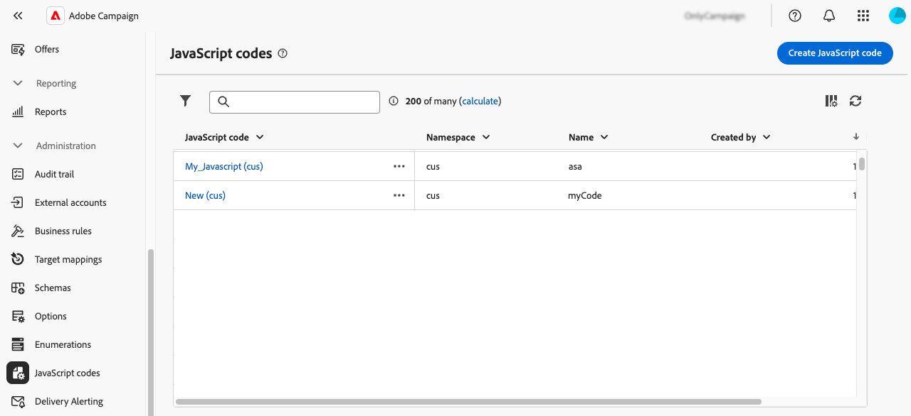
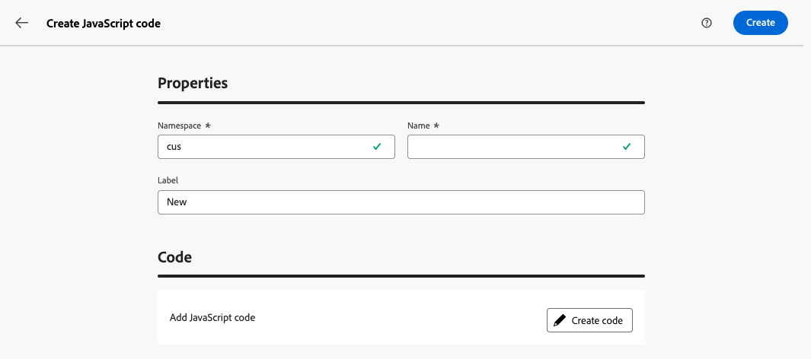
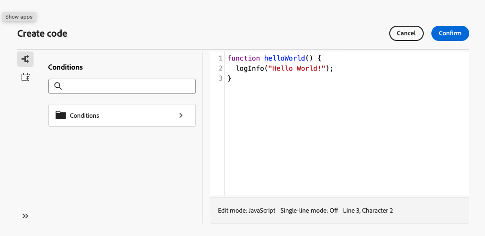
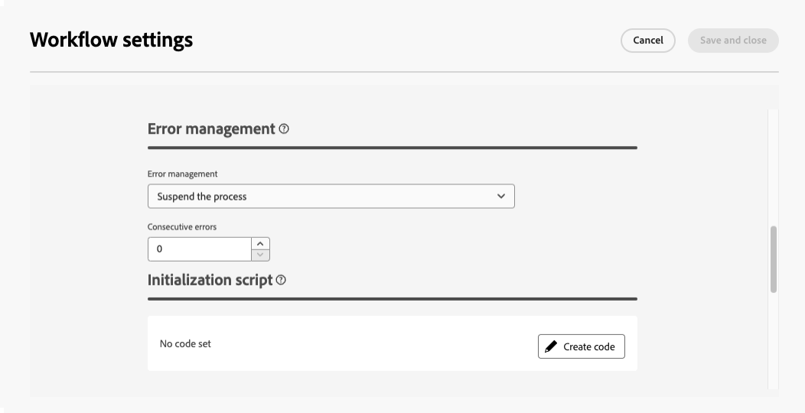
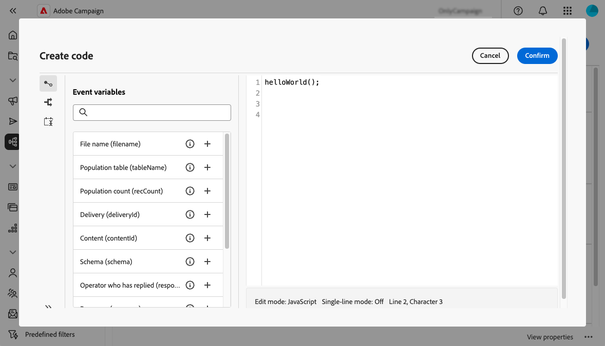

# Trabajo con códigos JavaScript {#javascript-codes}

>[!CONTEXTUALHELP]
>id="acw_javascript_codes_list"
>title="Códigos JavaScript"
>abstract="Los códigos JavaScript son funciones reutilizables que se pueden utilizar en todos los flujos de trabajo, de forma similar a una biblioteca. Desde esta lista, puede crear, modificar, duplicar o eliminar un código JavaScript."

>[!CONTEXTUALHELP]
>id="acw_javascript_codes_create"
>title="Crear código JavaScript"
>abstract="Defina un área de nombres, un nombre y una etiqueta para su código JavaScript y, a continuación, escriba su contenido utilizando las funciones predefinidas disponibles para las condiciones y el formato de fecha. Una vez creados, el área de nombres y el nombre no se pueden modificar."

>[!CONTEXTUALHELP]
>id="acw_dynamic_javascript_pages_list"
>title="Páginas dinámicas de JavaScript"
>abstract="Las páginas dinámicas de JavaScript (JSSP) le permiten crear páginas del lado del servidor que generan contenido dinámico cuando se accede a ellas a través de una dirección URL, como API personalizadas, exportaciones o lógica de aplicación web. Desde esta lista, puede crear, modificar, duplicar o eliminar una página dinámica de JavaScript."

>[!CONTEXTUALHELP]
>id="acw_dynamic_javascript_pages_create"
>title="Crear página de Dynamic JavaScript"
>abstract="Defina un área de nombres, un nombre y una etiqueta para su página dinámica de JavaScript y, a continuación, escriba su contenido con el código JavaScript. Una vez creados, el área de nombres y el nombre no se pueden modificar."

## Acerca de los códigos JavaScript {#about}

Los códigos JavaScript permiten crear funciones reutilizables que se pueden utilizar en distintos flujos de trabajo, de forma similar a una biblioteca. Estas funciones se almacenan en el menú **[!UICONTROL Administración]** > **[!UICONTROL Códigos JavaScript]** del panel de navegación izquierdo.



Desde la lista JavaScript codes, puede:

* **Duplicar o eliminar un código**: haga clic en el botón de puntos suspensivos y seleccione la acción que desee.
* **Modificar un código**: haga clic en el nombre de un código para abrir sus propiedades, realizar los cambios y guardar.
* **Crear un nuevo código JavaScript**: Haz clic en el botón **[!UICONTROL Crear código JavaScript]**.

>[!NOTE]
>
>Aunque la ubicación del menú de códigos JavaScript difiere entre la consola de Adobe Campaign y la interfaz de usuario web, la lista es idéntica y funciona como un reflejo.

## Creación de un código JavaScript {#create}

Para crear un código JavaScript, siga estos pasos:

1. Vaya al menú **[!UICONTROL JavaScript codes]** y haga clic en el botón **[!UICONTROL Crear código JavaScript]**.

1. Defina las propiedades del código:

   * **[!UICONTROL Espacio de nombres]**: especifique el espacio de nombres relevante para los recursos personalizados. De forma predeterminada, el área de nombres es &quot;cus&quot;, pero puede variar según la implementación.
   * **[!UICONTROL Nombre]**: El identificador único usado para hacer referencia al código.
   * **[!UICONTROL Etiqueta]**: La etiqueta descriptiva que se muestra en la lista de códigos JavaScript.

   

   >[!NOTE]
   >
   >Una vez creados, los campos **[!UICONTROL Namespace]** y **[!UICONTROL Name]** no se pueden modificar. Para realizar cambios, duplique el código y actualícelo según sea necesario.
   >
   >En la consola de Campaign, el nombre del código JavaScript aparece como una concatenación de estos dos campos.

1. Haga clic en el botón **[!UICONTROL Crear código]** para definir el código JavaScript. El panel izquierdo incluye dos menús que permiten utilizar funciones predefinidas relacionadas con las condiciones y el formato de fecha.

   

1. Haga clic en **[!UICONTROL Confirmar]** para guardar el código.

1. Cuando el código de JavaScript esté listo, haz clic en **[!UICONTROL Crear]**. El código JavaScript ya está disponible para su uso en todos los flujos de trabajo.

## Uso de un código JavaScript de un flujo de trabajo {#workflow}

### Carga de bibliotecas de código JavaScript {#library}

Puede hacer referencia a códigos JavaScript en los flujos de trabajo para evitar que se vuelva a escribir el código para tareas repetitivas. Para utilizar estos códigos, cargue la biblioteca correspondiente en el script de inicialización del flujo de trabajo. Esto le permite cargar una vez todas las bibliotecas que contienen las funciones que desea utilizar en el flujo de trabajo.

Para cargar una biblioteca, siga estos pasos:

1. Abra un flujo de trabajo y haga clic en el botón **[!UICONTROL Configuración]**.
1. Vaya a la sección **[!UICONTROL Script de inicialización]** y haga clic en **[!UICONTROL Crear código]**.

   

1. Utilice la sintaxis siguiente en el código para cargar una biblioteca:

   ```
   loadLibrary("/<namespace>/<name>")
   ```

   * Reemplace `<namespace>` por el área de nombres especificado durante la creación del código de JavaScript.
   * Reemplace `<name>` con el nombre del código JavaScript.

1. Haga clic en **[!UICONTROL Confirmar]** y guarde la configuración.

### Funciones de referencia en flujos de trabajo {#reference}

Una vez cargada la biblioteca JavaScript, puede hacer referencia a las funciones definidas en el código JavaScript directamente dentro del flujo de trabajo, por lo general mediante una actividad **[!UICONTROL JavaScript code]**.

