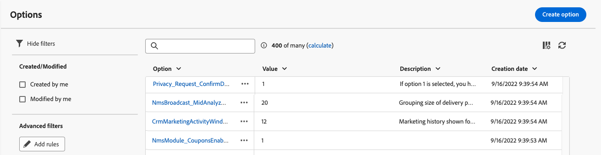

# Configurar opciones de [!DNL Campaign] {#options}

>[!CONTEXTUALHELP]
>id="acw_options_list"
>title="Opciones"
>abstract="Opciones"

>[!CONTEXTUALHELP]
>id="acw_options_create"
>title="Opción Crear"
>abstract="Opción Crear"

Adobe Campaign Web incluye opciones técnicas que permiten configurar las aplicación de forma más específica. Algunas de estas opciones están integradas, mientras que otras se pueden agregar manualmente según sea necesario.

>[!IMPORTANT]
>\
>Las opciones integradas están preconfiguradas y solo los usuarios avanzados deben modificarlas. Si tiene alguna pregunta o solicitud, póngase en contacto con su representante de Adobe.

## Opciones de Campaign de acceso {#access}

Opciones están disponibles en el **[!UICONTROL menú Administración]** / **[!UICONTROL Opciones]** . Utilice el panel de filtro para reducir la lista y localizar rápidamente la opción que necesite.

\
[Opciones lista muestran en el menú Administración / Opciones]

>[!NOTE]
>\
>Aunque la ubicación del menú de opciones difiere entre la consola de Adobe Campaign y la interfaz de usuario Web, la lista es idéntica y funciona gustar espejo. Para obtener más detalles sobre las opciones disponibles, consulte la lista de opciones en [Campaign documentación](https://experienceleague.adobe.com/en/docs/campaign-classic/using/installing-campaign-classic/appendices/configuring-campaign-options){target="_blank"} de v7.

Desde las opciones lista, puede:

* **Duplicar o eliminar una opción**: Haga clic en el botón de puntos suspensivos y seleccione la acción deseada.
* **Modificar una opción**: Haga clic en el nombre de la opción para abrir sus propiedades. Realice los cambios y guárdeles.
* **Crear una opción** personalizada: Haga clic en la **[!UICONTROL opción]** Crear botón.

## Crear una opción {#create}

La interfaz de Adobe Campaign Web usuario le permite crear opciones personalizadas que satisfagan sus necesidades. Esto es especialmente útil cuando se trabaja con código **JavaScript** flujo de trabajo actividades para tienda datos intermedios.

Para crear una opción:

1. Acceda al lista de opciones y haga clic en **[!UICONTROL Crear opción]**.
1. Introduzca un nombre para la opción, seleccione su tipo y defina el valor deseado.
1. Haga clic en **[!UICONTROL Crear]** para crear la opción.

Opciones puede actuar como almacenamiento temporal para los datos, ofreciendo los siguientes beneficios:

* Valores con tipo: Opciones admiten tipos de datos específicos, como fechas, enteros, cadenas, etc.
* Flexibilidad: Opciones permiten a los usuarios tienda y recuperar datos de manera eficiente sin la sobrecarga de administrar tablas de bases de datos.

En el siguiente ejemplo, se crea una opción personalizada denominada `sampleOption` con el valor inicial &quot;a&quot;. Un **[!UICONTROL código]** de JavaScript actividad en un flujo de trabajo modifica el valor de esta opción y lo almacena en un variable. El valor actualizado se muestra en los registros de flujo de trabajo y se refleja en el **[!UICONTROL menú Opciones]** .

1. Crear la opción.

   

1. Configure un **[!UICONTROL código de JavaScript]** actividad y inicio el flujo de trabajo.

   

1. Ejecute el flujo de trabajo para ver el valor actualizado en los registros de flujo de trabajo.

   

1. El valor actualizado ahora está visible en el menú Opciones **&#x200B;**.

   