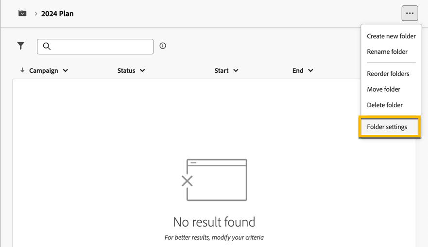
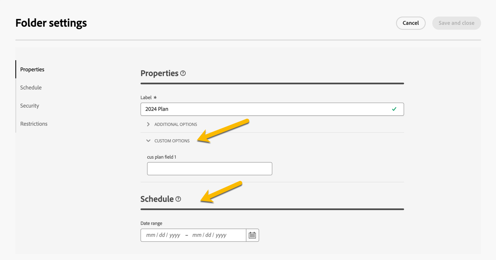
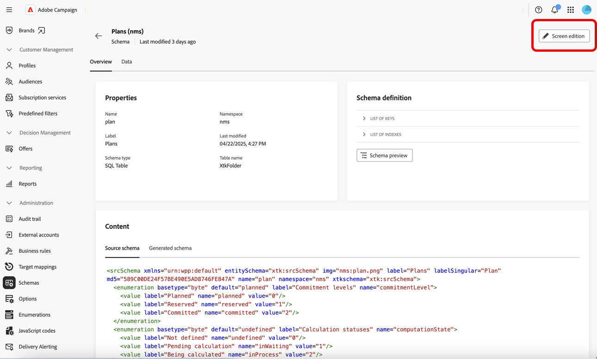
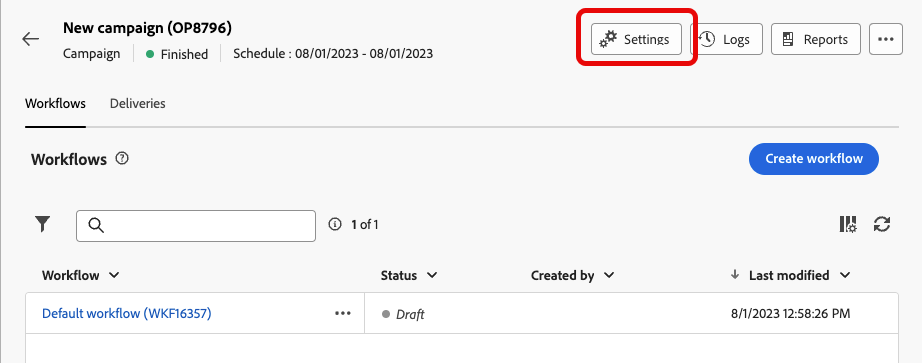

# Planes y programas {#plan-and-programs}

Adobe Campaign permite configurar la jerarquía de carpetas para planes y programas de marketing.

Para organizar mejor estos componentes, Adobe recomienda la siguiente jerarquía: Planificar `>` Programas `>` Campañas.

* Un **plan** puede contener varios programas. Define objetivos estratégicos para un periodo específico.
* Un **programa** puede contener otros programas, así como campañas, flujos de trabajo y páginas de destino.
* Una **campaña** puede contener envíos, flujos de trabajo y páginas de aterrizaje.

## Creación y configuración de un plan {#create-plan}

Para crear un plan, cree una carpeta con el tipo de carpeta **[!UICONTROL Plan]**. [Más información sobre cómo crear una carpeta](../get-started/work-with-folders.md)

{zoomable="yes"}

Vaya a la **[!UICONTROL configuración de la carpeta]** de su plan para administrarla.

{zoomable="yes"}

Defina **[!UICONTROL opciones personalizadas]** y establezca la fecha de horario de su plan.

{zoomable="yes"}

Para administrar **[!UICONTROL opciones personalizadas]**:

1. Vaya a **[!UICONTROL Esquemas]**.
1. Elija los **[!UICONTROL esquemas editables]** en los filtros.
1. Haga clic en el esquema.

{zoomable="yes"}

1. Haga clic en el botón **[!UICONTROL Edición de pantalla]**.

   {zoomable="yes"}

Configure las opciones personalizadas:

{zoomable="yes"}

## Creación y configuración de un programa {#create-program}

Los programas están disponibles en el menú de navegación de la izquierda, de forma similar a las vistas de lista de campañas, envíos y flujos de trabajo. La entrada **[!UICONTROL Programas]** permite crear un programa dentro de un programa existente, no bajo un plan.

Para crear su primer programa de nivel superior en un plan, navegue hasta su plan en el Explorador (consulte esta [sección](#create-plan)) y cree una carpeta con el tipo de carpeta **[!UICONTROL Programa]**. [Más información sobre cómo crear una carpeta](../get-started/work-with-folders.md).

Para crear un programa dentro de uno existente, siga los pasos a continuación:

1. Vaya a la entrada **[!UICONTROL Programas]** en el menú de navegación de la izquierda. Esta vista enumera todos los programas y le permite buscar y filtrar. Al hacer clic en un programa, se abre en la vista del explorador.

   {zoomable="yes"}

1. Haga clic en **[!UICONTROL Crear programa]** y configure las siguientes opciones:

   {zoomable="yes"}

   * Escriba una **[!UICONTROL etiqueta]**.
   * Seleccione el programa existente que se usará como **[!UICONTROL carpeta principal]**.
   * De manera opcional, establezca un **[!UICONTROL Intervalo de fechas]** en la sección **[!UICONTROL Programar]**.

   >[!TIP]
   >
   >Si crea un programa desde la vista del explorador, la carpeta principal se establece automáticamente en el programa actual.

1. Vuelva a hacer clic en **[!UICONTROL Crear programa]** para guardar los cambios y crear el programa. A continuación, el programa se muestra en la vista del explorador. Puede cambiarle el nombre, eliminarlo y acceder a su configuración, como cualquier otra carpeta. También puede crear programas secundarios dentro de este programa.

   {zoomable="yes"}

Las opciones personalizadas de un programa se configuran del mismo modo que para un plan. Ver [Crear y configurar un plan](#create-plan).

## Vinculación de una campaña a un programa

Tiene dos formas de vincular una campaña a un programa:

### Forma #1: ya tiene un programa y desea crear una campaña vinculada a él

Para vincular una nueva campaña al programa, cree la campaña directamente dentro del programa.

{zoomable="yes"}

La configuración de **[!UICONTROL Carpeta]** se rellenará automáticamente con la ruta de acceso a su programa.

{zoomable="yes"}

### Forma #2: ya tiene una campaña y desea vincularla a un programa existente

Vaya al botón **[!UICONTROL Configuración]** de la campaña que desea vincular a su programa.

{zoomable="yes"}

En sus **[!UICONTROL propiedades]**, haga clic en el icono **[!UICONTROL Carpeta]** en la configuración de **[!UICONTROL Carpeta]** para elegir la carpeta **[!UICONTROL Programa]**.

{zoomable="yes"}

Seleccione la carpeta **[!UICONTROL Programa]**, haga clic en el botón **[!UICONTROL Confirmar]** y, a continuación, haga clic en el botón **[!UICONTROL Guardar y cerrar]**.

{zoomable="yes"}

La campaña ahora aparece en el programa.

{zoomable="yes"}