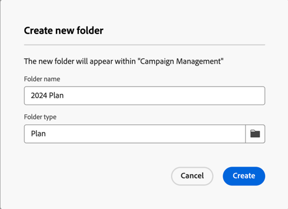

# Planes y programas {#plan-and-programs}

Adobe Campaign permite configurar la jerarquía de carpetas para planes y programas de marketing.

Para organizarlas mejor, Adobe recomienda la siguiente jerarquía: Planificar `>` Programas `>` Campañas

* Un **plan** puede contener varios programas. Define objetivos estratégicos para un período de tiempo.
* Un **programa** puede contener otros programas, así como campañas, flujos de trabajo y páginas de aterrizaje.
* Una **campaña** puede contener envíos, flujos de trabajo y páginas de aterrizaje.

## Creación y configuración de un plan {#create-plan}

Para crear un plan, debes crear una carpeta con el tipo de carpeta **[!UICONTROL Plan]** [Más información acerca de cómo crear una carpeta](../get-started/work-with-folders.md).

{zoomable="yes"}

Vaya a la **[!UICONTROL configuración de la carpeta]** de su plan para administrarla.

{zoomable="yes"}

Puede definir **[!UICONTROL opciones personalizadas]** y establecer la fecha de programación de su plan.

{zoomable="yes"}

Para administrar **[!UICONTROL opciones personalizadas]**:

1. Vaya a **[!UICONTROL Esquemas]**
1. Elija los **[!UICONTROL esquemas editables]** en los filtros
1. Haz clic en el icono de **[!UICONTROL Editar detalles personalizados]**

{zoomable="yes"}

Puede configurarlas:

{zoomable="yes"}

## Creación y configuración de un programa

Para crear un programa en tu plan ([Más información sobre cómo crear un plan](#create-plan)), debes estar en tu plan y crear una carpeta con el tipo de carpeta **[!UICONTROL Programa]** [Más información sobre cómo crear una carpeta](../get-started/work-with-folders.md).

{zoomable="yes"}

Vaya a la **[!UICONTROL configuración de carpeta]** de su programa para administrarla.

{zoomable="yes"}

Puede definir **[!UICONTROL opciones personalizadas]** y establecer la fecha de programación del programa.

{zoomable="yes"}

Para administrar **[!UICONTROL opciones personalizadas]**:

1. Vaya a **[!UICONTROL Esquemas]**
1. Elija los **[!UICONTROL esquemas editables]** en los filtros
1. Haz clic en el icono de **[!UICONTROL Editar detalles personalizados]**

{zoomable="yes"}

Puede configurarlas:

{zoomable="yes"}

## Vinculación de una campaña a un programa

Tiene dos formas de vincular una campaña a un programa:

### Forma #1: ya tiene un programa y desea crear una campaña vinculada a él

Para vincular una nueva campaña al programa, cree directamente la campaña en el programa:

{zoomable="yes"}

La configuración de **[!UICONTROL Carpeta]** se rellenará automáticamente con la ruta de acceso al programa.

{zoomable="yes"}

### Forma #2: ya tiene una campaña y desea vincularla a un programa existente

Vaya al botón **[!UICONTROL Configuración]** de la campaña que desea vincular a su programa:

{zoomable="yes"}

En sus **[!UICONTROL propiedades]**, haga clic en el icono **[!UICONTROL Carpeta]** en la configuración de **[!UICONTROL Carpeta]** para elegir la carpeta **[!UICONTROL Programa]**.

{zoomable="yes"}

Seleccione su carpeta **[!UICONTROL Programa]**, haga clic en el botón **[!UICONTROL Confirmar]** y luego en el botón **[!UICONTROL Guardar y cerrar]**.

{zoomable="yes"}

La campaña ahora aparece en el programa:

{zoomable="yes"}
