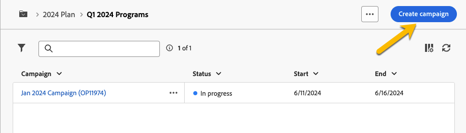
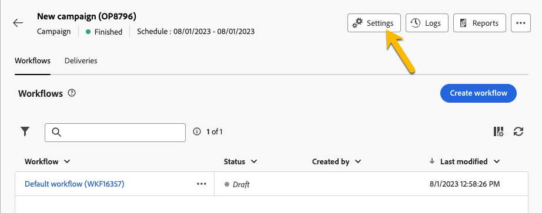

# Planes y programas

Adobe Campaign permite configurar la jerarquía de carpetas para planes y programas de marketing.

Para organizarlos mejor, Adobe recomienda la siguiente jerarquía: Plan `>` Programas `>` Campañas

* A **plan** puede contener varios programas. Define objetivos estratégicos para un período de tiempo.
* A **programa** puede contener otros programas, así como campañas, flujos de trabajo y páginas de aterrizaje.
* A **campaña** puede contener envíos, flujos de trabajo y páginas de aterrizaje.

## Creación y configuración de un plan {#create-plan}

Para crear un plan, debe crear una carpeta con el tipo de carpeta **[!UICONTROL Plan]** [Más información sobre la creación de una carpeta](create-manage-folder.md).

{zoomable="yes"}

Vaya a la **[!UICONTROL Configuración de carpeta]** de su plan para administrarlo.

{zoomable="yes"}

Puede definir **[!UICONTROL Opciones personalizadas]** y para establecer la fecha de programación del plan.

{zoomable="yes"}

Para administrar el  **[!UICONTROL Opciones personalizadas]**:

1. Vaya a la **[!UICONTROL Esquemas]**
1. Elija la **[!UICONTROL Editable]** esquemas en los filtros
1. Haga clic en el icono de **[!UICONTROL Editar detalles personalizados]**

{zoomable="yes"}

Puede configurarlas:

{zoomable="yes"}

## Creación y configuración de un programa

Para crear un programa en su plan ([Más información sobre la creación de un plan](#create-plan)), debe estar en su plan y crear una carpeta con el tipo de carpeta **[!UICONTROL Programa]** [Más información sobre la creación de una carpeta](create-manage-folder.md).

{zoomable="yes"}

Vaya a la **[!UICONTROL Configuración de carpeta]** de su programa para administrarlo.

{zoomable="yes"}

Puede definir **[!UICONTROL Opciones personalizadas]** y para establecer la fecha de programación del programa.

{zoomable="yes"}

Para administrar el  **[!UICONTROL Opciones personalizadas]**:

1. Vaya a la **[!UICONTROL Esquemas]**
1. Elija la **[!UICONTROL Editable]** esquemas en los filtros
1. Haga clic en el icono de **[!UICONTROL Editar detalles personalizados]**

{zoomable="yes"}

Puede configurarlos de la siguiente manera:

{zoomable="yes"}

## Vinculación de una campaña a un programa

Tiene dos formas de vincular una campaña a un programa:

### Forma #1 : Ya tiene un programa y desea crear una campaña vinculada a él

Para vincular una nueva campaña a su programa, cree directamente su campaña en el programa:

{zoomable="yes"}

El **[!UICONTROL Carpeta]** la configuración se rellenará automáticamente con la ruta del programa.

{zoomable="yes"}

### Forma #2 : ya tiene una campaña y desea vincularla a un programa existente

Vaya a la **[!UICONTROL Configuración]** de la campaña que desea vincular a su programa:

{zoomable="yes"}

En su **[!UICONTROL Propiedades]**, haga clic en **[!UICONTROL Carpeta]** en el menú **[!UICONTROL Carpeta]** , para poder elegir su **[!UICONTROL Programa]** carpeta.

{zoomable="yes"}

Seleccione su **[!UICONTROL Programa]** y haga clic en **[!UICONTROL Confirmar]** botón y, a continuación, en **[!UICONTROL Guardar y cerrar]** botón.

{zoomable="yes"}

La campaña ahora aparece en el programa:

{zoomable="yes"}