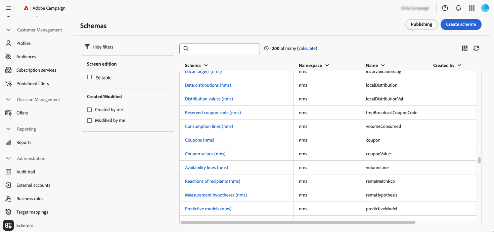
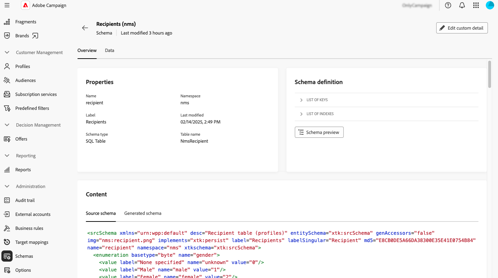
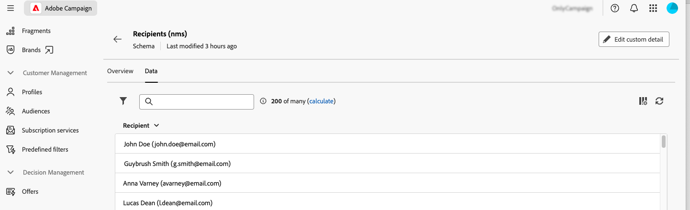
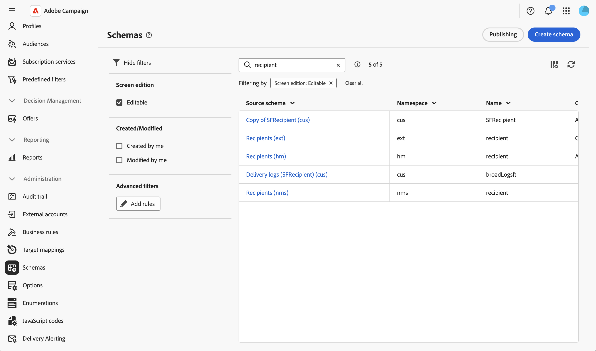
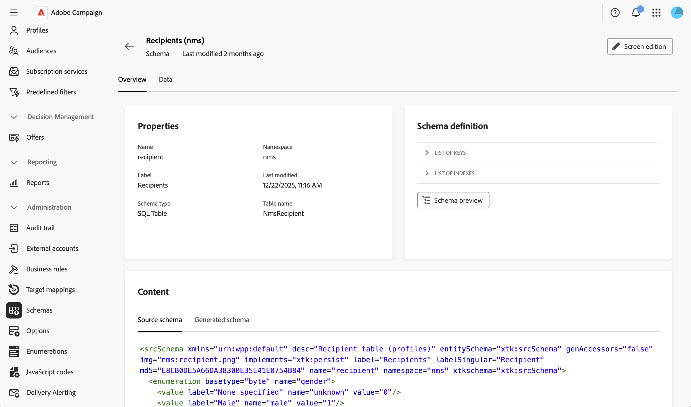
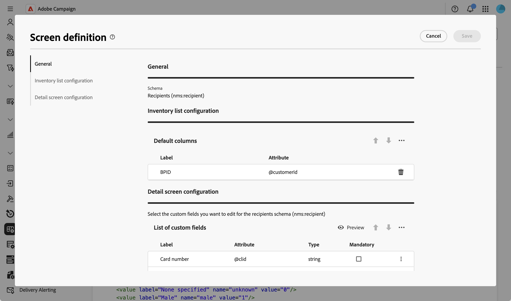

# Acceso y configuración de esquemas {#access}

Se puede acceder a los esquemas desde el menú **[!UICONTROL Administración]** > **[!UICONTROL Esquemas]**.

Desde esta pantalla, puede ver todos los esquemas existentes. Hay filtros disponibles para ayudarle a restringir la lista, como mostrar solo los esquemas editables.

Para abrir un esquema, seleccione su nombre. Se muestra una vista de esquema detallada.

## Resumen del esquema {#overview}

La ficha **[!UICONTROL Información general]** proporciona una vista general del esquema:

* La sección **[!UICONTROL Properties]** muestra información clave, como el nombre del esquema, el área de nombres y el nombre de la tabla asociada.

* La sección **[!UICONTROL Definición de esquema]** muestra detalles sobre la definición de esquema, incluida la clave principal utilizada para la reconciliación de datos y sus vínculos con otras tablas.

  Haga clic en el botón **[!UICONTROL Vista previa del esquema]** para ver los diferentes campos y vínculos que componen el esquema. Esto permite comprobar la estructura completa de un esquema. Si el esquema se ha ampliado con campos personalizados, puede visualizar todas sus extensiones.

* La sección **[!UICONTROL Content]** muestra el contenido XML del esquema, lo que le permite alternar entre el origen y la sintaxis generada.

## Datos de esquema {#data}

La ficha **[!UICONTROL Datos]** proporciona información sobre los datos del esquema.

## Personalizar visualización de pantalla {#screen-def}

La definición de pantalla permite configurar cómo se muestran y editan los campos de esquema en la interfaz. Puede configurar columnas predeterminadas para vistas de lista, personalizar qué campos personalizados se muestran en pantallas de detalles, agregar listas de recopilación para mostrar datos relacionados y organizar los campos en secciones con separadores y criterios de visibilidad.

Para acceder a la definición de pantalla:

1. Vaya al menú **[!UICONTROL Esquemas]** y busque esquemas editables mediante los filtros.

   

1. Seleccione el nombre del esquema en la lista para abrirlo y haga clic en el botón **[!UICONTROL Screen edition]** de la vista de detalles del esquema para acceder a la definición de pantalla.

   

   Las distintas listas permiten reordenar los elementos utilizando los iconos de flecha arriba y abajo o arrastrándolos y soltándolos. Para quitar elementos, haga clic en el icono de papelera de una fila específica o seleccione **[!UICONTROL Eliminar todo]** en el icono de puntos suspensivos.

   

Desde la definición de pantalla, puede:

* [Configurar columnas de lista predeterminadas](schemas-list-columns.md) - Configurar qué columnas se muestran de forma predeterminada en las vistas de lista.
* [Agregar filtros personalizados](schemas-custom-filters.md) - Agregar campos de filtro de acceso rápido en el panel de filtros de una vista de lista.
* [Editar campos personalizados](schemas-custom-fields.md): configure qué campos personalizados se muestran en pantallas de detalles y organícelos en secciones.
* [Agregar listas de colección](schemas-collection-lists.md) - Agregar listas de colección para mostrar datos relacionados en pantallas de perfil.
* [Acciones de control en los datos](schemas-action-data.md): restringe las acciones de creación, edición y eliminación para esquemas personalizados.

Para esquemas que alimentan una o más entradas en la navegación izquierda, como **nms:delivery** o **xtk:workflow**, la definición de pantalla también muestra una sección **[!UICONTROL Acceso de navegación lateral]**. Seleccione la casilla de verificación **[!UICONTROL Quitar el acceso al menú de]** correspondiente a una entrada de menú para ocultarla de la navegación izquierda para todos los usuarios de la instancia, independientemente de sus derechos de acceso individuales. Algunos esquemas activan varias entradas de menú: por ejemplo, **nms:delivery** se comparte mediante las entradas **[!UICONTROL Envíos]** y **[!UICONTROL Mensajes transaccionales]**, por lo que se muestra una casilla de verificación para cada una de ellas.
