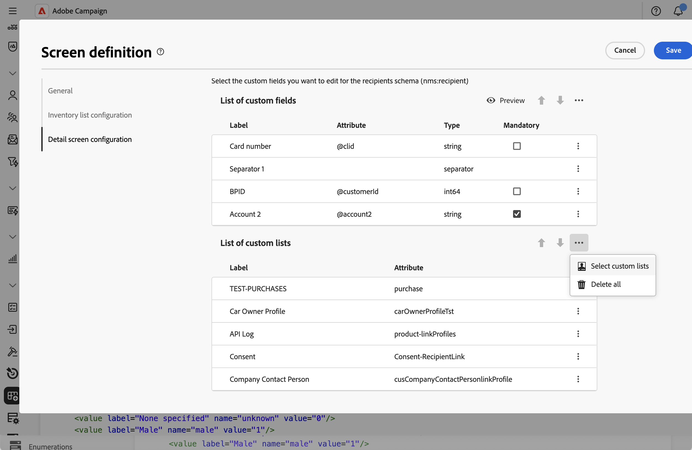
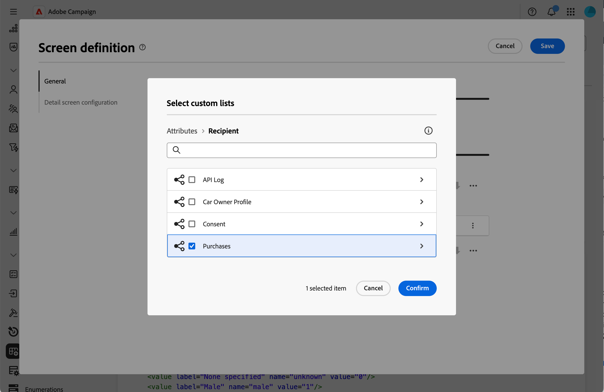
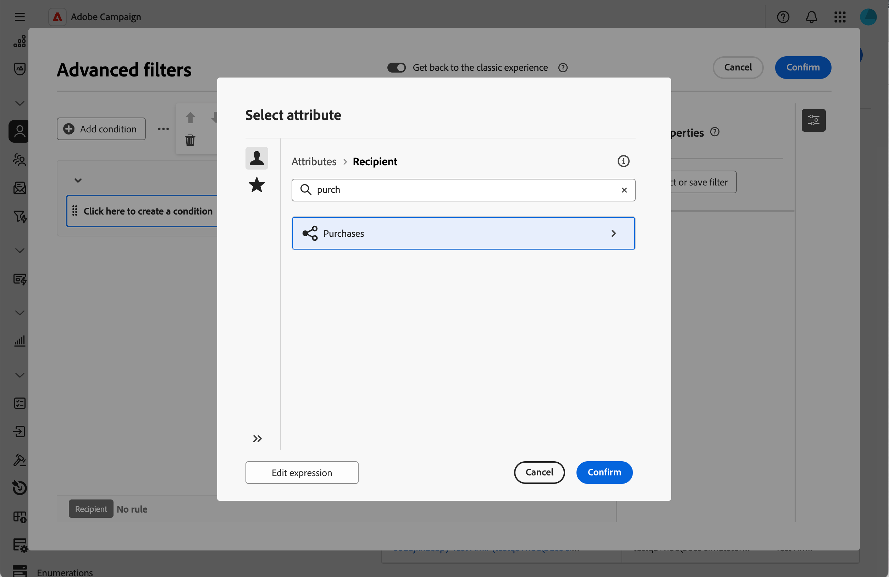
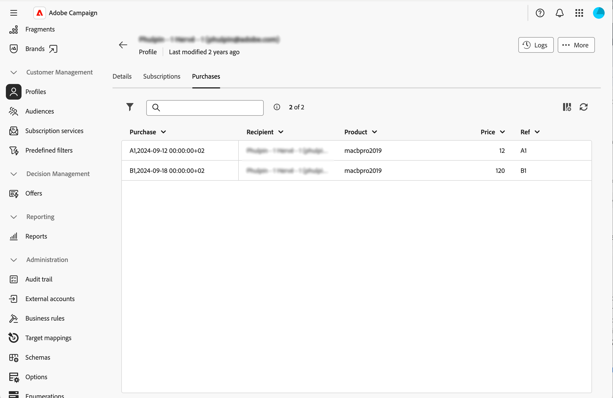

# Añadir listas de colección {#collection-lists}

La sección **Lista de listas personalizadas** le permite definir vínculos de colección, como compras. A continuación, los datos relacionados se muestran en pantallas de perfil a través de una pestaña dedicada.

Para obtener más información sobre la pantalla de definición de pantalla y cómo acceder a ella, consulte la sección [Acceder a la definición de pantalla](schemas-browse-access.md#screen-def).

>[!NOTE]
>
>Actualmente, esta capacidad solo está disponible para el esquema Recipients.

Para añadir listas de colecciones:

1. Vaya al menú **[!UICONTROL Esquemas]** y busque esquemas editables mediante los filtros.

1. Seleccione el nombre del esquema en la lista para abrirlo y haga clic en el botón **[!UICONTROL Screen edition]** de la vista de detalles del esquema para acceder a la definición de pantalla.

1. Haga clic en el icono de los tres puntos y elija **[!UICONTROL Seleccionar listas personalizadas]**.

   

1. Seleccione una de las listas personalizadas disponibles, por ejemplo, compras, luego haga clic en **[!UICONTROL Confirmar]**.

   

1. Vaya al menú **Perfiles** y filtre los perfiles que hayan realizado compras.

   

1. Haga clic en un perfil. Verá que se muestra la nueva pestaña. Puede agregar más columnas si es necesario.

   
