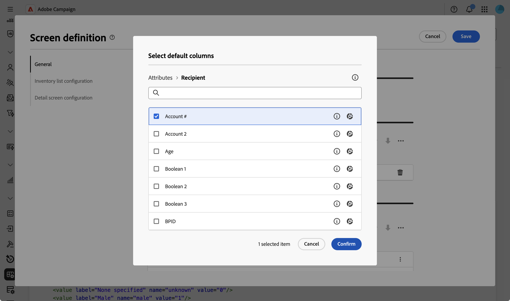

# Configurar columnas de lista {#list-columns}

>[!CONTEXTUALHELP]
>id="acw_schema_inventory_list_configuration"
>title="Configuración de lista de inventario"
>abstract="Configure qué columnas se muestran de forma predeterminada en las vistas de lista. Cada columna muestra su etiqueta y el atributo correspondiente."

La sección **[!UICONTROL Configuración de lista de inventario]** le permite configurar qué columnas se muestran de forma predeterminada en las vistas de lista. Cada columna muestra su etiqueta y el atributo correspondiente.

Para obtener más información sobre la pantalla de definición de pantalla y cómo acceder a ella, consulte la sección [Acceder a la definición de pantalla](schemas-browse-access.md#screen-def).

Para agregar nuevas columnas a la lista predeterminada:

1. Vaya al menú **[!UICONTROL Esquemas]** y busque esquemas editables mediante los filtros.

1. Seleccione el nombre del esquema en la lista para abrirlo y haga clic en el botón **[!UICONTROL Screen edition]** de la vista de detalles del esquema para acceder a la definición de pantalla.

1. Haga clic en el icono de tres puntos.
1. Elija **[!UICONTROL Seleccionar columnas]**.
   

1. Seleccione los atributos que desee mostrar en las vistas de lista y confirme.

   

1. Vaya al menú **Perfiles** para acceder a la vista de la lista de perfiles. Verá que se muestran las pestañas nuevas. Puede agregar más columnas si es necesario.

   
