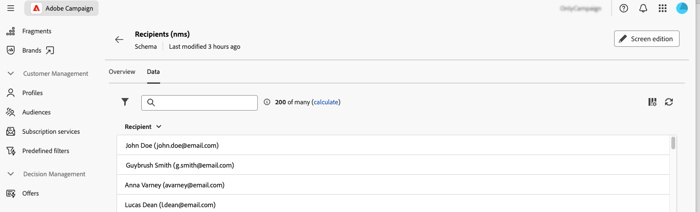

# Usar esquemas {#schemas}

>[!CONTEXTUALHELP]
>id="acw_homepage_welcome_rn3"
>title="Usar esquemas"
>abstract="Ahora puede acceder a los detalles de un esquema seleccionando su nombre en la lista. También puede acceder a la edición de campos personalizados en el botón **Editar detalle personalizado**."
>additional-url="https://experienceleague.adobe.com/docs/campaign-web/v8/release-notes/release-notes.html?lang=es" text="Consulte las notas de la versión"

>[!CONTEXTUALHELP]
>id="acw_schema"
>title="Esquemas"
>abstract="**[!DNL Adobe Campaign]** utiliza esquemas basados en XML para definir la estructura física y lógica de los datos dentro de la aplicación. Desde esta pantalla, puede ver todos los esquemas existentes y acceder a los detalles de un esquema seleccionando su nombre en la lista. Hay filtros disponibles para ayudarle a restringir la lista, como mostrar solo los esquemas editables."

## Acerca de los esquemas {#about}

**[!DNL Adobe Campaign]** utiliza esquemas basados en XML para definir la estructura física y lógica de los datos dentro de la aplicación. Un esquema es un documento XML vinculado a una tabla de base de datos que define lo siguiente:

* La estructura de la tabla SQL (nombre de tabla, campos, relaciones).
* La estructura de datos XML (elementos, atributos, jerarquía, tipos, valores predeterminados, etiquetas).

Los esquemas desempeñan un papel clave en:

* Asignación de datos de aplicación a tablas de base de datos.
* Definición de relaciones entre objetos de datos.
* Especificar la estructura y las propiedades de cada campo.

Cada entidad de Adobe Campaign tiene un esquema específico que garantiza la coherencia y la organización de los datos.

Encontrará información detallada sobre los esquemas en la [documentación de la consola de Campaign](https://experienceleague.adobe.com/en/docs/campaign/campaign-v8/developer/shemas-forms/schemas){target="_blank"}

## Acceso a esquemas en la interfaz de usuario web {#access}

Se puede acceder a los esquemas desde el menú **[!UICONTROL Administración]** > **[!UICONTROL Esquemas]**.

Desde esta pantalla, puede ver todos los esquemas existentes. Hay filtros disponibles para ayudarle a restringir la lista, como mostrar solo los esquemas editables.

Para abrir un esquema, seleccione su nombre. Se muestra una vista de esquema detallada.

### Resumen del esquema {#overview}

La ficha **[!UICONTROL Información general]** proporciona una vista general del esquema:

* La sección **[!UICONTROL Properties]** muestra información clave, como el nombre del esquema, el área de nombres y el nombre de la tabla asociada.

* La sección **[!UICONTROL Definición de esquema]** muestra detalles sobre la definición de esquema como la clave principal utilizada para la reconciliación de datos y sus vínculos con otras tablas.

  Haga clic en el botón **[!UICONTROL Vista previa del esquema]** para ver los diferentes campos y vínculos que componen el esquema. Esto permite comprobar la estructura completa de un esquema. Si el esquema se ha ampliado con campos personalizados, puede visualizar todas sus extensiones.

* La sección **[!UICONTROL Content]** muestra el contenido XML del esquema, lo que le permite alternar entre el origen y la sintaxis generada.

### Datos de esquema {#data}

La ficha **[!UICONTROL Datos]** proporciona información sobre los datos del esquema.

## Editar campos personalizados {#fields}

Los campos personalizados son atributos adicionales añadidos a los esquemas predeterminados a través de la consola de Adobe Campaign. Permiten personalizar esquemas incluyendo nuevos atributos para adaptarlos a las necesidades de la organización.

Los campos personalizados se pueden mostrar en varias pantallas, como los detalles del perfil, en la interfaz web de Campaign. Puede controlar qué campos son visibles y cómo aparecen en la interfaz. Para ello, haga clic en el botón **[!UICONTROL Editar detalle personalizado]** del menú **[!UICONTROL Esquemas]**.

Información detallada sobre cómo editar campos personalizados en un esquema, consulte esta sección: [Configurar campos personalizados](../administration/custom-fields.md).
