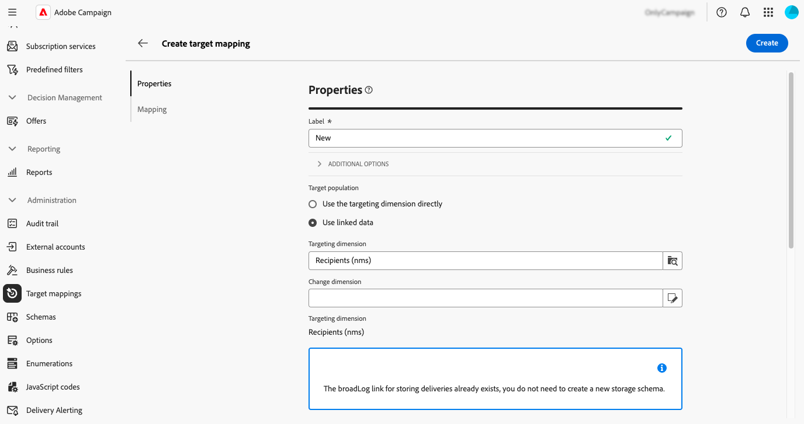

# Administrar asignaciones de público destinatario {#target-mappings}

>[!CONTEXTUALHELP]
>id="acw_homepage_welcome_rn5"
>title="Asignaciones de destino"
>abstract="Ahora puede crear asignaciones de público destinatario en la interfaz de usuario de Campaign Web. Las asignaciones de destino definen cómo los distintos canales de envío (correo electrónico, SMS, notificaciones push) vinculan los campos de datos de un esquema. "
>additional-url="https://experienceleague.adobe.com/docs/campaign-web/v8/release-notes/release-notes.html?lang=es" text="Consulte las notas de la versión"

>[!CONTEXTUALHELP]
>id="acw_targetmapping_list"
>title="Asignaciones de público destinatario "
>abstract="Asignaciones de público destinatario"

## Acerca de las asignaciones de destino {#about}

Cada canal de comunicación utiliza una asignación de destino predeterminada para dirigirse a sus destinatarios. Por ejemplo, de forma predeterminada, las plantillas de envíos de correo electrónico y SMS tienen como destino **[!UICONTROL Destinatarios]**. El destino de mapeo utiliza los campos de la tabla **nms:recipient.** Para las notificaciones push, la asignación de destino predeterminada es **Aplicaciones del suscriptor (nms:appSubscriptionRcp)**, que está vinculada a la tabla de destinatarios.

Se puede acceder a las asignaciones de destino desde el menú **[!UICONTROL Administración]** > **[!UICONTROL Asignaciones de destino]**. Desde esta pantalla, puede acceder a los detalles de cada asignación de destino o crear nuevas asignaciones de destino para adaptarlas a sus necesidades.

Para obtener más información sobre las asignaciones de destino integradas que se proporcionan con Adobe Campaign, consulte la [documentación de la consola del cliente de Campaign v8](https://experienceleague.adobe.com/docs/campaign/campaign-v8/audience/add-profiles/target-mappings.html?lang=es){target="_blank"}.

## Creación de una asignación de destino {#create-mapping}

>[!CONTEXTUALHELP]
>id="acw_targetmapping_properties"
>title="Propiedades de asignación de destinatario"
>abstract="La sección **[!UICONTROL Propiedades]** le permite definir la configuración genérica para la asignación de destino y la población de destino."

>[!CONTEXTUALHELP]
>id="acw_targetmapping_mapping"
>title="Asignación de destinatario"
>abstract="La sección **[!UICONTROL Asignación]** le permite identificar qué atributos del esquema de la asignación de destino se utilizarán para los distintos campos de direcciones de envío."

>[!CONTEXTUALHELP]
>id="acw_targetmapping_denylist"
>title="Lista de bloqueados de asignación de destinatario"
>abstract="Lista de bloqueados de asignación de destinatario"

>[!CONTEXTUALHELP]
>id="acw_targetmapping_storage"
>title="Almacenamiento de asignación de destinatario"
>abstract="La sección **[!UICONTROL Almacenamiento]** le permite identificar dónde se deben almacenar los registros."

Para crear una nueva asignación de destino, acceda al menú **[!UICONTROL Administración]** > **[!UICONTROL Asignaciones de destino]**. Haga clic en el botón **[!UICONTROL Crear asignación]** y, a continuación, siga los pasos detallados en las secciones siguientes.

1. En la sección **[!UICONTROL Propiedades]**, escriba una **[!UICONTROL Etiqueta]** para la asignación de destino.

1. Expanda la sección **[!UICONTROL Opciones adicionales]** para definir la configuración avanzada, como el nombre interno, la carpeta de almacenamiento y la descripción de la asignación de destino.

1. Seleccione la población objetivo. Puede:

   * **[!UICONTROL Usar la dimensión de segmentación directamente]**: seleccione la dimensión a la que se va a destinar directamente desde la lista de dimensiones disponibles.
   * **[!UICONTROL Usar datos vinculados]**: Comience desde una dimensión de segmentación (por ejemplo, suscripciones) y, a continuación, cambie a la dimensión de segmentación que desee segmentar (por ejemplo, destinatarios).

   

1. Si la dimensión seleccionada aún no se utiliza en una asignación de destino existente, es necesario crear esquemas para almacenar los registros. Hay opciones adicionales disponibles en la sección **[!UICONTROL Almacenamiento]**. Expanda la sección siguiente para obtener más detalles.

   +++Opciones de almacenamiento para nuevas dimensiones de segmentación

   1. **[!UICONTROL Espacio de nombres]**: identifique el espacio de nombres que se utilizará para crear los registros.
   1. **[!UICONTROL Sufijo del esquema de extensión]**: proporcione un sufijo para el nuevo esquema.

      En el ejemplo siguiente, el nombre del broadlog será &quot;cusbroadlogSupplier&quot;.

      

   1. **[!UICONTROL Registros de envío]**: active las opciones de esta sección para enriquecer los registros de envío con un campo de código de segmento o un campo que contenga la dirección IP de envío. Por ejemplo, guarde un código de segmento calculado durante el flujo de trabajo en los registros de envío para restringir el destinatario más adelante. Esto permite segmentar perfiles con este código de segmento específico.

   1. **[!UICONTROL Exclusiones]**: especifique cómo almacenar los registros de exclusiones.

   1. **[!UICONTROL Registros de seguimiento]**: active la opción **[!UICONTROL Generar un esquema para el seguimiento]** para generar un esquema de almacenamiento para los registros de seguimiento.

+++

1. Utilice la sección **[!UICONTROL Mapping]** para identificar qué atributos del esquema de la asignación de destino se utilizarán en cada campo de dirección de entrega. Para cada campo, seleccione el atributo que desee asignar. También puede crear una expresión para identificar el campo. Por ejemplo, aplique una función menor al atributo address.

   

1. Cuando la asignación de destino esté lista, haga clic en el botón **[!UICONTROL Crear]**. El sistema crea automáticamente la asignación de destino y todos los esquemas relacionados para los registros.

Una vez creada la asignación de destino, aparecen dos secciones adicionales en la pantalla:

* **[!UICONTROL Inclusión en la lista de bloqueados de]**: esta sección le permite identificar los atributos del esquema de la asignación de destino que se utilizarán para las listas de bloqueados de la.

  

* **[!UICONTROL Almacenamiento]**: esta sección le permite identificar las tablas que se utilizarán para almacenar registros.

  

   * **[!UICONTROL Esquema del mensaje]**: identifica el esquema que se va a utilizar para almacenar los registros de envío.
   * **[!UICONTROL Mensajes excluidos]**: especifica cómo administrar el almacenamiento de registros de envío y exclusión.

      * **[!UICONTROL Almacenar exclusiones y mensajes en la misma tabla]**
      * **[!UICONTROL Almacenar solo mensajes]**: no almacene exclusiones.
      * **[!UICONTROL Almacenar exclusiones y mensajes en tablas independientes]**: seleccione el esquema que se utilizará para almacenar los registros de exclusión en el campo **[!UICONTROL Esquema de rechazo]**.

   * **[!UICONTROL Registros de seguimiento]**: elige dónde almacenar los registros de seguimiento y el origen de tráfico predeterminado.
   * **[!UICONTROL Campos adicionales]**: especifique una lista de campos adicionales para almacenar en los registros de envío. Estos campos pueden almacenar permanentemente información sobre miembros individuales del destino (por ejemplo, `recipient/@firstName`) o almacenar datos adicionales calculados durante el flujo de trabajo (por ejemplo, `[targetData/@offeCode]`).

     Para ello, seleccione **[!UICONTROL Agregar campo]**. Identifique la información que desea guardar en el campo **[!UICONTROL Source]** y el atributo que se utilizará en los registros de envío para guardar esta información en el campo **[!UICONTROL Destino]**.

     {width="50%" zoomable="yes"}