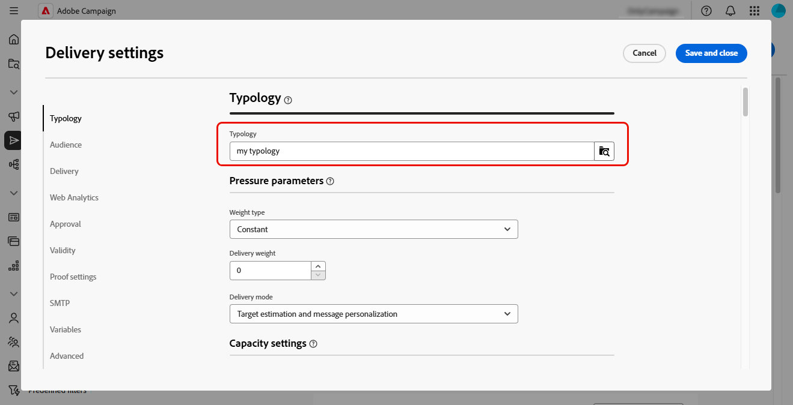

# Trabajo con reglas empresariales (tipologías) {#typologies}

>[!CONTEXTUALHELP]
>id="acw_homepage_welcome_rn1"
>title="Reglas empresariales"
>abstract="Ahora puede crear tipologías y reglas de tipología en la interfaz de usuario de Adobe Campaign Web. La tipología permite controlar, filtrar y priorizar los envíos."
>additional-url="https://experienceleague.adobe.com/docs/campaign-web/v8/release-notes/release-notes.html?lang=es" text="Consulte las notas de la versión"

>[!CONTEXTUALHELP]
>id="acw_business_rules"
>title="Tipologías y reglas de tipología"
>abstract="Las tipologías permiten estandarizar las prácticas empresariales en todos los envíos. Una tipología es un colección de reglas tipológicas que permite controlar, filtrar y priorizar el envío de envíos. Los perfiles que coinciden con criterios dentro de una reglas de tipología se excluyen de las audiencias envío durante la fase de preparación."

## Acerca de las tipologías

Las tipologías permiten estandarizar las prácticas empresariales en todos los envíos. Una **tipología** es un colección de reglas **tipológicas** que permite controlar, filtrar y priorizar el envío de envíos. Los perfiles que coinciden con criterios dentro de una reglas de tipología se excluyen de las audiencias envío durante la fase de preparación.

Las tipologías garantizan que las entregas siempre contengan determinados elementos, como un vínculo de baja o una línea de asunto, o reglas de filtrado para excluir grupos de los destinatarios deseados, como suscriptores que se han dado de baja, competidores o clientes que no sean fieles.

Se puede acceder a las tipologías mediante el > **[!UICONTROL de**[!UICONTROL  administración ]**Empresa menú de reglas]**. Desde esta pantalla, acceda a todas las tipologías y reglas de tipología existentes, o cree otras nuevas en función de sus necesidades.

>[!NOTE]
>
>El **[!UICONTROL lista reglas]** de tipología muestra todas las reglas existentes creadas hasta el momento en la interfaz Web del usuario o en la Consola del cliente. Sin embargo, sólo **se pueden crear reglas de control** y **filtrado** en la interfaz web del usuario. Para crear otros tipos de reglas de tipología, como reglas de presión o capacidad, utilice la consola de cliente de Campaign v8. [Aprenda a crear reglas de tipología en la consola del cliente](https://experienceleague.adobe.com/es/docs/campaign/automation/campaign-optimization/campaign-typologies){target="_blank"}

Los pasos principales para aplicar tipologías a sus mensajes son los siguientes:

1. [Crear una tipología](#typology).
1. [Crear reglas](#typology-rules) de tipología.
1. [Reglas de tipología de referencia en la tipología](#add-rules).
1. [Aplicar la tipología de un mensaje](#message).

## Creación de una topología {#typology}

>[!CONTEXTUALHELP]
>id="acw_business_rules_typology_properties"
>title="Propiedades de la tipología"
>abstract="Defina las propiedades de la tipología y expanda la sección **[!UICONTROL Opciones adicionales]** para acceder a la configuración avanzada. Utilice el campo **[!UICONTROL afinidad de IP]** para asociar afinidades de IP con tipologías. Esto permite controlar mejor el tráfico SMTP saliente definiendo qué direcciones IP específicas se pueden utilizar para cada afinidad."

>[!CONTEXTUALHELP]
>id="acw_business_rules_typology_ip_affinity"
>title="Afinidad de IP"
>abstract="La administración de afinidades con direcciones IP permite un mejor control del tráfico SMTP de salida mediante la asociación de distintas direcciones IP con cada tipo de tráfico en función de la tipología de su acción de envío."

Para crear una tipología, seguir estos pasos:

1. Desplácese al menú de reglas de Empresa y seleccione el pestaña Tipología ]****[!UICONTROL .****

1. Haga clic en el botón de **[!UICONTROL tipología]** de Crear e introduzca un **[!UICONTROL Etiquetar]** para la tipología.

1. Expanda la sección **[!UICONTROL Opciones adicionales]** para definir la configuración avanzada, como el nombre interno de la tipología, la carpeta de almacenamiento y la descripción.

   

   >[!NOTE]
   >
   >El **[!UICONTROL campo afinidad]** de IP permite asociar afinidades de IP con tipologías. Esto permite un mejor control de los tráfico SMTP salientes al definir qué direcciones IP específicas se pueden utilizar para cada afinidad. Por ejemplo, puede utilizar una afinidad por país o subdominio. A continuación, puede crear una tipología por país y vincular cada afinidad a la tipología correspondiente.

1. Haga clic en **[!UICONTROL Crear]** para confirmar la creación de la tipología.

Se abren los detalles de la tipología. Desde esta pantalla, haga referencia directamente a las reglas de tipología existentes o cree nuevas reglas de tipología para consultarlas más adelante:
* [Aprenda a crear una reglas de tipología](#add-rules)
* [Obtenga información sobre cómo hacer referencia a reglas en una tipología](#add-rules)

## Creación de una regla de tipología {#typology-rule}

>[!CONTEXTUALHELP]
>id="acw_business_rules_typology_rules_properties"
>title="Propiedades de la regla de tipología"
>abstract="Defina las propiedades de la regla de tipología. Las reglas de **Control** verifican la calidad y validez del mensaje previo al envío, mientras que las reglas de **Filtrado** excluyen segmentos del público destinatario de acuerdo con criterios específicos.  También puede cambiar el orden de ejecución de la regla para administrar la secuencia en la que se ejecutarán las reglas de tipología cuando se ejecuten varias reglas del mismo tipo durante la misma fase de procesamiento de mensajes."

Para crear una regla de tipología, vaya al menú **[!UICONTROL Reglas de negocio]** y luego seleccione la pestaña **[!UICONTROL Reglas de tipología]**.

Haga clic en el **[!UICONTROL botón reglas de tipología]** Crear y, a continuación, seguir los pasos que se detallan a continuación.

### Definir las propiedades del reglas de tipología {#properties}

Defina las propiedades del reglas de tipología:

1. Introduzca un **[!UICONTROL Etiquetar]** para el regla.

   

1. Seleccione el tipo ]**de**[!UICONTROL  reglas de tipología:

   * **Control**: garantiza la calidad y la validez del mensaje antes del envío, como la visualización de caracteres, la longitud del SMS, la formato de direcciones o el acortamiento URL. Estas reglas se crean utilizando una interfaz script para definir lógica compleja para comprobaciones y modificaciones de contenido.

   * **Filtrado**: excluye segmentos del audiencia de destino en función de criterios específicos, como la edad, la ubicación, el país o los números de teléfono. Estas reglas están vinculadas a una dimensión objetivo.

   >[!NOTE]
   >
   >Actualmente, solo **se pueden crear reglas de tipología de control** y **filtrado** desde la interfaz web del usuario. Para crear otros tipos de reglas, utilice la consola del cliente. [Aprenda a crear reglas de tipología en la consola del cliente](https://experienceleague.adobe.com/es/docs/campaign/automation/campaign-optimization/campaign-typologies){target="_blank"}

1. Seleccione un **[!UICONTROL canal]** para asociarlo a la regla.

1. Desactive la opción **[!UICONTROL Active]** si no desea que la regla esté activa inmediatamente después de su creación.

1. Defina el **[!UICONTROL orden de ejecución]** de la regla.

   De forma predeterminada, el orden de las reglas de tipología se establece en 50. Adapte este valor para administrar la secuencia en la que se ejecutarán las reglas de tipología cuando se ejecuten varias reglas del mismo tipo durante la misma fase de procesamiento de mensajes. Por ejemplo, una regla de filtrado con un orden de ejecución de 20 se ejecuta antes que una regla de filtrado con un orden de ejecución de 30.

1. Expanda la sección **[!UICONTROL Opciones adicionales]** para obtener acceso a la configuración avanzada, como el nombre interno de la regla, el almacenamiento de carpetas y la descripción.

1. Para las reglas de control, hay dos campos adicionales disponibles en las opciones adicionales. Especifique cuándo se debe aplicar la regla y su nivel de alerta:

   * **[!UICONTROL Fase]**: especifique en qué punto del ciclo de vida de la entrega se aplicará la regla. Seleccione el valor en la lista desplegable **[!UICONTROL Fase]**. Expanda la sección siguiente para obtener más detalles sobre los valores posibles.

   +++Fases de reglas de control:

   **[!UICONTROL Al inicio de direccionamiento]**: Evite que el paso personalización se ejecute en caso de errores.

   **[!UICONTROL Después de direccionamiento]**: Seleccione esta fase si necesita conocer el volumen del destino para aplicar el regla de control. Por ejemplo, la regla de control Comprobar **[!UICONTROL prueba tamaño]** se aplica después de cada direccionamiento fase. Este regla evita la personalización del mensaje si hay demasiados destinatarios prueba.

   **[!UICONTROL Al inicio de personalización]**: Seleccione esta fase si el control afecta a la aprobación de personalización de mensajes. La personalización del mensaje se lleva a cabo durante la fase de análisis.

   **[!UICONTROL Al final del análisis]**: Aplicar comprobaciones que requieran personalización mensaje completo.

+++

   * **[!UICONTROL Nivel]**: especifique el nivel de alerta para la regla. Amplíe la sección siguiente para obtener más información.

   +++Niveles de reglas de control:

   **[!UICONTROL Error]**: Parada la preparación del mensaje.

   **[!UICONTROL Advertencia]**: mostrar una advertencia en los registros de preparación.

   **[!UICONTROL Información]**: Mostrar información en los registros de preparación.

   **[!UICONTROL Detallado]**: muestra información en los registros del servidor.

+++

### Creación del contenido de la regla {#build}

>[!CONTEXTUALHELP]
>id="acw_business_rules_typology_rules_filtering"
>title="Filtrado"
>abstract="**Las reglas de filtrado** excluyen segmentos del destino audiencia en función de criterios específicos, como la edad, la ubicación, el país o los números de teléfono. Seleccione la dimensión de segmentación de la regla de tipología y haga clic en el botón **[!UICONTROL Añadir reglas]** para acceder al modelador de consultas y generar la regla."

>[!CONTEXTUALHELP]
>id="acw_business_rules_typology_rules_code"
>title="Código"
>abstract="**Las reglas de control** verifican la calidad y la validez del mensaje antes del envío, como la visualización de caracteres, la longitud del SMS, la formato de direcciones o la abreviación URL. Estas reglas se crean utilizando JavaScript código."

Una vez definidas las propiedades del reglas de tipología, versión el contenido del regla.

* En **Reglas** de control, haga clic en el botón código **de Editar** e introduzca la lógica del regla mediante JavaScript. En el siguiente ejemplo, se crea un regla para mostrar una advertencia en los registros si el destino está vacío.

  

* En **Reglas** de filtrado, seleccione el dimensión de segmentación y haga clic en el **[!UICONTROL botón reglas de añadir]** para definir criterios de filtrado mediante el [consulta modelador](../query/query-modeler-overview.md).

  

Cuando el regla esté listo, haga clic en el botón Crear **** para crear el reglas de tipología. Cite la regla en una tipología para aplicarla a los mensajes.

## Reglas de tipología de referencia en una tipología {#add-rules}

Para hacer referencia a una o varias reglas en una tipología, siga estos pasos:

1. Desplácese hasta el pestaña Tipología **** y abra la tipología a la que desee hacer referencia a los regla.

1. Seleccione el pestaña reglas de **[!UICONTROL tipología y haga clic en el**[!UICONTROL  botón añadir reglas de tipología ]**.]**

   

1. Seleccione una o varias reglas de tipología para asociarlas con la tipología y confirme.

   

1. Haga clic en **[!UICONTROL Guardar]**.

Ahora puede aplicar la tipología a los mensajes. Una vez finalizadas, se ejecutarán todas las reglas de tipología seleccionadas para realizar las comprobaciones definidas.

## Aplicar tipologías a los mensajes {#message}

Para aplicar una tipología a un mensaje o plantilla de mensaje, seleccione la tipología en la configuración del mensaje. [Obtenga información sobre cómo configurar los ajustes de envío](../advanced-settings/delivery-settings.md#typology)

Una vez aplicadas, se ejecutan las reglas de tipología incluidas en la tipología para comprobar la validez envío durante la preparación del mensaje. Los perfiles que coinciden con criterios dentro de una reglas de tipología se excluyen de las audiencias envío.