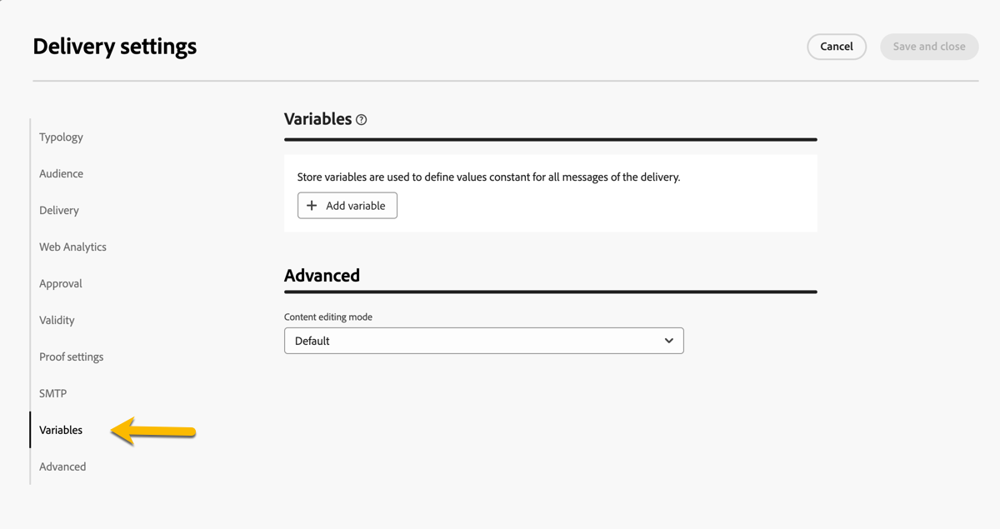

# Configuración del envío {#del-settings}

La configuración de envío es de **parámetros técnicos de envío** que se definen en la plantilla de envío. Se pueden sobrecargar para cada envío. Esta configuración está disponible en el botón **Configuración** disponible al editar una entrega o una plantilla de envíos.

>[!CAUTION]
>
>Esta configuración es solo informativa. Algunos ajustes dependen de la configuración y los permisos. No deben modificarse en esta versión del producto.

## Configuración de tipología {#typology}

>[!CONTEXTUALHELP]
>id="acw_email_settings_typology"
>title="Tipología"
>abstract="Las reglas de tipología permiten a los especialistas en marketing estandarizar las prácticas comerciales en todos los envíos. Una tipología es una colección de reglas de tipología que le permiten controlar, filtrar y priorizar la entrega de envíos. Los perfiles que coinciden con los criterios dentro de las reglas de tipología quedan excluidos de los públicos de envío en la fase de preparación."

>[!CONTEXTUALHELP]
>id="acw_delivery_template_settings_typology"
>title="Configuración de tipología para el envío"
>abstract="Las reglas de tipología permiten a los especialistas en marketing estandarizar las prácticas comerciales en todos los envíos. Una tipología es una colección de reglas de tipología que le permiten controlar, filtrar y priorizar la entrega de envíos. Los perfiles que coinciden con los criterios dentro de las reglas de tipología quedan excluidos de los públicos de envío en la fase de preparación."

Las tipologías son conjuntos de **reglas de tipología** que se ejecutan durante la fase de preparación para aplicar fácilmente varias reglas de filtrado a un envío a la vez. Permiten a los especialistas en marketing estandarizar las prácticas comerciales en todas las entregas, ya que les permiten controlar, filtrar y priorizar la entrega de entregas. [Aprenda a crear tipologías y reglas de tipología](../administration/typologies.md)

{zoomable="yes"}

### Parámetros de presión {#pressure-parameters}

>[!CONTEXTUALHELP]
>id="acw_email_settings_pressure_parameters"
>title="Parámetros de presión del envío"
>abstract="Los pesos del envío le permiten identificar los envíos de mayor prioridad dentro del marco de la administración de la fatiga. Los mensajes con mayor peso tienen prioridad."

>[!CONTEXTUALHELP]
>id="acw_delivery_template_settings_delivery_weight"
>title="Peso del envío"
>abstract="El peso del envío le permite identificar las entregas de mayor prioridad dentro del marco de la gestión de presión. Los mensajes con mayor peso tienen prioridad."

En esta sección, los parámetros de presión le permiten definir un **umbral** para configurar las reglas de administración de fatiga, que es el número máximo de mensajes que se pueden enviar a un perfil durante un periodo determinado.

Una vez alcanzado este umbral, no se pueden realizar más entregas hasta el final del periodo. Este proceso permite excluir automáticamente un perfil de un envío si un mensaje supera el umbral establecido, evitando así saturar al destinatario.

Los valores de umbral pueden ser constantes o variables. Esto significa que, para un periodo determinado, los umbrales pueden variar de un perfil a otro o incluso en un mismo perfil.

En el campo **[!UICONTROL Tipo de peso]**, hay tres opciones disponibles:

* **[!UICONTROL Constante]**
* **[!UICONTROL Según el destinatario]**
* **[!UICONTROL Definido en cada regla]**

Utilice el campo **[!UICONTROL Peso del envío]** para definir la prioridad de envío. Cada envío tiene un peso que representa su nivel de prioridad. De forma predeterminada, el peso de una entrega se establece en 5. Las reglas de presión permiten definir el peso de los envíos a los que se aplican. El peso puede ser fijo o calcularse mediante una fórmula para adaptarse a los destinatarios. Por ejemplo, puede definir el peso de un envío en función de los intereses del destinatario.

Utilice el campo **[!UICONTROL Modo de envío]** para seleccionar el modo de evaluación de destino.

Hay tres modos disponibles:

* **[!UICONTROL Estimación de destinatarios y personalización de mensajes]**
* **[!UICONTROL Estimación y aprobación de los destinatarios provisionales]**
* **[!UICONTROL Evaluación de los destinatarios]**

>[!NOTE]
>
>La administración de fatiga y las reglas de presión se configuran en la consola del cliente de Campaign. Obtenga más información en la [documentación de Campaign v8 (consola de cliente)](https://experienceleague.adobe.com/docs/campaign/automation/campaign-optimization/pressure-rules.html?lang=es){target="_blank"}.

### Configuración de la capacidad {#capacity-settings}

>[!CONTEXTUALHELP]
>id="acw_email_settings_capacity_settings"
>title="Configuración de la capacidad del envío"
>abstract="Antes de enviar mensajes, utilice reglas de capacidad para asegurarse de que su organización pueda procesar el envío, los mensajes entrantes que puede generar el envío y el número de llamadas que se realizan para ponerse en contacto con los suscriptores, por ejemplo. Las reglas de capacidad se definen en la consola de la versión 8 de Adobe Campaign. En esta pantalla, seleccione una regla asociada al canal."

>[!CONTEXTUALHELP]
>id="acw_delivery_template_settings_recipient_importance"
>title="Importancia del destinatario"
>abstract="La importancia del destinatario es una fórmula que se utiliza para determinar qué destinatarios se conservan cuando se exceden las reglas de tipología de capacidad."

En esta sección, puede seleccionar una regla de capacidad definida en la consola de Adobe Campaign v8. Esta regla está asociada al canal.

El campo **[!UICONTROL Importancia del destinatario]** es una fórmula que se usa para determinar qué perfiles se conservan cuando se exceden las reglas de tipología de capacidad.

>[!NOTE]
>
>Las reglas de tipología se configuran en la consola del cliente de Campaign. Obtenga más información en la [documentación de Campaign v8 (consola de cliente)](https://experienceleague.adobe.com/docs/campaign/automation/campaign-optimization/consistency-rules.html?lang=es){target="_blank"}.

## Configuración del público {#audience}

>[!CONTEXTUALHELP]
>id="acw_email_settings_audience"
>title="Configuración del público del envío"
>abstract="Seleccione una **asignación de destino** entre las disponibles. Las asignaciones de destino se definen en la consola de la versión 8 de Adobe Campaign. También puede definir los parámetros de exclusión del envío."

En esta sección, puede seleccionar una **asignación de destino** entre las disponibles. Las asignaciones de destino se definen en la consola de la versión 8 de Adobe Campaign. La asignación de destino es el tipo de datos que administra una operación. Permite definir la población objetivo: destinatarios, beneficiarios de contratos, operadores, suscriptores, etc. [Más información sobre las asignaciones de destino](../audience/targeting-dimensions.md).

En el campo **[!UICONTROL Exclusión]**, puede seleccionar excluir perfiles que ya no desean que se les contacte o que están en cuarentena. [Más información](https://experienceleague.adobe.com/docs/campaign/campaign-v8/send/failures/quarantines.html){target="_blank"}

## Entrega {#delivery}

>[!CONTEXTUALHELP]
>id="acw_email_settings_delivery"
>title="Configuración global del envío"
>abstract="Los parámetros de envío son las configuraciones técnicas que se aplican a su envío. Puede cambiar los modos de envío y rutina, activar el CCO del correo electrónico, enviar por olas y también elegir el formato de los mensajes de correo electrónico enviados. Estas opciones están restringidas únicamente a usuarios expertos."

Los parámetros **[!UICONTROL Envío]** son ajustes técnicos que se aplican a su envío.

{zoomable="yes"}

La cuenta externa integrada **[!UICONTROL Routing]** se proporciona de forma predeterminada. Contiene los parámetros técnicos que permiten a la aplicación realizar envíos.

Puede definir la configuración de **[!UICONTROL envío]** a continuación.

* **[!UICONTROL Prioridad de envío]**: use esta opción para cambiar el orden de envío de los envíos estableciendo su nivel de prioridad: normal, alto o bajo.

* **[!UICONTROL Cantidad de lotes de mensajes]**: utilice esta opción para definir el número de mensajes agrupados dentro del mismo paquete de entrega XML. Si el parámetro se establece en 0, los mensajes se agrupan automáticamente. El tamaño del paquete se define mediante el cálculo `<delivery size>/1024`, con un mínimo de 8 y un máximo de 256 mensajes por paquete.

  >[!IMPORTANT]
  >
  >Cuando se crea la entrega duplicando una existente, este parámetro se restablece.

* **[!UICONTROL Probar envío SMTP]** (canal de correo electrónico): esta opción se usa para probar el envío a través de SMTP. El correo electrónico se procesa hasta la conexión con el servidor SMTP, pero no se envía: para cada destinatario del correo electrónico, Campaign se conecta al servidor del proveedor SMTP, ejecuta el comando SMTP RCPT TO y cierra la conexión antes del comando SMTP DATA.

* **[!UICONTROL Correo electrónico CCO]** (canal de correo electrónico): esta opción se usa para almacenar correos electrónicos en un sistema externo a través de CCO simplemente agregando una dirección de correo electrónico CCO al destino del mensaje. Obtenga más información en la [documentación de Campaign v8 (consola de cliente)](https://experienceleague.adobe.com/docs/campaign/campaign-v8/send/emails/email-bcc.html?lang=es){target="_blank"}.

En la sección **[!UICONTROL Definición de onda]**, seleccione la opción **[!UICONTROL Enviar usando múltiples ondas]** para aumentar progresivamente el volumen enviado mediante ondas. Esto evitará que sus mensajes se marquen como correo no deseado o para limitar el número de mensajes por día. Mediante las oleadas puede dividir los envíos en varios lotes en lugar de enviar volúmenes altos de mensajes al mismo tiempo. [Más información](send-using-waves.md)

En el caso de los mensajes de correo electrónico, también puede cambiar los **[!UICONTROL formatos de correo]** de los mensajes enviados tal como se detalla a continuación.

* **[!UICONTROL Usar preferencias de destinatario]** (modo predeterminado): el formato de correo electrónico se define según los datos almacenados en el perfil de destinatario. Si un destinatario desea recibir correos electrónicos en un formato determinado, este es el formato enviado. Si el campo no está rellenado, se envía un correo electrónico multipart-alternative (consulte a continuación).

* **[!UICONTROL Permita que el cliente de correo del destinatario elija el formato más apropiado]**: El correo electrónico contiene ambos formatos: texto y HTML. El formato que se muestra al recibirlo depende de la configuración del software de correo del destinatario (multipart-alternative).

  >[!IMPORTANT]
  >
  >Esta opción incluye ambas versiones del documento. Por lo tanto, esto afecta a la tasa de entrega, ya que el tamaño del correo electrónico es mayor.

* **[!UICONTROL Enviar todos los mensajes en formato de texto]**: El correo electrónico se envía en formato de texto. El formato HTML no se envía, pero se utiliza solo para la página espejo cuando el destinatario hace clic en el correo electrónico.

## Análisis web {#web-analytics}

>[!CONTEXTUALHELP]
>id="acw_email_settings_webanalytics"
>title="Configuración de análisis web del envío"
>abstract="Seleccione una cuenta de análisis web. Esta cuenta se configura en la consola del cliente de Campaign. También puede definir las etiquetas compartidas con la herramienta de análisis que está utilizando."

En esta sección, puede seleccionar una cuenta de análisis web. Esta cuenta se configura en la consola del cliente de Campaign.

También puede definir las etiquetas compartidas con la herramienta de análisis que está utilizando.

>[!NOTE]
>
>Las funcionalidades de Web Analytics se configuran en la consola del cliente de Campaign. Obtenga más información en la [documentación de Campaign v8 (consola de cliente)](https://experienceleague.adobe.com/docs/campaign/campaign-v8/connect/ac-aa.html?lang=es#external-account-ac){target="_blank"}.

## Reintentos {#retries}

>[!CONTEXTUALHELP]
>id="acw_delivery_template_settings_retries"
>title="Número máximo de reintentos"
>abstract="Si un mensaje falla debido a un error temporal, se realizan reintentos hasta el final de la duración del envío."

<!--Currently not visible in UI > ??-->

Los mensajes no enviados temporalmente debido a un error leve o ignorado están sujetos a un reintento automático. De manera predeterminada, se programan cinco reintentos para el primer día del envío con un intervalo mínimo de una hora distribuidos durante las 24 horas del día.

## Aprobación (canal de correo electrónico) {#approval}

>[!CONTEXTUALHELP]
>id="acw_email_settings_approval"
>title="Modo de aprobación del envío"
>abstract="Seleccione el modo de aprobación. Si se generan advertencias durante la preparación del envío, se puede configurar el envío para definir si se debe ejecutar o no."

>[!CONTEXTUALHELP]
>id="acw_delivery_template_settings_approval"
>title="Modo de aprobación de los envíos"
>abstract="Seleccione el modo de aprobación de los envíos basados en esta plantilla. Si se generan advertencias durante la preparación del envío, se puede configurar el envío para definir si se debe ejecutar o no."

Si se generan advertencias durante la preparación de una entrega de correo electrónico, puede configurar la entrega para definir si se debe ejecutar o no. De forma predeterminada, el usuario debe confirmar el envío de correos electrónicos al final de la fase de análisis: esta es la validación **manual**.

Puede seleccionar otro modo de aprobación en el campo correspondiente. Los modos disponibles son los siguientes:

* **[!UICONTROL Manual]**: al final de la fase de análisis, el usuario debe confirmar el envío para iniciarlo.
* **[!UICONTROL Semiautomático]**: el envío se realiza automáticamente si la fase de análisis no genera mensajes de advertencia.
* **[!UICONTROL Automático]**: el envío se realiza automáticamente al final de la fase de análisis, sin importar el resultado.

## Validez {#validity}

>[!CONTEXTUALHELP]
>id="acw_email_settings_validity"
>title="Validez de la configuración"
>abstract="El campo **Duración del envío** permite introducir el límite de los reintentos de envío global. Esto significa que Adobe Campaign envía los mensajes comenzando en la fecha de inicio y, a continuación, para los mensajes que devuelven solo un error se realizan reintentos normales y configurables hasta que se alcanza el límite de validez. El campo **Vigencia de los recursos** se utiliza para los recursos cargados, como la página espejo y las imágenes. Una vez alcanzado el límite, los recursos ya no están disponibles."

>[!CONTEXTUALHELP]
>id="acw_delivery_template_settings_resources_validity"
>title="Vigencia de los recursos"
>abstract="El campo **Vigencia de los recursos** se utiliza para los recursos cargados, principalmente para la página espejo y las imágenes. Estos recursos son válidos durante un tiempo limitado: una vez alcanzado el límite, los recursos ya no están disponibles."

>[!CONTEXTUALHELP]
>id="acw_delivery_template_settings_delivery_duration"
>title="Duración del envío"
>abstract="El campo **Duración del envío** permite introducir el límite de los reintentos de envío global. Esto significa que Adobe Campaign envía los mensajes comenzando en la fecha de inicio y, a continuación, para los mensajes que devuelven solo un error se realizan reintentos normales y configurables hasta que se alcanza el límite de validez."

<!--
>[!CONTEXTUALHELP]
>id="acw_email_settings_resources_validity"
>title="Resources validity limit"
>abstract="The Validity limit field is used for uploaded resources, such as the mirror page or images. These resources are valid for a limited time: once the limit is reached, resources are no longer available."
-->

### Período de validez {#validity-period}

El campo **[!UICONTROL Duración del envío]** permite introducir el límite de los reintentos de envío global. Esto significa que Adobe Campaign envía los mensajes comenzando en la fecha de inicio y, a continuación, para los mensajes que devuelven solo un error se realizan reintentos normales y configurables hasta que se alcanza el límite de validez.

Asimismo, puede especificar fechas. Para ello, seleccione **[!UICONTROL Establecer explícitamente las fechas de validez]**. En este caso, las fechas de envío y de límite de validez también permiten especificar el tiempo. El tiempo actual se utiliza de forma predeterminada, pero puede modificarse directamente en el campo de entrada.

**[!UICONTROL Límite de validez de los recursos]** se usa para los recursos cargados, principalmente para la página espejo y las imágenes. Los recursos de esta página son válidos durante un tiempo limitado (para ahorrar espacio en el disco). Después de este límite, estos recursos ya no están disponibles.

{zoomable="yes"}

<!--Change screenshot to be consistent with prod > not sure which version is correct-->

Obtenga más información acerca del período de validez de la entrega en la [documentación de Campaign v8 (consola de cliente)](https://experienceleague.adobe.com/docs/campaign/campaign-v8/campaigns/send/failures/delivery-failures.html?lang=es#validity-period){target="_blank"}.

### Administración de páginas espejo (canal de correo electrónico) {#mirror}

La página espejo es una página HTML accesible en línea mediante un navegador web. Su contenido es idéntico al del correo electrónico. De forma predeterminada, la página espejo se genera si el vínculo se inserta en el contenido del correo electrónico.

Además del modo predeterminado, también están disponibles las siguientes opciones:

* **[!UICONTROL Forzar la generación de la página espejo]**: utilice este modo para generar la página espejo aunque no se inserte ningún vínculo a la página espejo en el correo electrónico.
* **[!UICONTROL No generar la página espejo]**: utilice este modo para evitar generar una página espejo, aunque el vínculo esté presente en el correo electrónico.
* **[!UICONTROL Genera una página espejo accesible solamente con el identificador del mensaje]**: Cuando el vínculo de la página espejo no esté presente en el contenido del correo electrónico, use esta opción para habilitar el acceso al contenido de la página espejo, en la ventana del registro de envío, desde la consola del cliente.

### Seguimiento {#tracking}

<!--
>[!CONTEXTUALHELP]
>id="acw_email_settings_tracking_validity"
>title="Validity period"
>abstract="This option defines the duration for which the tracking is activated on the URLs."
-->

>[!CONTEXTUALHELP]
>id="acw_delivery_template_settings_tracking_validity"
>title="Período de validez"
>abstract="El período de vigencia establece la duración durante la cual se activa el seguimiento en las direcciones URL de los mensajes."

Los parámetros **[!UICONTROL Tracking]** se definen en la sección relacionada. Las opciones posibles son:

* **[!UICONTROL Límite de validez de seguimiento]**: utilice esta opción para cambiar la duración durante la cual se activa el seguimiento en las direcciones URL.
* **[!UICONTROL URL de sustitución para direcciones URL caducadas]**: utilice esta opción para introducir una dirección URL en una página web de reserva: se muestra una vez que ha caducado el seguimiento.

## Configuración de prueba {#test-setttings}

>[!CONTEXTUALHELP]
>id="acw_email_settings_testsettings"
>title="Defina la configuración de prueba del envío"
>abstract="Seleccione los parámetros de exclusión y personalice la etiqueta de las pruebas."

<!--Test to be replaced with Proof everywhere - currently not consistent within UI > changed to Proof to reflect UI here but not consistent in documentation either-->

Puede establecer los parámetros de exclusión en esta sección. Las opciones disponibles son las siguientes:

* **[!UICONTROL Mantener dobles]** le permite autorizar varios envíos a perfiles que cumplan varios criterios de segmentación.
* **[!UICONTROL Mantener las direcciones incluidas en la lista de bloqueados]** permite excluir de los destinatarios los perfiles a los que ya no se dirige el envío, por ejemplo, tras una cancelación de baja (exclusión).
* **[!UICONTROL Mantener direcciones en cuarentena]** permite excluir del destinatario cualquier perfil con una dirección que no responde.

También puede personalizar la etiqueta de las pruebas:

* Use **[!UICONTROL Mantener el código de envío de la prueba]** para asociar a la prueba el mismo código de envío que el definido para la entrega con el que se relaciona.
* De forma predeterminada, el asunto de la prueba lleva el prefijo &quot;PROOF #&quot;, donde # es el número de la prueba. Se puede cambiar este prefijo en el campo **[!UICONTROL Prefijo de la etiqueta]**.

## Configuración de SMS (canal SMS) {#sms-tab}

>[!CONTEXTUALHELP]
>id="acw_sms_delivery_settings"
>title="Configuración del envío de SMS"
>abstract="Los parámetros de envío son las configuraciones técnicas que se aplican al envío de SMS. Puede definir la dirección del remitente, los parámetros de servicio, el modo de transmisión y mucho más. Estas opciones están restringidas únicamente a usuarios expertos."

Los parámetros de envío son las configuraciones técnicas que se aplican al envío de SMS. Puede definir la dirección del remitente, los parámetros de servicio, el modo de transmisión y mucho más. Estas opciones están restringidas únicamente a usuarios expertos.

<!--

* **[!UICONTROL Sender address]**

  The field is limited to 21 characters by the SMPP specification, but some providers may allow longer values. Note also that very strict restrictions may be applied in some countries (length, content, allowed characters, …), so you may need to double-check that the content you place here is legal. Be especially careful when using personalized fields.

  This optional field allows you to override the sender address (oADC). Its content is placed in the *source_addr* field of the SUBMIT_SM PDU.

  Although the SMPP specification limits this field to 21 characters, some providers may support longer values. Be aware that certain countries impose strict regulations on sender addresses (regarding length, content, allowed characters, etc.), so always verify that your input complies with local requirements. Use extra caution when working with personalized fields.

  If this field is left empty, the value of the Source number field defined in the external account will be used instead. If both values are empty, the *source_addr* field will be left empty.

-->

* **[!UICONTROL Tipo de servicio]**:

  Este parámetro se pasa al proveedor tal cual.

* **[!UICONTROL ID de servicio o programa]**

  >[!NOTE]
  >
  >Se desaconseja el uso de este campo. Los parámetros SMPP opcionales, disponibles en la consola del cliente, proporcionan una implementación mucho más flexible.
  >
  >Este campo no se puede utilizar simultáneamente con parámetros SMPP opcionales.

  En combinación con la configuración de cuenta externa correspondiente, permite enviar un parámetro opcional con cada MT. Este campo define la parte de valor del TLV.

* **[!UICONTROL Modo de transmisión]**

  Este campo define el tipo de SMS que se va a enviar: si es un mensaje normal o flash, y si debe almacenarse en el dispositivo móvil o en la tarjeta SIM. Esta configuración se transmite en el campo opcional dest_addr_subunit de la PDU SUBMIT_SM.

   * **Flash** establece el valor en 1. Envía un SMS flash que aparece inmediatamente en la pantalla y no se almacena.
   * **Normal** establece el valor en 0. Envía un SMS estándar.
   * **Guardado en el móvil** establece el valor en 2. Indica al dispositivo que almacene el SMS en la memoria interna.
   * **Guardado en el terminal** establece el valor en 3. Indica al dispositivo que almacene el SMS en la tarjeta SIM.

* **[!UICONTROL Prioridad, tipo de comunicación]**

  El conector SMPP extendido ignora estos campos.

* **[!UICONTROL Número máximo de SMS por mensaje]**

  Esta configuración solo es efectiva si la opción Carga útil del mensaje está desactivada (consulte la configuración de la cuenta externa para obtener más información). Si el mensaje requiere más SMS que este valor, se activa un error.

  Aunque el protocolo SMS permite dividir los mensajes en hasta 255 partes, algunos dispositivos móviles pueden tener problemas para volver a montar los mensajes con más de 10 partes (el límite depende del modelo del dispositivo). Para mayor fiabilidad, es mejor limitar los mensajes a 5 partes o menos.

  Tenga en cuenta que, debido al funcionamiento de los mensajes personalizados en Adobe Campaign, los tamaños de los mensajes pueden variar. Un número elevado de mensajes largos puede resultar en un aumento de los costes de envío, por lo que el uso de un límite razonable ayuda a controlar los gastos.

  Si este valor se establece en 0, se deshabilita el límite.

* **[!UICONTROL Parámetros SMPP opcionales (TLV)]**

  Puede especificar campos adicionales para enviarlos como parámetros SMPP opcionales (TLV). Estos campos adicionales se envían con cada MT y los campos personalizados permiten tener valores diferentes para cada MT.
En la tabla se enumeran los parámetros opcionales que se envían con cada mensaje. Las columnas contienen la siguiente información:

   * **Etiqueta**: se trata de una etiqueta opcional de forma libre. No se transmite al proveedor. Puede proporcionar una descripción textual del parámetro.
   * **Tag**: el valor de la etiqueta, ya sea en formato decimal (p. ej., 12345) o hexadecimal con prefijo 0x (p. ej., 0x12ab). Las etiquetas pueden ir entre 0 y 65535. Solicite al proveedor de servicios SMPP las etiquetas compatibles.
   * **Value**: valor que se enviará en el parámetro opcional. Este es un campo personalizado.
   * **Formato**: codificación utilizada para el parámetro. Puede seleccionar cualquier codificación de texto compatible o los formatos binarios más comunes. Solicite al proveedor de servicios SMPP el formato requerido.
   * **Longitud máxima**: Número máximo de bytes para este parámetro. Esto se ignora para los campos binarios, ya que estos tienen un tamaño fijo.

  **Usando formatos binarios para TLV**

  Campaign admite el envío de TLV en formato binario. El binario se limita a enviar números.

  Dado que los campos personalizados siempre muestran texto, el campo personalizado debe contener una representación decimal del número (cualquier cadena es correcta, siempre que solo contenga dígitos). Los valores pueden estar firmados o no, el motor de personalización solo los convierte en la representación binaria correcta.

  Cuando se utilizan formatos binarios, los valores especiales &#39;&#39; (cadena vacía), &#39;null&#39; y &#39;undefined&#39; desactivan el campo completamente sin generar un error. En estos 3 casos especiales, la etiqueta no se pasa en absoluto. Esto permite pasar un TLV específico solo para algunos mensajes cuando se utiliza JavaScript cuidadosamente diseñado en el campo de personalización.

  >[!NOTE]
  >
  >Los formatos binarios siempre se codifican en forma de big endian.

## Configuración de SMTP para envío de correo electrónico {#smtp}

>[!CONTEXTUALHELP]
>id="acw_email_settings_smtp"
>title="Parámetros de SMTP"
>abstract="Puede añadir parámetros SMTP adicionales a su envío de correo electrónico."

Puede añadir parámetros SMTP adicionales a su envío de correo electrónico. Puede hacerlo en la pestaña SMTP de la configuración de entrega.

{zoomable="yes"}

### Codificación de caracteres {#character-encoding}

La sección **[!UICONTROL Codificación de caracteres]** le permite establecer una codificación específica. La codificación predeterminada es UTF-8, que funciona para la mayoría de los caracteres. Sin embargo, es posible que algunos proveedores de correo electrónico no muestren los caracteres especiales correctamente si no admiten la codificación estándar UTF-8.

Por ejemplo, si desea enviar un correo electrónico con caracteres japoneses, es mejor utilizar una codificación que admita específicamente esos caracteres para que la audiencia de Japón pueda ver todo correctamente.

Para ello, active la opción **[!UICONTROL Force the encoding used for messages]** y seleccione la codificación correcta en la lista que admite los caracteres especiales.

{zoomable="yes"}

### Correos electrónicos rechazados {#bounce-emails}

La pestaña **[!UICONTROL SMTP]** de la configuración de entrega también le permite configurar la administración de los correos electrónicos rechazados.

* **[!UICONTROL Errores a la dirección]**: Si activa la opción **[!UICONTROL Usar la dirección de error predeterminada definida para la plataforma]**, los correos electrónicos rechazados se reciben en el cuadro de error predeterminado de la plataforma. Si no lo activa, puede definir una dirección de error específica para la entrega.

* **[!UICONTROL Dirección de rechazo]**: también puede definir otra dirección a la que se reenviarán los mensajes de correo electrónico rechazados sin procesar. Esta dirección permite investigar las razones de la devolución cuando la aplicación no pudo calificar automáticamente los correos electrónicos.

Estos dos campos se pueden personalizar tal como se describe en [esta sección](../personalization/gs-personalization.md).

{zoomable="yes"}

### Encabezados SMTP adicionales {#smtp-headers}

Puede agregar **[!UICONTROL encabezados SMTP]** a su envío de correo electrónico, en la pestaña SMTP de la configuración de envío.

El script especificado en esta ventana debe hacer referencia a un encabezado por línea en el siguiente formulario: name:value.

Los valores se codifican automáticamente si es necesario.

{zoomable="yes"}

>[!IMPORTANT]
>
>La adición de secuencias de comandos para insertar encabezados SMTP se reserva para usuarios avanzados. La sintaxis de esta secuencia de comandos debe cumplir con los requisitos de este tipo de contenido: no dejar espacios sin utilizar, ninguna línea vacía, etc.

## Adición de variables {#variables-delivery}

>[!CONTEXTUALHELP]
>id="acw_delivery_settings_variable"
>title="Variables"
>abstract="Puede añadir variables al envío, que pueden ser útiles para el seguimiento y la personalización. Se puede acceder a estas variables desde el contenido del envío y los flujos de trabajo."

Puede añadir variables al envío, que pueden ser útiles para el seguimiento y la personalización. Se puede acceder a estas variables desde el contenido de la entrega y los flujos de trabajo. Las variables almacenadas se utilizan para establecer valores que permanecen constantes en todos los mensajes dentro de la entrega. También se pueden configurar en plantillas de envío.

Para agregar una variable, vaya a la pestaña **[!UICONTROL Variables]**, como se muestra a continuación.

{zoomable="yes"}

Haga clic en el botón **[!UICONTROL Agregar variables]** para escribir los detalles de la variable. Puede agregar directamente su valor o utilizar una expresión para él activando la casilla de verificación **[!UICONTROL El valor es el resultado de una expresión]**. A continuación, haga clic en **[!UICONTROL Confirmar]** para guardar los cambios.

{zoomable="yes"}

Más información acerca de [usar variables para la personalización](../personalization/personalize.md#variables-personalization) y [usar variables para el contenido dinámico](../personalization/conditions.md#variables-conditional).