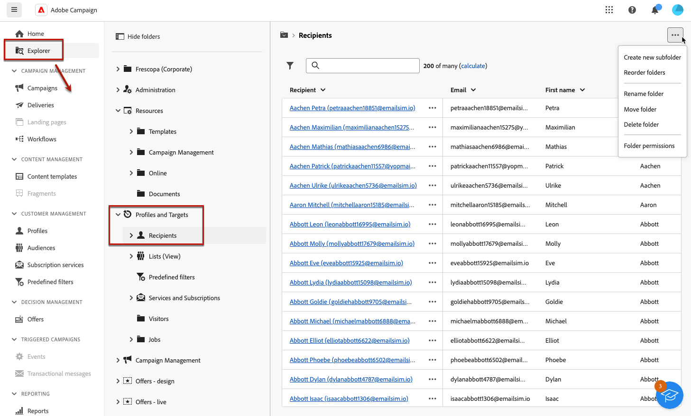
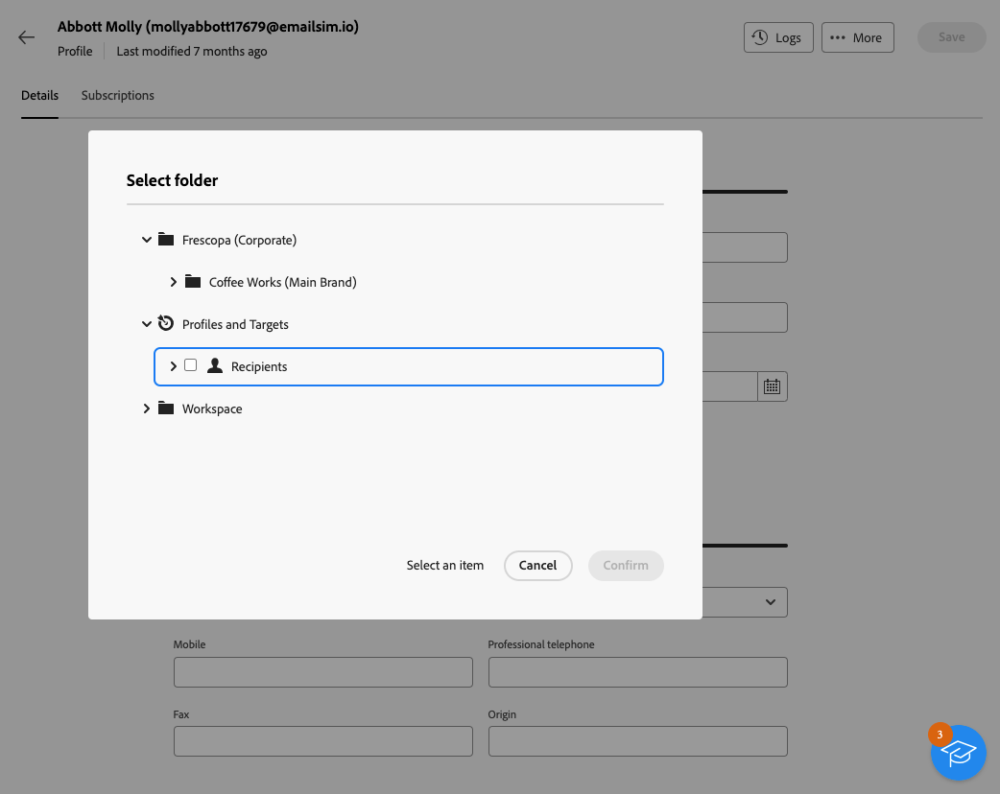
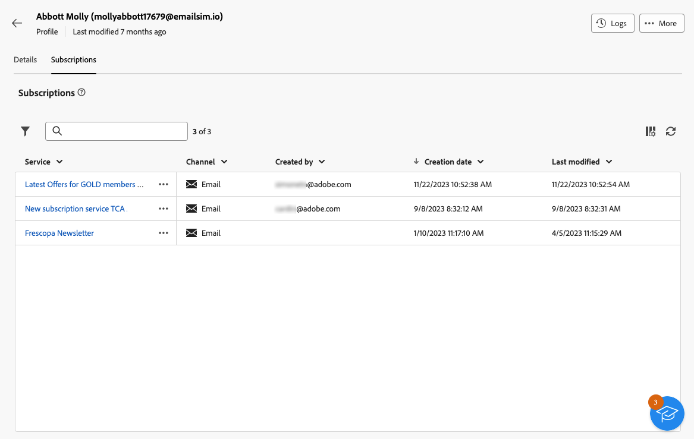

# Monitorizar y administrar perfiles {#profiles}

>[!CONTEXTUALHELP]
>id="acw_homepage_welcome_rn4"
>title="Vista 360 de sus perfiles"
>abstract="Cree nuevos perfiles y monitorícelos con potentes informes y herramientas. Acceda a los atributos, interacciones y registros de sus perfiles. Utilice las opciones de filtrado para examinar la lista de perfiles y editar y actualizar su perfil."
>additional-url="https://experienceleague.adobe.com/docs/campaign-web/v8/whats-new.html?lang=es" text="Consulte las notas de la versión"

<!--TO REMOVE BELOW-->
>[!CONTEXTUALHELP]
>id="acw_homepage_rn4"
>title="Vista 360 de sus perfiles"
>abstract="Cree nuevos perfiles y monitorícelos con potentes informes y herramientas. Acceda a los atributos, interacciones y registros de sus perfiles. Utilice las opciones de filtrado para examinar la lista de perfiles y editar y actualizar su perfil."
>additional-url="https://experienceleague.adobe.com/docs/campaign-web/v8/whats-new.html?lang=es" text="Consulte las notas de la versión"

<!--TO REMOVE ABOVE-->

>[!CONTEXTUALHELP]
>id="acw_recipients_list"
>title="Perfiles"
>abstract="Un perfil es una persona que está destinada a recibir mensajes enviados por Adobe Campaign. En esta lista, puede ver los detalles de los perfiles en función de sus permisos. Utilice las opciones de filtrado para examinar esta lista. Puede editar y actualizar un pequeño conjunto de atributos de los perfiles."

## Introducción a los perfiles {#gs}

Un perfil en Adobe Campaign Web es una persona almacenada en la base de datos y que sirve como componente clave para [crear audiencias](create-audience.md) para entregas y [añadir personalización](../personalization/personalize.md) datos en el contenido.

En la base de datos se almacenan otros tipos de perfiles, como **[!UICONTROL Perfiles de prueba]**, diseñadas para probar los envíos antes de enviarlos a la audiencia final. [Más información](test-profiles.md)

Los perfiles solo se pueden crear desde la consola del cliente de Adobe Campaign: [descubra cómo](https://experienceleague.adobe.com/docs/campaign/campaign-v8/audience/add-profiles/create-profiles.html){target="_blank"}. Sin embargo, son accesibles y editables en Adobe Campaign Web desde el **[!UICONTROL Administración de clientes]** > **Perfiles** en el carril de navegación izquierdo.

>[!NOTE]
>
>Según los permisos, es posible que no tenga acceso a la lista completa de perfiles almacenados en la base de datos. [Más información sobre los permisos](../get-started/permissions.md).

* Puede filtrar la variable **[!UICONTROL Perfiles]** mediante el campo de búsqueda o filtros disponibles en la lista **Mostrar filtros** botón. Puede restringir los resultados a un específico [carpeta](../get-started/permissions.md#folders) mediante la lista desplegable o agregue reglas utilizando la variable [modelador de consultas](../query/query-modeler-overview.md).

  

* Para eliminar un perfil, seleccione la opción correspondiente en la **[!UICONTROL Más acciones]** menú.

* Para editar un perfil, haga clic en el elemento que desee en la lista. [Más información](#access)

También puede acceder a los perfiles a través del **[!UICONTROL Explorer]** vista, desde el **[!UICONTROL Perfiles y objetivos]** > **[!UICONTROL Destinatarios]** nodo.

Desde allí puede examinar, crear y administrar carpetas o subcarpetas, así como comprobar los permisos asociados. [Obtenga información sobre cómo crear carpetas](../get-started/permissions.md#folders)

Desde el **[!UICONTROL Explorer]** vista también puede filtrar, eliminar y [editar](#access) perfiles.

## Acceder y editar atributos de perfiles {#access}

>[!CONTEXTUALHELP]
>id="acw_recipients_creation_details"
>title="Detalles básicos"
>abstract="Esta sección ofrece detalles básicos del perfil. Para modificar cualquier información, realice los cambios directamente en el campo correspondiente y haga clic en el botón **Guardar**, situado en la esquina superior derecha de la pantalla."

>[!CONTEXTUALHELP]
>id="acw_recipients_creation_contactinformation"
>title="Información de contacto"
>abstract="Esta sección ofrece detalles sobre la información de contacto del perfil. Para modificar cualquier información, realice los cambios directamente en el campo correspondiente y haga clic en el botón **Guardar**, situado en la esquina superior derecha de la pantalla."

>[!CONTEXTUALHELP]
>id="acw_recipients_creation_address"
>title="Dirección"
>abstract="Esta sección ofrece detalles sobre la dirección postal del perfil y la calidad de la dirección. Para modificar cualquier información, realice los cambios directamente en el campo correspondiente y haga clic en el botón **Guardar**, situado en la esquina superior derecha de la pantalla."

>[!CONTEXTUALHELP]
>id="acw_recipients_creation_account"
>title="Detalles de la cuenta"
>abstract="Esta sección ofrece información sobre los detalles de la cuenta del perfil. Para modificar cualquier información, realice los cambios directamente en el campo correspondiente y haga clic en el botón **Guardar**, situado en la esquina superior derecha de la pantalla."

>[!CONTEXTUALHELP]
>id="acw_recipients_creation_nolongercontact"
>title="Destinatarios Ya no hay contacto"
>abstract="Esta sección ofrece detalles sobre las preferencias de contacto del perfil. Para modificar cualquier información, realice los cambios directamente en el campo correspondiente y haga clic en el botón **Guardar**, situado en la esquina superior derecha de la pantalla."

>[!CONTEXTUALHELP]
>id="acw_recipients_creation_customfields"
>title="Campos personalizados"
>abstract="Los campos personalizados son atributos específicos adaptados a sus necesidades que se han configurado para su instancia. Para modificar cualquier información, realice los cambios directamente en el campo correspondiente y haga clic en el botón **Guardar**, situado en la esquina superior derecha de la pantalla."

>[!CONTEXTUALHELP]
>id="acw_recipients_creation_othersfields"
>title="Otros"
>abstract="Esta sección proporciona atributos integrados adicionales. Para modificar cualquier información, realice los cambios directamente en el campo correspondiente y haga clic en el botón **Guardar**, situado en la esquina superior derecha de la pantalla."

>[!CONTEXTUALHELP]
>id="acw_recipients_subscription_list"
>title="Lista de suscripciones de destinatarios"
>abstract="Esta pestaña enumera todos los servicios a los que está suscrito el perfil."

Para acceder a los detalles de un perfil y editarlos, siga los pasos a continuación.

1. Navegar a **[!UICONTROL Administración de clientes]** > **[!UICONTROL Perfiles]** y haga clic en el elemento que desee en **[!UICONTROL Perfiles]** lista.

   

1. Se muestra información detallada sobre el perfil.

   El **[!UICONTROL Detalles]** permite examinar los atributos integrados y personalizados del perfil. Para editar un atributo, realice cambios en el campo deseado y haga clic en **[!UICONTROL Guardar]** botón.

   

   1. De forma predeterminada, los perfiles se almacenan en **[!UICONTROL Destinatarios]** carpeta. Puede cambiarlo navegando a la ubicación deseada. [Aprenda a trabajar con carpetas](../get-started/permissions.md#folders)

      

   1. En el **[!UICONTROL Información de contacto]** , puede actualizar la dirección de correo electrónico y otros datos relevantes. La dirección de correo electrónico se muestra entre corchetes después de la etiqueta de perfil.

      

   1. Compruebe la **[!UICONTROL Ya no se puede contactar]** y actualícelas si es necesario. Cuando se selecciona cualquiera de estas opciones, el perfil se encuentra en la lista de bloqueados de la. Por ejemplo, si el destinatario hace clic en un vínculo para darse de baja de un boletín, esta información se agrega a los datos de contacto. Este destinatario ya no está dirigido a los canales seleccionados. [Más información](https://experienceleague.adobe.com/docs/campaign/campaign-v8/send/failures/quarantines.html){target="_blank"}

      

   1. Si hay **[!UICONTROL Campos personalizados]**, puede actualizar sus valores según sea necesario. Los campos personalizados son atributos adicionales añadidos a **[!UICONTROL Perfiles]** mediante la consola de Adobe Campaign. [Más información](https://experienceleague.adobe.com/docs/campaign/campaign-v8/developer/shemas-forms/extend-schema.html){target="_blank"}

      

1. Haga clic en **[!UICONTROL Suscripciones]** para acceder a la información sobre los servicios a los que está suscrito el perfil. [Más información sobre los servicios de suscripción](manage-services.md)

   

1. Haga clic en **[!UICONTROL Registros]** situado en la esquina superior derecha de la pantalla para ver el historial de las interacciones del perfil mediante el envío, la exclusión y los registros de seguimiento. [Más información sobre los registros de envío](../monitor/delivery-logs.md)

   También puede revisar las ofertas presentadas al perfil en la **[!UICONTROL Propuestas]** pestaña. [Más información sobre las ofertas](../msg/offers.md)

   
