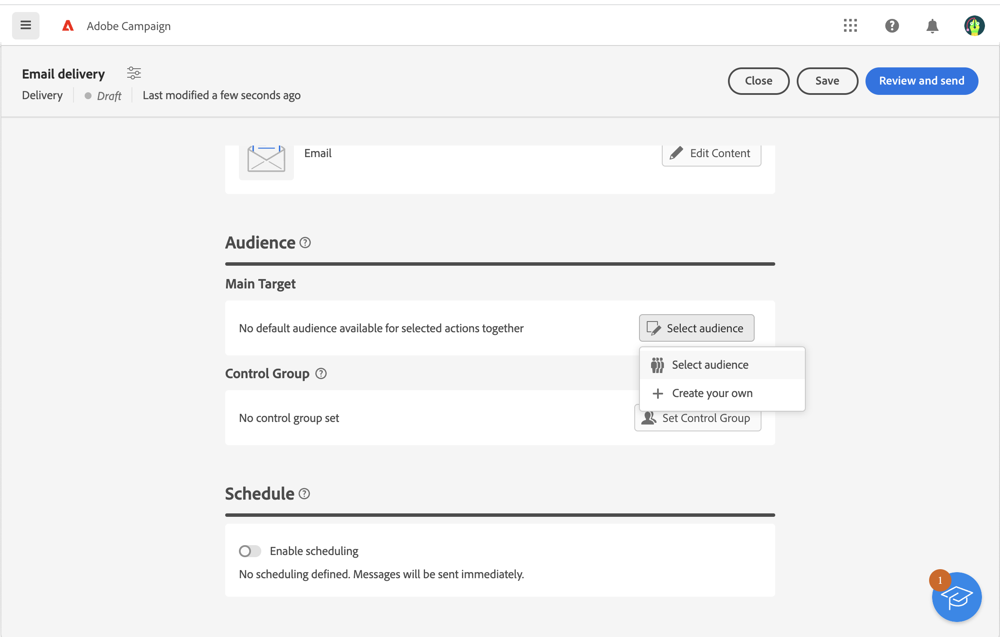
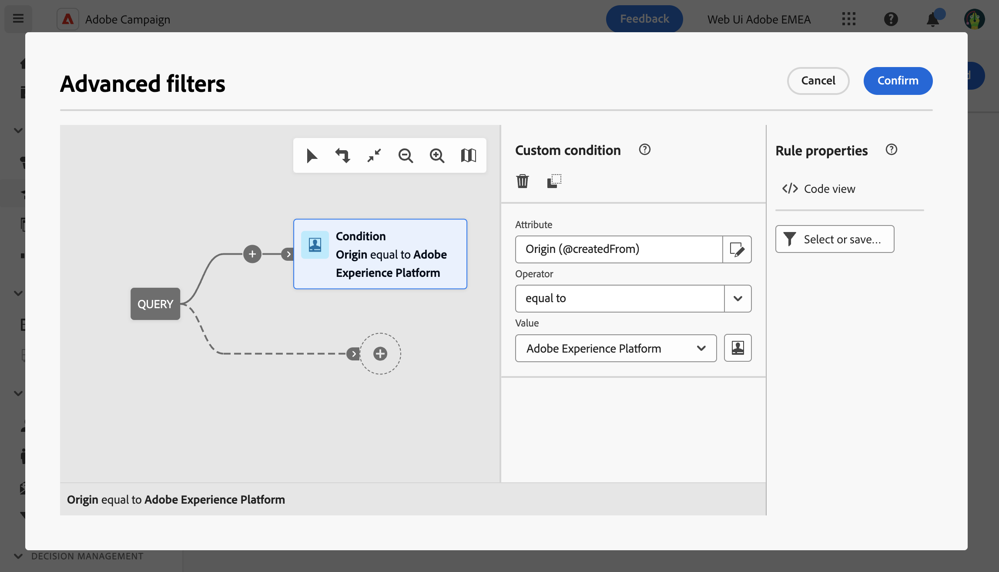

# Usar un público de Adobe Experience Platform{#aep-audience}

Los conectores Origen y Destino del Cloud Service administrado de Adobe Campaign permiten una integración perfecta entre Adobe Campaign y Adobe Experience Platform.

Una vez creada una audiencia de Adobe Experience Platform y disponible en la consola del cliente, puede utilizarla del mismo modo que lo haría para que una audiencia de Campaign personalice y envíe mensajes.

>[!NOTE]
>
>Para utilizar audiencias de Adobe Experience Platform en Campaign, debe configurar la integración con Fuentes y destinos de Adobe. Consulte [Documentación de Campaign v8 (consola de cliente)](https://experienceleague.adobe.com/docs/campaign/campaign-v8/connect/ac-aep/ac-aep.html){target="_blank"}.

Para seleccionar la audiencia de una entrega, también puede:

* Crear una audiencia nueva. [Más información](../query/query-modeler-overview.md)
* Carga de una audiencia desde un archivo externo. [Más información](file-audience.md)
* Utilice una audiencia de Campaign existente. [Más información](add-audience.md).

Para seleccionar una audiencia de Adobe Experience Platform para su envío, siga los pasos a continuación:

1. En la sección **Público** del asistente de creación de envíos, haga clic en el botón **[!UICONTROL Seleccionar el público]**.

   

1. Elija **[!UICONTROL Seleccionar el público]** para usar un público existente. Para crear un nuevo público para usarlo en este correo electrónico, elija **Crear el suyo propio**. Consulte esta [sección](../query/query-modeler-overview.md).

   Esta pantalla muestra todas las audiencias existentes definidas en la consola del cliente de Adobe Campaign para la carpeta actual. Para elegir una audiencia de Adobe Experience Platform, vaya al `AEP Audiences folder` en la sección de filtro de la pantalla.

   

   También puede definir una regla para filtrar el origen de las audiencias, como se muestra a continuación:

   

1. Elija un público y haga clic en **Seleccionar**.

1. Haga clic en **Editar reglas** si desea restringir el público.

   

1. Con el modelador de consultas, puede enriquecer la audiencia con filtros adicionales o combinando distintas audiencias. Consulte esta [sección](../query/query-modeler-overview.md).

1. Haga clic en **Save**.
