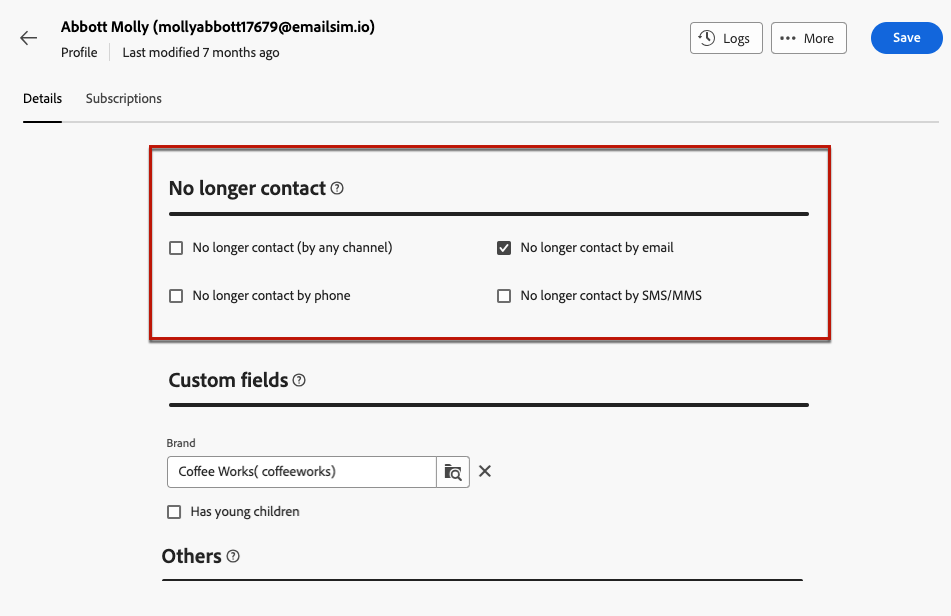

# Administración del consentimiento {#manage-consent}

## Recomendaciones generales {#general-recommendations}

Adobe Campaign le permite recopilar datos, incluida la información personal y confidencial. Es esencial obtener y monitorizar el consentimiento de los destinatarios de acuerdo con las regulaciones de protección de datos, como el RGPD (Reglamento General de Protección de Datos) y otras leyes de privacidad aplicables.

* En primer lugar, evite enviar correos electrónicos, notificaciones push y mensajes SMS no solicitados (&quot;correo no deseado&quot;). Adobe apoya firmemente los principios del marketing autorizado para fomentar la lealtad y el valor de duración del cliente. Adobe prohíbe estrictamente el uso de Adobe Campaign para enviar mensajes no solicitados. [Más información](#denylisted-profiles)

* Asegúrese siempre de que los destinatarios acepten recibir comunicaciones al proporcionarles la capacidad de optar por no recibir sus envíos<!-- and keep honoring opt-out requests as quickly as possible-->. [Más información](#opt-out)

* Utilice el proceso de administración de suscripciones para administrar las preferencias de los destinatarios y rastrear qué destinatarios se han suscrito a tipos específicos de suscripciones. [Más información](../../delivery/using/about-services-and-subscriptions.md)

## Administración de la exclusión {#opt-out}

Proporcionar a los destinatarios la capacidad de cancelar la suscripción a la recepción de comunicaciones de una marca es un requisito legal. También es necesario asegurarse de que se cumple esta opción. <!--Learn more about the applicable legislation in the [Adobe Campaign Classic v7 documentation](https://experienceleague.adobe.com/docs/campaign-classic/using/getting-started/privacy/privacy-and-recommendations.html?lang=es#privacy-regulations){target="_blank"}.-->

**¿Por qué es importante?**

* El incumplimiento de estas regulaciones conlleva riesgos legales para su marca.
* Ayuda a evitar el envío de comunicaciones no solicitadas a los destinatarios, lo que podría llevarlos a marcar sus mensajes como correo no deseado y dañar su reputación.

Al realizar envíos mediante la web de Adobe Campaign, asegúrese de que los clientes puedan cancelar la suscripción a comunicaciones futuras. Una vez cancelada la suscripción, los perfiles se eliminan automáticamente de la audiencia de futuros mensajes de marketing.

### Exclusión de correo electrónico {#email-opt-out}

Para permitir que los destinatarios cancelen su suscripción a la recepción de comunicaciones por correo electrónico, incluya **vínculo para cancelar la suscripción** en cada correo electrónico enviado a los destinatarios.

Siga estos pasos:

1. Cree una página de aterrizaje externa y aloje la página en el sistema de terceros que elija.

1. Creación de una entrega por correo electrónico. [Descubra cómo](../email/create-email.md)

1. Inserte un vínculo en el contenido del correo electrónico. [Descubra cómo](../email/message-tracking.md#insert-links)

   

1. En el campo **[!UICONTROL Url]**, pegue el vínculo a la página de aterrizaje de terceros.

1. Haga clic en el icono **[!UICONTROL Vínculos]** del panel izquierdo para mostrar la lista de todas las direcciones URL del contenido que se van a rastrear.

1. Haga clic en el icono de lápiz situado junto al nuevo vínculo para editarlo.

1. Modifique el **[!UICONTROL Tipo de seguimiento]** y configúrelo en **[!UICONTROL Exclusión]**.

   

1. Haz clic en **[!UICONTROL Guardar]** y envía el mensaje. [Más información](../monitor/prepare-send.md)

1. Una vez recibido el mensaje, si el destinatario hace clic en el vínculo para cancelar la suscripción, se muestra la página de aterrizaje.

1. Cuando el destinatario envía el formulario de página de aterrizaje, se actualizan los datos de perfil. [Más información](#denylisted-profiles)

<!--Any other option available such as one-click opt-out link or List-Unsubscribe (to include an unsubscribe link in the email header) to enable opt-out in a delivery?-->

## Incluir en la lista de bloqueados perfiles de {#denylisted-profiles}

Después de una baja (exclusión), los perfiles se agregan a la **lista de bloqueados de** para un canal determinado. Esto significa que ya no son el objetivo de ningún envío.

>[!NOTE]
>
>Si un perfil de la lista de bloqueados de la para el canal de correo electrónico tiene dos direcciones de correo electrónico, ambas se excluyen del envío.

Puede comprobar si un perfil se encuentra en la lista de bloqueados de la para uno o más canales en la sección **[!UICONTROL Ya no se puede contactar con]** de la pestaña **[!UICONTROL Detalles]** del perfil. [Más información](../audience/about-recipients.md#access)

<!--Denylisted status on quarantine list

Additionally, when recipients report your message as spam, or reply to an SMS message with a keyword such as "STOP", their address or phone number is quarantined with the **[!UICONTROL Denylisted]** status. Their profile is updated accordingly.

QUESTION: When a user marks an email as spam, is the profile's No longer contact section also updated? Apparently no (not the same = quarantine vs denylist)

>[!NOTE]
>
>The **[!UICONTROL Denylisted]** status refers to the address only, the profile is not on the denylist, so that the user continues receiving SMS messages and push notifications.

Learn more about Feedback loops in the [Delivery Best Practices Guide](https://experienceleague.adobe.com/docs/deliverability-learn/deliverability-best-practice-guide/transition-process/infrastructure.html?lang=es#feedback-loops){target="_blank"}.

Learn more about quarantine in the [Campaign v8 (client console) documentation](https://experienceleague.adobe.com/docs/campaign/campaign-v8/send/failures/quarantines.html?lang=es#non-deliverable-bounces){target="_blank"}.-->