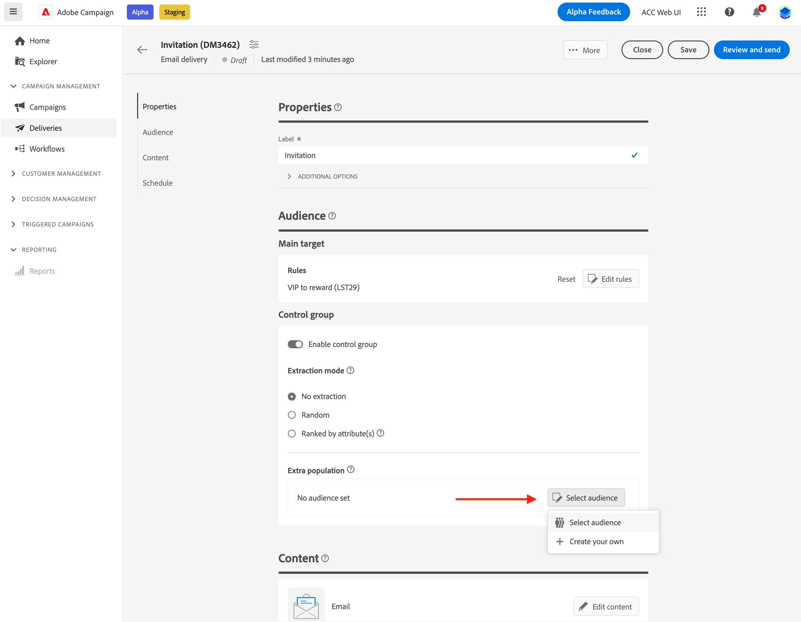

# Establecer un grupo de control {#control-group}

Un grupo de control es una subpoblación excluida del envío. Puede definir un grupo de control para evitar enviar mensajes a una parte de la audiencia y comparar el comportamiento tras la entrega con el destinatario principal. Esta opción le ayuda a medir el impacto de su campaña.

➡️ [Descubra esta funcionalidad en vídeo](create-audience.md#video)

## Habilitar grupo de control{#add-a-control-group}

Para añadir un grupo de control, active la opción al definir la audiencia del envío. El grupo de control se puede extraer aleatoriamente del objetivo principal o seleccionarse de una población específica. Por lo tanto, hay dos formas principales de definir un grupo de control:

* Extraer varios perfiles de los destinatarios principales.
* Excluir algunos perfiles de una lista o en función de criterios definidos en una consulta.

Puede combinar ambos métodos al definir un grupo de control.

Todos los perfiles del grupo de control en la fase de preparación del envío se eliminan del destinatario principal. No recibirán el mensaje.

>[!CAUTION]
>
>No se pueden utilizar grupos de control al cargar la población de público destinatario [desde un archivo externo](file-audience.md).

Para agregar un grupo de control a un envío, active la opción **[!UICONTROL Habilitar grupo de control]** desde la sección **Audiencia** de la pantalla de creación de envíos.

## Extracción de destinatario {#extract-target}

>[!CONTEXTUALHELP]
>id="acw_deliveries_email_controlgroup_target"
>title="Modo de extracción"
>abstract="Un grupo de control es un conjunto de perfiles excluidos del envío. Para definir un grupo de control, puede elegir extraer, aleatoriamente o en función de un orden, un porcentaje o un número fijo de perfiles de la población de destinatarios."

### Creación de un grupo de control {#build-extract-target}

Para definir un grupo de control, puede elegir extraer, aleatoriamente o en función de un orden, un porcentaje o un número fijo de perfiles de la población de destinatarios. Si prefiere agregar una población adicional, elija la opción **Sin extracción** y seleccione la población adicional [tal como se detalla aquí](#extra-population).

En primer lugar, defina la forma en que se extraen los perfiles del destinatario: aleatoriamente o en función de un orden.

En la sección **Grupo de control**, elija un **modo de extracción**:

* **Aleatorio**: al preparar el envío, Adobe Campaign extraerá aleatoriamente un número de perfiles correspondiente al porcentaje o al número máximo que se establecerá como límite de tamaño.

* **Clasificación por atributos**: esta opción permite excluir un conjunto de perfiles en función de los atributos específicos de un orden de clasificación específico.

A continuación, utilice la sección **Límite de tamaño** para establecer el número de perfiles que debe extraer del destinatario principal. Puede ser un número sin procesar (por ejemplo, 50 perfiles que excluir) o un porcentaje de la audiencia inicial (por ejemplo, el 5 % del destinatario principal).

### Muestra del grupo de control{#control-group-sample}

Por ejemplo, para crear un grupo de control con los 100 perfiles más nuevos, siga estos pasos:

1. Seleccione el campo **Age** como criterio de ordenación. Deje la opción de ordenación **Ascendente**.
1. Agregue el campo **Fecha de creación**. Cambie a la opción de orden **Descending**.
1. Defina 100 como el umbral en la sección **Límite de tamaño**.

   {zoomable="yes"}

Estos 100 nuevos perfiles más jóvenes se excluyen del objetivo principal.

### Comprobación del grupo de control {#check-control-group}

Puede ver los registros para comprobar e identificar los perfiles excluidos. Veamos el ejemplo de una exclusión aleatoria en cinco perfiles.

{zoomable="yes"}

Después de la preparación de la entrega, puede revisar cómo se aplicaron las exclusiones:

* En el panel de envío, antes de realizar el envío, compruebe el KPI **Para excluir**.

  {zoomable="yes"}

* En los registros de envío, la pestaña Logs muestra el paso de exclusión.

  {zoomable="yes"}
<!--

 * The **Exclusion logs** tab displays each profile and the related exclusion **Reason**.

    {zoomable="yes"}
-->

* La pestaña **Causas de exclusión** muestra el número de perfiles excluidos para cada regla de tipología.

  {zoomable="yes"}

Para obtener más información sobre los registros de envío, consulte esta [sección](../monitor/delivery-logs.md).

## Añadir una población adicional {#extra-population}

>[!CONTEXTUALHELP]
>id="acw_deliveries_email_controlgroup_extra"
>title="Población adicional"
>abstract="Un grupo de control es un conjunto de perfiles excluidos del envío. Puede excluir una población específica del público de envío seleccionando un público existente o definiendo una consulta."

Otra forma de definir un grupo de control es seleccionar una población específica en una audiencia existente o definir una consulta.

En la sección **Población adicional** de la pantalla de definición **Grupo de control**, haga clic en el botón **[!UICONTROL Seleccionar público]**.

{zoomable="yes"}

* Para usar un público existente, haga clic en **Seleccionar público**. Obtenga más información en [esta sección](add-audience.md).

* Para definir una nueva consulta, seleccione **Crear la suya** y defina los criterios de exclusión con el modelador de consultas. Obtenga más información en [esta sección](../query/query-modeler-overview.md).

Los perfiles incluidos en la audiencia o que coinciden con el resultado de la consulta son **excluidos** del destino de entrega: no reciben ningún mensaje.

## Comparar los resultados{#control-group-results}

Una vez entregado el envío, puede extraer los registros de envío para comparar el comportamiento entre los perfiles que no recibieron la comunicación y el destinatario efectivo. También puede utilizar los registros de envío para crear un nuevo objetivo.

Para ver qué perfiles se eliminaron del destino, consulte **Registros de envío**. Obtenga más información [en esta sección](#check-control-group).
