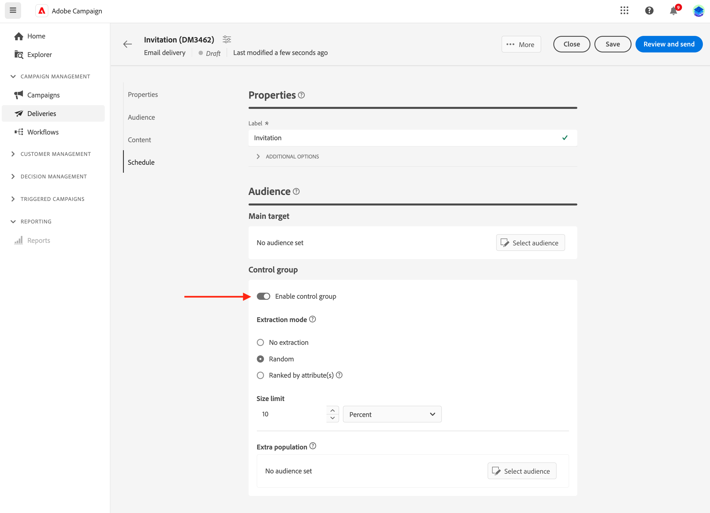

# Establecer un grupo de control {#control-group}

Puede utilizar grupos de control para impedir el envío de mensajes a una parte de la audiencia con el fin de medir el impacto de sus campañas.

Para hacerlo, cree un grupo de control al definir la audiencia de envío. Los perfiles se agregan al grupo de control de forma aleatoria, se filtran o no, o se basan en criterios. A continuación, podrá comparar el comportamiento de la población de destinatarios que recibió el mensaje con el de los contactos a los que no estaba destinado.

El grupo de control se puede extraer aleatoriamente del objetivo principal o seleccionarse de una población específica. Por lo tanto, hay dos formas principales de definir un grupo de control:

* Extraer varios perfiles de los destinatarios principales.
* Excluir algunos perfiles según los criterios definidos en la consulta.

Puede utilizar ambos métodos para definir el grupo de control.

Todos los perfiles del grupo de control en la fase de preparación del envío se eliminan del destinatario principal. No recibirán el mensaje.

Para crear un grupo de control, haga clic en el botón **[!UICONTROL Establecer grupo de control]**, en la sección **Audiencia** del asistente de creación de envíos.

## Extracción de destinatario {#extract-target}

>[!CONTEXTUALHELP]
>id="acw_deliveries_email_controlgroup_target"
>title="Extracción de destinatario"
>abstract="Para definir un grupo de control, puede elegir extraer, aleatoriamente o en función de un orden, un porcentaje o un número fijo de perfiles de la población de destinatarios."

Para definir un grupo de control, puede elegir extraer, aleatoriamente o en función de un orden, un porcentaje o un número fijo de perfiles de la población de destinatarios.

En primer lugar, defina la forma en que se extraerán los perfiles del destinatario: aleatoriamente o en función de un orden.

En la sección **Extracción de destinatario**, elija un **Tipo de exclusión**:

* **Aleatorio**: al preparar el envío, Adobe Campaign extraerá aleatoriamente un número de perfiles correspondiente al porcentaje o al número máximo que se establecerá como límite de tamaño.

   

* **Clasificación por atributos**: esta opción permite excluir un conjunto de perfiles en función de los atributos específicos de un orden de clasificación específico.

   

A continuación, defina el **límite de tamaño**: debe definir cómo va a limitar el número de perfiles que extraiga del destinatario principal.

**Por ejemplo**

Puede ver los registros para comprobar e identificar los perfiles excluidos. Veamos el ejemplo de una exclusión aleatoria en cinco perfiles.

Después de la preparación del envío, puede ver las exclusiones en las pantallas siguientes:

* El KPI **Para excluir** en el panel de envío, antes de enviar.

   

* Los **Registros de exclusión** muestran cada perfil y la **Razón** de exclusión relacionada.

   

* Las **causas de exclusión** muestran el número de perfiles excluidos para cada regla de tipología.

   

Para obtener más información sobre los registros de envío, consulte esta [sección](../monitor/delivery-logs.md).

## Población adicional {#extra-population}

>[!CONTEXTUALHELP]
>id="acw_deliveries_email_controlgroup_extra"
>title="Población adicional"
>abstract="Otra forma de definir un grupo de control es excluir una población específica del destinatario mediante una audiencia existente o definiendo una consulta."

Otra forma de definir un grupo de control es excluir una población específica del destinatario mediante una audiencia existente o definiendo una consulta.

En la sección **Población adicional** de la pantalla de definición **Grupo de control**, haga clic en el botón **[!UICONTROL Seleccionar audiencia]**.

* Para usar una audiencia existente, haga clic en **Seleccionar audiencia**. Consulte esta [sección](add-audience.md).

* Para definir una nueva consulta, seleccione **Crear su propia consulta** y defina los criterios de exclusión mediante el generador de reglas. Consulte esta [sección](segment-builder.md).

Los perfiles incluidos en la audiencia o que coinciden con el resultado de la consulta se excluyen del destinatario.