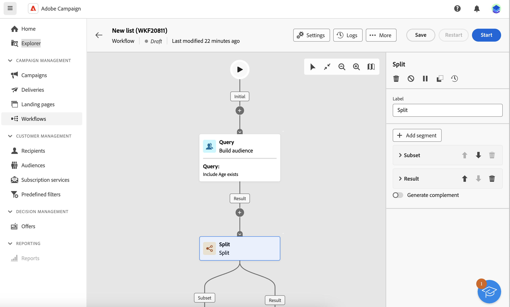

# Crear públicos {#create-audiences}

>[!CONTEXTUALHELP]
>id="acw_homepage_welcome_rn3"
>title="Composición del público"
>abstract="Cree nuevos públicos en un lienzo de flujo de trabajo visual. Además de empezar desde cero para crear un público sencillo, también puede aprovechar las actividades del flujo de trabajo para perfeccionar su público. Combine varios públicos en uno solo, enriquézcalo con atributos externos o divídalo en varios en función de las reglas que elija."
>additional-url="https://experienceleague.adobe.com/docs/campaign-web/v8/release-notes/release-notes.html?lang=es" text="Consulte las notas de la versión"

>[!CONTEXTUALHELP]
>id="acw_audiences_list"
>title="Públicos"
>abstract="Desde esta pantalla, puede acceder a la lista de todos los públicos que se pueden segmentar en los envíos. Haga clic en **Crear** para crear nuevos públicos en un lienzo visual utilizando varias actividades de flujo de trabajo como **División** o **Excluir**."

>[!CONTEXTUALHELP]
>id="acw_audiences_create_settings"
>title="Configuración del público"
>abstract="Introduzca el nombre de público y las opciones adicionales y, a continuación, haga clic en el botón **Crear público**."

La web de Campaign le permite crear nuevas audiencias en un lienzo de flujo de trabajo visual. Además de empezar desde cero para crear un público sencillo, también puede aprovechar las actividades del flujo de trabajo para perfeccionar su público. Por ejemplo, puede combinar varias audiencias en una sola, enriquecer la audiencia con atributos externos o dividir una en varias audiencias en función de las reglas que elija.

Una vez que haya creado el flujo de trabajo, las audiencias resultantes se almacenan automáticamente en la base de datos de Campaign junto con las existentes. Estas audiencias pueden segmentarse en flujos de trabajo o envíos independientes.

➡️ [Descubra esta función en vídeo](#video)

## Cree su primera audiencia {#create}

Para crear una audiencia, siga estos pasos:

1. Vaya a **[!UICONTROL Audiencias]** y haga clic en el **[!UICONTROL Crear audiencia]** situado en la esquina superior derecha.

1. Se crea automáticamente un nuevo flujo de trabajo, que le permite combinar actividades para generar su audiencia. De forma predeterminada, el lienzo contiene dos actividades principales:

   * La &quot;Consulta&quot; **[!UICONTROL Crear audiencia]** La actividad de es el punto de partida del flujo de trabajo, lo que permite crear una audiencia y utilizarla como base del flujo de trabajo.

   * La &quot;nueva audiencia&quot; **[!UICONTROL Guardar audiencia]** La actividad de representa el último paso del flujo de trabajo, lo que permite guardar los resultados como una nueva audiencia.

   {zoomable=&quot;yes&quot;}

   >[!IMPORTANT]
   >
   >Los flujos de trabajo de audiencia se almacenan en **Flujos de trabajo** junto con los demás flujos de trabajo de la campaña. Están diseñadas específicamente para crear audiencias y se pueden identificar por su lienzo vertical.

1. Para mejorar la legibilidad, se recomienda cambiar el nombre del flujo de trabajo en la configuración del flujo de trabajo&quot; **Etiqueta** field. [Obtenga información sobre cómo configurar los ajustes del flujo de trabajo](../workflows/workflow-settings.md)

1. Abra el **[!UICONTROL Crear audiencia]** y utilice el modelador de consultas para definir la población que se incluirá en la audiencia filtrando los datos contenidos en la base de datos. [Obtenga información sobre cómo configurar una actividad Generar audiencia](../workflows/activities/build-audience.md)

1. Si desea realizar operaciones adicionales en la población objetivo del flujo de trabajo, añada tantas actividades como sea necesario y conéctelas. Para obtener más información sobre la configuración de actividades de flujo de trabajo, consulte la [documentación de flujos de trabajo](../workflows/activities/about-activities.md).

   >[!NOTE]
   >
   >Las actividades de canal no están disponibles para su uso en flujos de trabajo de audiencia.

   {zoomable=&quot;yes&quot;}

1. Configure las variables **[!UICONTROL Guardar audiencia]** actividad para especificar cómo desea guardar la población calculada en sentido ascendente en el flujo de trabajo. [Obtenga información sobre cómo configurar una actividad Guardar audiencia](../workflows/activities/save-audience.md)

1. Cuando el flujo de trabajo esté listo, haga clic en **[!UICONTROL Inicio]** para ejecutarlo.

El flujo de trabajo se guarda en **[!UICONTROL Flujos de trabajo]** , mientras que las audiencias resultantes son accesibles en la **[!UICONTROL Audiencias]** lista con la etiqueta definida en la variable **Guardar audiencia** actividad. Obtenga información sobre cómo monitorizar y administrar audiencias en [esta sección](manage-audience.md)

Ahora puede utilizar esta audiencia como el destinatario principal de una entrega. [Más información](add-audience.md)

## Ejemplo de flujo de trabajo de audiencia {#example}

El ejemplo siguiente muestra un flujo de trabajo de audiencia configurado para dirigirse a clientes mujeres que viven en Nueva York y crear dos audiencias nuevas en función de su última compra (equipo de yoga o de running).

{zoomable=&quot;yes&quot;}

1. El **[!UICONTROL Crear audiencia]** La actividad se dirige a todos los perfiles femeninos que viven en Nueva York.
1. El **[!UICONTROL Enriquecimiento]** La actividad enriquece a la audiencia con información de la tabla Compras para identificar qué tipo de producto compraron los clientes.
1. El **[!UICONTROL Split]** La actividad divide el flujo de trabajo en dos rutas en función de la última compra de los clientes.
1. El **[!UICONTROL Guardar audiencia]** las actividades al final de cada ruta crean dos nuevas audiencias en la base de datos, incluida la población calculada en cada ruta.

## Editar una audiencia {#edit}

Puede modificar una audiencia generada a partir de un flujo de trabajo siempre que sea necesario volviendo a ejecutar su flujo de trabajo correspondiente. Esto le permite actualizar fácilmente los datos de audiencia o refinar la audiencia ajustando la consulta para adaptarla a sus necesidades.

1. Vaya a **Audiencias** y abra la audiencia que desee editar.
1. En el **Información general** , la pestaña **Último flujo de trabajo** proporciona un vínculo al flujo de trabajo utilizado para generar la audiencia. Haga clic en él para acceder al flujo de trabajo.
1. Realice los cambios deseados y haga clic en **Inicio** para volver a ejecutar el flujo de trabajo. Una vez finalizada, la audiencia resultante del flujo de trabajo se actualiza automáticamente con los últimos resultados del flujo de trabajo.

De forma predeterminada, al volver a ejecutar un flujo de trabajo de audiencia, se sustituye todo el contenido de la audiencia por datos nuevos, lo que provoca la pérdida de datos anteriores.

Si prefiere no reemplazar los resultados de audiencia existentes, configure el **Guardar audiencia** actividades para alinearse con sus necesidades. Por ejemplo, puede cambiar el **Etiqueta de audiencia** para almacenar los nuevos resultados en una nueva audiencia o añadir los nuevos resultados al contenido de audiencia existente sin borrar los datos anteriores. [Obtenga información sobre cómo configurar una actividad Guardar audiencia](../workflows/activities/save-audience.md)

{zoomable=&quot;yes&quot;}

## Vídeos explicativos {#video}

Obtenga información sobre cómo crear y administrar audiencias, cómo seleccionar audiencias para una entrega y definir grupos de control.

>[!VIDEO](https://video.tv.adobe.com/v/3425861?quality=12)
