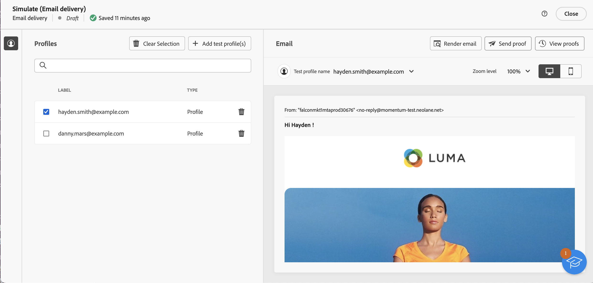

# Importación de un público de correo electrónico desde un archivo {#audience-from-file}

>[!CONTEXTUALHELP]
>id="acw_audience_fromfile_select"
>title="Selección de archivos"
>abstract="Seleccione el archivo local que desea subir. Los formatos compatibles son TXT y CSV. Alinee el formato del archivo con el archivo de muestra vinculado a continuación."

>[!CONTEXTUALHELP]
>id="acw_audience_fromfile_columns"
>title="Definición de columnas"
>abstract="Compruebe el formato de las columnas en el archivo externo."

>[!CONTEXTUALHELP]
>id="acw_audience_fromfile_formatting"
>title="Parámetros de formato"
>abstract="Especifique el formato del archivo externo para asegurarse de que los datos se importan correctamente."

>[!CONTEXTUALHELP]
>id="acw_audience_fromfile_preview"
>title="Vista previa del archivo"
>abstract="Compruebe la previsualización de las columnas del archivo externo. Esta pantalla solo muestra hasta 30 registros."

Adobe Campaign interfaz web del usuario le permite destino perfiles almacenados en un archivo externo. Una vez cargados los perfiles, todos los campos del archivo de entrada están disponibles para personalizar su envío [Obtén información sobre cómo personalizar tus contenido](../personalization/personalize.md).

Los perfiles del archivo de entrada no se añaden a la base de datos. Se cargan y solo están disponibles para esta envío correo electrónico independiente específica.

>[!NOTE]
>
>Esta página describe cómo cargar perfiles externos desde un archivo al crear un envío de correo electrónico independiente. Para cargar datos de un archivo en el contexto de un flujo de trabajo, consulte [esta página](../workflows/activities/load-file.md).

## Lectura obligatoria {#must-read}

* Esta funcionalidad solo está disponible para **envíos de correo electrónico**.
* Los formatos de archivo admitidos son: texto (TXT) y valor separado por comas (CSV).
* No puede utilizar [grupos de control](control-group.md) al cargar la población de público destinatario desde un archivo externo.

## Selección y configuración del archivo de entrada {#upload}

Para segmentar perfiles a partir de un archivo en los correos electrónicos, siga estos pasos:

1. Abra una envío de correo electrónico existente o [cree una nueva envío correo electrónico](../email/create-email.md).
1. En la **sección Audiencia** , haz clic en el **botón Seleccionar audiencia** y, a continuación, selecciona **Seleccionar del archivo**.

   {zoomable="yes"}

1. Seleccione el archivo local que desea cargar. El formato de archivo debe alinearse con el [archivo de muestra](#sample-file).
1. Obtenga una vista previa y compruebe cómo se asignan los datos en la sección central de la pantalla.

   

1. Especifique la columna que contiene la dirección de correo electrónico de la lista desplegable **Campo de dirección**. También puede seleccionar la columna de lista de bloqueados de la si dispone de dicha información en el archivo de entrada.
1. Ajuste la configuración de columna y defina cómo dar formato a los datos mediante las opciones disponibles.
1. Haga clic en **Confirmar** una vez que la configuración sea correcta.

Al crear el contenido del mensaje, agregue personalización aprovechando los campos del archivo de entrada. [Obtenga información sobre cómo personalizar el contenido](../personalization/personalize.md)

{zoomable="yes"}

## Archivo de muestra {#sample-file}

>[!CONTEXTUALHELP]
>id="acw_audience_fromfile_samplefile"
>title="Importación de un público desde un archivo"
>abstract="Los formatos compatibles son TXT y CSV. Usar la primera línea como encabezado de columna. Alinee el formato del archivo con el archivo de muestra proporcionado en el vínculo siguiente."

Al cargar un archivo externo para segmentar perfiles en los envíos, asegúrese de que el archivo de entrada coincida con las recomendaciones siguientes:

* Los formatos compatibles son TXT y CSV.
* La primera línea del archivo es el encabezado de columna.
* Alinee el formato del archivo con el archivo de ejemplo siguiente:

  ```javascript
  {
  lastname,firstname,city,birthdate,email,denylist
  Smith,Hayden,Paris,23/05/1985,hayden.smith@example.com,0
  Mars,Daniel,London,17/11/1999,danny.mars@example.com,0
  Smith,Clara,Roma,08/02/1979,clara.smith@example.com,0
  Durance,Allison,San Francisco,15/12/2000,allison.durance@example.com,1
  }
  ```

## Previsualización y prueba del correo electrónico {#test}

Campaign Web le permite previsualización y enviar pruebas al utilizar un audiencia cargado desde un archivo. Para ello, siga estos pasos:

1. Haga clic en la **[!UICONTROL botón Simular contenido]** de la pantalla de edición de contenido de envío y haga clic en la **[!UICONTROL añadir prueba perfil]** botón.

1. Se muestran los perfiles contenidos en el archivo cargado. Seleccione los perfiles que desea utilizar para obtener una vista previa del contenido y haga clic en **[!UICONTROL Seleccionar]**.

1. En el panel derecho de la pantalla aparece una vista previa del contenido de la entrega. Los elementos personalizados se sustituyen por los datos del perfil seleccionado en el panel izquierdo. [Más información sobre la vista previa del contenido de envío](../preview-test/preview-content.md)

   {zoomable="yes"}

1. Para enviar pruebas, haga clic en el **[!UICONTROL botón Enviar prueba]** .

1. Haga clic en el **[!UICONTROL botón Cargar perfiles]** de prueba y seleccione el archivo .txt o .csv que contenga los destinatarios del prueba.

   >[!CAUTION]
   >
   >Asegúrese de que el formato del archivo coincide con el que se utilizó para cargar el audiencia. Cualquier error de formato mostrará una alerta.

1. Cuando se agreguen los perfiles de prueba y esté listo para enviar las pruebas, haga clic en el botón **[!UICONTROL Enviar prueba]** y confirme el envío.

   {zoomable="yes"}

1. Monitorice el envío de la prueba en cualquier momento con el botón **[!UICONTROL Ver pruebas]**. [Más información sobre la supervisión de pruebas](../preview-test/test-deliveries.md#access-test-deliveries)