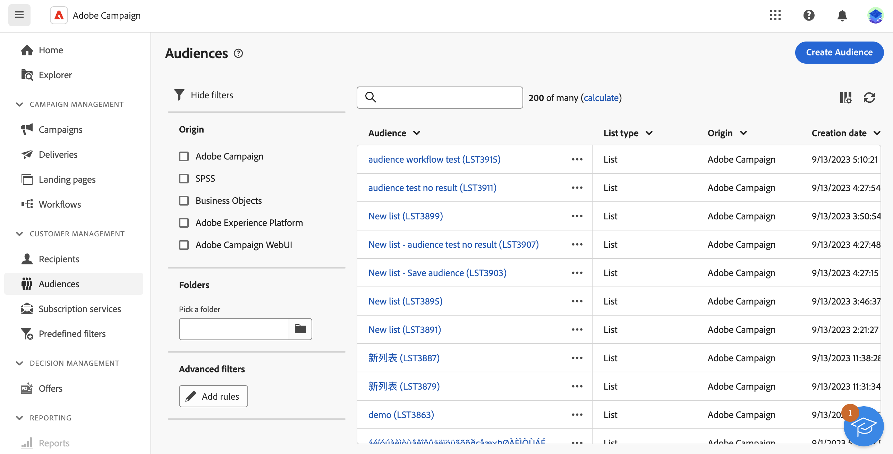

# Introducción a los públicos {#monitor-manage}

>[!CONTEXTUALHELP]
>
[!CONTEXTUALHELP]

[!CONTEXTUALHELP]

[!CONTEXTUALHELP]

La audiencia es el destinatario principal del envío: los perfiles que reciben los mensajes. Se puede acceder a la lista de audiencias disponibles para usar en Campaign Web desde el menú **[!UICONTROL Audiencias]**.

{zoomable="yes"}

Las audiencias pueden proceder de varias fuentes. La columna **[!UICONTROL Origen]** indica dónde se ha creado una audiencia determinada:

* **[!UICONTROL Adobe Campaign]**: estas audiencias se han creado en la [interfaz de usuario web de Adobe Campaign](create-audience.md) o en la [consola de cliente de Adobe Campaign v8](https://experienceleague.adobe.com/docs/campaign/campaign-v8/audience/create-audiences/create-audiences.html?lang=es){target="_blank"}.

* **[!UICONTROL Adobe Experience Platform:]** Estas audiencias se han creado en Adobe Experience Platform y se integran en el sitio web de Campaign mediante la integración de orígenes y destinos de Adobe. Aprenda a configurar esta integración en la [documentación de Campaign v8 (consola de cliente)](https://experienceleague.adobe.com/docs/campaign/campaign-v8/connect/ac-aep/ac-aep.html){target="_blank"}.

  ➡️ [Descubra esta funcionalidad en vídeo](#video)

Para obtener información adicional sobre una audiencia, ábrala en la lista. Se muestran las propiedades de la audiencia junto con el número de perfiles incluidos en la audiencia. Actualice el recuento de audiencias en cualquier momento con el botón **[!UICONTROL Calcular]**.

La ficha **[!UICONTROL Datos]** le permite visualizar los perfiles que forman parte de la audiencia. Personalice esta vista añadiendo columnas adicionales o utilice filtros avanzados para restringir los datos mostrados.

{zoomable="yes"}

Para duplicar o eliminar una audiencia, haga clic en el botón **[!UICONTROL Más acción]** disponible en la lista de audiencias junto al nombre de la audiencia o dentro de una pantalla de detalles de audiencia.

## Vídeos explicativos {#video}

Obtenga información sobre cómo crear un destino para utilizar una audiencia de Experience Platform en la interfaz de usuario web de Adobe Campaign.

>[!VIDEO](https://video.tv.adobe.com/v/3427635?quality=12)

Encontrará información detallada sobre cómo configurar la integración de orígenes y destinos de Adobe en la [documentación de Campaign v8 (consola de cliente)](https://experienceleague.adobe.com/docs/campaign/campaign-v8/connect/ac-aep/ac-aep.html){target="_blank"}.