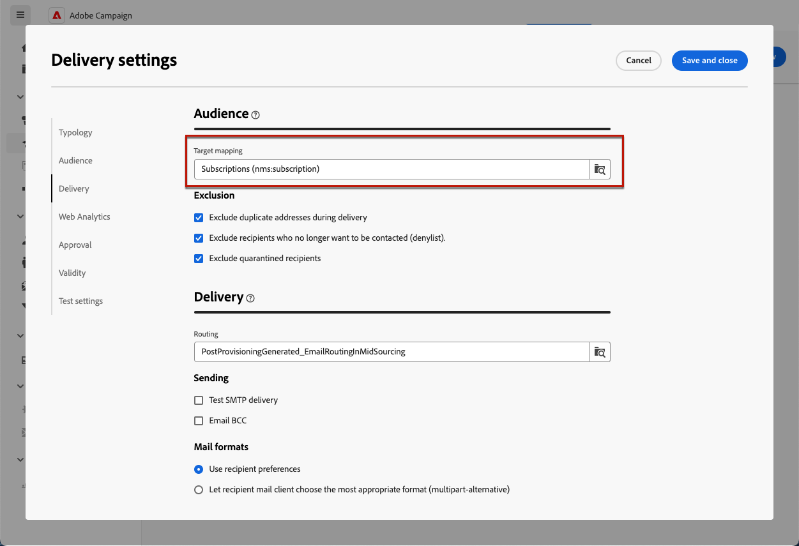

# Creación y administración de servicios de suscripción {#manage-services}

>[!CONTEXTUALHELP]
>id="acw_subscriptions_list"
>title="Crear y administrar servicios"
>abstract="Utilice Adobe Campaign para crear y monitorizar sus servicios, como los boletines informativos, y para comprobar las suscripciones o las bajas a estos servicios. Las suscripciones solo se aplican al envío de correo electrónico y SMS."

Utilice la web de Adobe Campaign para administrar y crear sus servicios, como boletines informativos, y para comprobar las suscripciones o cancelaciones de suscripción a estos servicios.

>[!NOTE]
>
>Las suscripciones solo se aplican al envío de correo electrónico y SMS.

Se pueden definir varios servicios en paralelo, por ejemplo: boletines para categorías de productos específicas, temas o áreas de un sitio web, suscripciones a varios tipos de mensajes de alerta y notificaciones en tiempo real.

Para obtener más información sobre la administración de suscripciones y bajas, consulte la [Documentación de Campaign v8 (consola de cliente)](https://experienceleague.adobe.com/docs/campaign/campaign-v8/audience/subscriptions.html){target="_blank"}.

## Acceso a servicios de suscripción {#access-services}

Para acceder a los servicios de suscripción disponibles para su plataforma, siga los pasos a continuación.

1. Vaya a la **[!UICONTROL Servicios de suscripción]** en el carril de navegación izquierdo.

   

1. Se muestra la lista de todos los servicios de suscripción existentes. Puede buscar los servicios y filtrar el canal, la carpeta o agregar reglas utilizando [modelador de consultas](../query/query-modeler-overview.md).

   

1. Para editar un servicio existente, haga clic en su nombre.

1. Puede eliminar o duplicar cualquier servicio mediante el icono de tres puntos situado junto al nombre del servicio.<!--so all subscribers are unsubscribed - need to mention?-->

## Creación de su primer servicio de suscripción {#create-service}

>[!CONTEXTUALHELP]
>id="acw_subscriptions_list_properties"
>title="Definir las propiedades del servicio"
>abstract="Introduzca la etiqueta del servicio de suscripción y defina opciones adicionales, como el período de validez del servicio."

>[!CONTEXTUALHELP]
>id="acw_subscriptions_list_confirm"
>title="Selección de un mensaje de confirmación"
>abstract="Cuando un usuario se suscribe o cancela la suscripción a un servicio, puede enviar un mensaje de confirmación. Seleccione las plantillas que usará en ese mensaje."

Para crear un servicio de suscripción, siga los pasos a continuación.

1. Seleccione el **[!UICONTROL Crear servicio de suscripción]** botón.

   

1. Seleccione un canal: **[!UICONTROL Correo electrónico]** o **[!UICONTROL SMS]**.

1. En las propiedades del servicio, introduzca una etiqueta y defina **[!UICONTROL Opciones adicionales]** como se quiere.

   

1. De forma predeterminada, los servicios de se almacenan en **[!UICONTROL Servicios y suscripciones]** carpeta. Puede cambiarlo navegando a la ubicación deseada. [Aprenda a trabajar con carpetas](../get-started/permissions.md#folders)

1. De forma predeterminada, las suscripciones son ilimitadas. Puede desactivar las **[!UICONTROL Período de validez ilimitado]** para definir una duración de validez del servicio.

   En el ejemplo siguiente, después de 20 días:
   * Ya no habrá destinatarios que puedan suscribirse a este servicio.
   * Todos los suscriptores de este servicio cancelarán su suscripción automáticamente pasados 20 días. [Más información](#automatic-unsubscription)

   

1. Cuando un usuario se suscribe o cancela la suscripción a un servicio, puede enviar un mensaje de confirmación. Seleccione las plantillas que desea utilizar para ese mensaje según el caso de uso. Estas plantillas deben configurarse con la variable **[!UICONTROL Suscripciones]** asignación de destino. [Más información](#create-confirmation-message)

   

1. Clic **[!UICONTROL Guardar y revisar]**. El nuevo servicio se agrega al **[!UICONTROL Servicios de suscripción]** lista.

Ahora puede hacer lo siguiente:

* Añada suscriptores a este servicio y cancele la suscripción de destinatarios. [Más información](../msg/send-to-subscribers.md)

* Envíe mensajes a los suscriptores de este servicio. [Descubra cómo](../msg/send-to-subscribers.md)

## Crear un mensaje de confirmación {#create-confirmation-message}

Para enviar mensajes de confirmación a los usuarios que se suscriben o cancelan la suscripción a su servicio, debe crear una plantilla de envío con el **[!UICONTROL Suscripciones]** asignación de destino, sin un destino definido. Para ello, siga los pasos a continuación.

1. Cree una plantilla de envío para la confirmación de suscripción. [Obtenga información sobre cómo crear una plantilla](../msg/delivery-template.md)

1. No seleccione una audiencia para este envío. En su lugar, acceda al envío **[!UICONTROL Configuración]**, vaya a la [Audiencia](../advanced-settings/delivery-settings.md#audience) y seleccione la pestaña **[!UICONTROL Suscripciones]** asignación de destino de la lista.

   

   >[!NOTE]
   >
   >Si no selecciona la variable  **[!UICONTROL Suscripciones]** asignación de destino, los suscriptores no recibirán el mensaje de confirmación. Las asignaciones de destino se definen en la consola de Campaign v8. Obtenga más información en la [Documentación de Adobe Campaign v8](https://experienceleague.adobe.com/docs/campaign/campaign-v8/audience/add-profiles/target-mappings.html?lang=es){target="_blank"}.

1. Edite el contenido de la plantilla de envíos, guárdelo y ciérrelo.

   

   >[!NOTE]
   >
   >Obtenga más información acerca de los canales de envío y cómo definir un contenido de envío en la [Canal de correo electrónico](../email/create-email.md) y [Canal de SMS](../sms/create-sms.md) secciones.

1. Repita los pasos anteriores para crear una plantilla de envíos para la confirmación de baja.

Ahora puede seleccionar estos mensajes cuando [creación de un servicio de suscripción](#create-service). Los usuarios que se suscriban o cancelen su suscripción a ese servicio recibirán los mensajes de confirmación seleccionados.

## Monitorización de los servicios de suscripción {#logs-and-reports}

>[!CONTEXTUALHELP]
>id="acw_subscriptions_totalnumber_subscribers"
>title="Número total de suscriptores"
>abstract="Clic **Calcular** el obtiene el número total de suscriptores para este servicio."

>[!CONTEXTUALHELP]
>id="acw_subscriptions_overtheperiod_subscribers"
>title="Número de suscripciones durante el periodo"
>abstract="Utilice la lista desplegable para cambiar el intervalo de tiempo y ver el número de suscripciones y bajas de suscripción durante el periodo seleccionado."

>[!CONTEXTUALHELP]
>id="acw_subscriptions_overallevolution_subscribers"
>title="Evolución general de suscripciones"
>abstract="Este gráfico muestra el desglose por periodo, incluidas las suscripciones, las bajas, la evolución en números y el porcentaje de fidelidad."

Para medir la eficacia de los servicios de suscripción para canales de correo electrónico y SMS, puede acceder a los registros e informes de un servicio determinado.

1. Seleccione un servicio existente del **[!UICONTROL Servicios de suscripción]** lista. Clic **[!UICONTROL Calcular]** el obtiene el número total de suscriptores.

   

1. En el panel de servicios, seleccione **[!UICONTROL Registros]** para ver la lista de suscriptores de este servicio.

   Puede comprobar el número total de suscriptores, el nombre y la dirección de cada destinatario y cuándo se han suscrito o dado de baja de la suscripción. También puede filtrar por ellos.

   

1. En el panel de servicios, seleccione **[!UICONTROL Informes]**. Compruebe las luces testigo siguientes:

   * El **[!UICONTROL Número total de suscriptores]** se muestra.

   * Puede ver el número de suscripciones y bajas de suscripción durante un periodo seleccionado. Utilice la lista desplegable para cambiar el intervalo de tiempo.

     

   * El **[!UICONTROL Evolución general de las suscripciones]** El gráfico muestra el desglose por periodo, incluidas las suscripciones, las bajas, la evolución en los números y el porcentaje de fidelidad.<!--what is Registered?-->

1. Utilice el **[!UICONTROL Recargar]** para recuperar los últimos valores de la ejecución y programación del flujo de trabajo de seguimiento.
