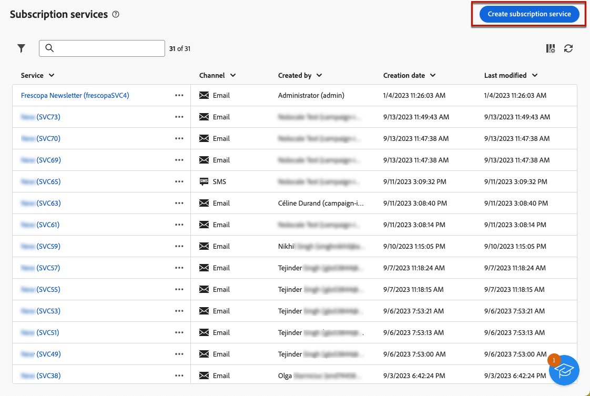
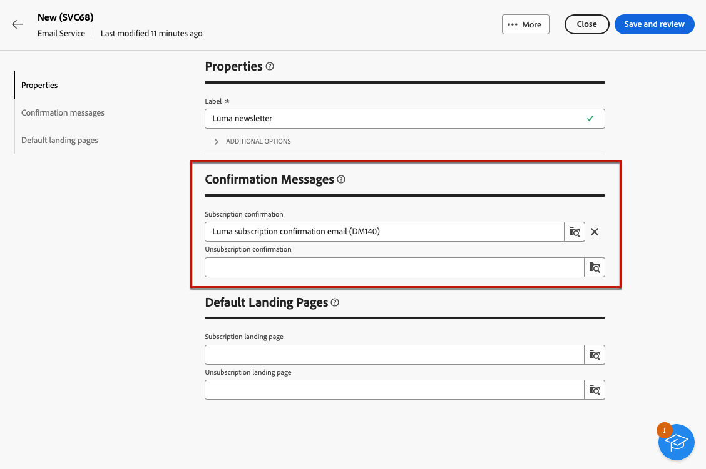
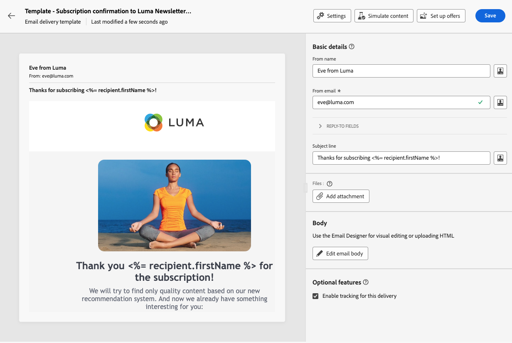

# Crear y administrar servicios de suscripción {#manage-services}

>[!CONTEXTUALHELP]
>id="acw_subscriptions_list"
>title="Crear y administrar servicios"
>abstract="Utilice Adobe Campaign para crear y monitorizar sus servicios, como los boletines informativos, y para comprobar las suscripciones o las bajas a estos servicios. Las suscripciones solo se aplican al envío de correo electrónico y SMS."

Utilice Adobe Campaign Web para administrar y crear sus servicios, como los boletines informativos, y para comprobar las suscripciones o bajas de suscripción a estos servicios.

Se pueden definir varios servicios en paralelo, por ejemplo: boletines para categorías de productos específicas, temas o áreas de un sitio web, suscripciones a varios tipos de mensajes de alerta y notificaciones en tiempo real.

>[!NOTE]
>
>Las suscripciones solo se aplican al envío de correo electrónico y SMS.

## Acceso a servicios de suscripción {#access-services}

Para acceder a los servicios de suscripción disponibles para su plataforma, siga los pasos a continuación.

1. Vaya a la **[!UICONTROL Servicios de suscripción]** en el carril de navegación izquierdo.

   {zoomable=&quot;yes&quot;}

1. Se muestra la lista de todos los servicios de suscripción existentes. Puede buscar los servicios y filtrar el canal, la carpeta o agregar reglas utilizando [modelador de consultas](../query/query-modeler-overview.md).

   {zoomable=&quot;yes&quot;}

1. Para editar un servicio existente, haga clic en su nombre.

1. Puede eliminar o duplicar cualquier servicio mediante el icono de tres puntos situado junto al nombre del servicio.<!--so all subscribers are unsubscribed - need to mention?-->

## Creación de su primer servicio de suscripción {#create-service}

>[!CONTEXTUALHELP]
>id="acw_subscriptions_list_properties"
>title="Definir las propiedades del servicio"
>abstract="Introduzca la etiqueta del servicio de suscripción y defina opciones adicionales, como el período de validez del servicio."

>[!CONTEXTUALHELP]
>id="acw_subscriptions_list_confirm"
>title="Selección de un mensaje de confirmación"
>abstract="Cuando un usuario se suscribe o cancela la suscripción a un servicio, puede enviar un mensaje de confirmación. Seleccione las plantillas que usará en ese mensaje."

>[!CONTEXTUALHELP]
>id="acw_subscriptions_defaultlp"
>title="Página de aterrizaje predeterminada"
>abstract="Seleccione las páginas de aterrizaje predeterminadas asociadas a este servicio."

Para crear un servicio de suscripción, siga los pasos a continuación.

1. Seleccione el **[!UICONTROL Crear servicio de suscripción]** botón.

   {zoomable=&quot;yes&quot;}

1. Seleccione un canal: **[!UICONTROL Correo electrónico]** o **[!UICONTROL SMS]**.

1. En las propiedades del servicio, introduzca una etiqueta y defina **[!UICONTROL Opciones adicionales]** como se quiere.

   {zoomable=&quot;yes&quot;}

1. De forma predeterminada, los servicios de se almacenan en **[!UICONTROL Servicios y suscripciones]** carpeta. Puede cambiarlo navegando a la ubicación deseada. [Aprenda a trabajar con carpetas](../get-started/permissions.md#folders)

1. De forma predeterminada, las suscripciones son ilimitadas.

   Puede desactivar las **[!UICONTROL Período de validez ilimitado]** para definir una duración de validez del servicio. Una vez finalizado el periodo de validez:
   * Ya ningún perfil puede suscribirse a este servicio
   * Todos los suscriptores de este servicio cancelan su suscripción automáticamente

   {zoomable=&quot;yes&quot;}

1. Cuando un usuario se suscribe o cancela la suscripción a un servicio, puede enviar un mensaje de confirmación. Seleccione las plantillas que desea utilizar para ese mensaje según el caso de uso. Estas plantillas deben configurarse con la variable **[!UICONTROL Suscripciones]** asignación de destino. [Más información](#create-confirmation-message)

   {zoomable=&quot;yes&quot;}

1. Clic **[!UICONTROL Guardar y revisar]**. El nuevo servicio se agrega al **[!UICONTROL Servicios de suscripción]** lista.

1. También puede seleccionar las páginas de aterrizaje predeterminadas de suscripción y de cancelación de suscripción asociadas a este servicio.

   >[!AVAILABILITY]
   >
   >Esta capacidad se encuentra en disponibilidad limitada (LA). Está restringido a los clientes que migran **de Adobe Campaign Standard a Adobe Campaign v8** y no se pueden implementar en ningún otro entorno.

   {zoomable=&quot;yes&quot;}

   Una vez finalizado, cuando [inserción de un vínculo](../email/message-tracking.md) en un correo electrónico, seleccione **[!UICONTROL Vínculo de suscripción]** o **[!UICONTROL Vínculo de baja]**. Al hacer clic en ese vínculo, se dirige a los usuarios a la página de aterrizaje de suscripción o de cancelación de suscripción a la que se hace referencia en el servicio. <!--After submitting the form, they will be subscribed to / unsubscribed from the service.-->

   {zoomable=&quot;yes&quot;}

1. Guarde y revise los cambios.

Ahora puede hacer lo siguiente:

* Añadir manualmente suscriptores a este servicio y cancelar la suscripción de perfiles. [Más información](../audience/manage-subscribers.md)

* Invite a sus clientes a suscribirse a este servicio a través de una página de aterrizaje. [Más información](../landing-pages/lp-use-cases.md#lp-subscription)

* Envíe mensajes a los suscriptores de este servicio. [Descubra cómo](../msg/send-to-subscribers.md)

## Creación de un mensaje de confirmación {#create-confirmation-message}

>[!CONTEXTUALHELP]
>id="acw_subscriptions_delivery_template"
>title="Selección de la plantilla de envíos de suscripciones"
>abstract="Para enviar mensajes de confirmación a los usuarios que se suscriben al servicio, debe seleccionar una plantilla de envíos específica basada en la asignación de destino **[!UICONTROL Suscripciones]**, sin un destino definido."

>[!CONTEXTUALHELP]
>id="acw_unsubscriptions_delivery_template"
>title="Selección de la plantilla de envíos de cancelación de suscripciones"
>abstract="Para enviar mensajes de confirmación a los usuarios que cancelan la suscripción al servicio, debe seleccionar una plantilla de envíos específica basada en la asignación de destino **[!UICONTROL Suscripciones]**, sin un destino definido."

Para enviar mensajes de confirmación a los usuarios que se suscriben o cancelan la suscripción a su servicio, debe crear una plantilla de envío con el **[!UICONTROL Suscripciones]** asignación de destino, sin un destino definido. Para ello, siga los pasos a continuación:

1. Cree una plantilla de envío para la confirmación de suscripción. [Obtenga información sobre cómo crear una plantilla](../msg/delivery-template.md)

1. No seleccione una audiencia para este envío. En su lugar, acceda al envío **[!UICONTROL Configuración]**, vaya a la [Audiencia](../advanced-settings/delivery-settings.md#audience) y seleccione la pestaña **[!UICONTROL Suscripciones]** asignación de destino de la lista.

   {zoomable=&quot;yes&quot;}

   >[!NOTE]
   >
   >Si no selecciona la variable  **[!UICONTROL Suscripciones]** asignación de destino, los suscriptores no recibirán el mensaje de confirmación. Obtenga más información sobre las asignaciones de destino en [esta sección](../audience/targeting-dimensions.md) .

1. Edite el contenido de la plantilla de envíos, guárdelo y ciérrelo.

   {zoomable=&quot;yes&quot;}

   >[!NOTE]
   >
   >Obtenga más información acerca de los canales de envío y cómo definir un contenido de envío en la [Canal de correo electrónico](../email/create-email.md) y [Canal de SMS](../sms/create-sms.md) secciones.

1. Repita los pasos anteriores para crear una plantilla de envíos para la confirmación de baja.

Ahora puede seleccionar estos mensajes cuando [creación de un servicio de suscripción](#create-service). Los usuarios que se suscriban o cancelen su suscripción a ese servicio recibirán los mensajes de confirmación seleccionados.

## Monitorizar los servicios de suscripción {#logs-and-reports}

>[!CONTEXTUALHELP]
>id="acw_subscriptions_totalnumber_subscribers"
>title="Recuento de suscriptores"
>abstract="Haga clic en **Calcular** para obtener el número total de suscriptores para este servicio."

>[!CONTEXTUALHELP]
>id="acw_subscriptions_totalnumber_subscribers_report"
>title="Número total de suscriptores"
>abstract="El indicador clave de rendimiento (KPI) proporciona una vista completa de la base de suscriptores, mostrando el recuento total de personas que se han suscrito a este servicio."

>[!CONTEXTUALHELP]
>id="acw_subscriptions_overtheperiod_subscribers"
>title="Número de suscripciones para el periodo"
>abstract="Utilice la lista desplegable para cambiar el intervalo de tiempo y ver el número de suscripciones y sus bajas durante el periodo seleccionado."

>[!CONTEXTUALHELP]
>id="acw_subscriptions_overallevolution_subscribers"
>title="Evolución general de suscripciones"
>abstract="Este gráfico muestra el desglose por periodo, incluidas las suscripciones, sus bajas, la evolución en números y el porcentaje de fidelidad."

Para medir la eficacia de los servicios de suscripción para canales de correo electrónico y SMS, puede acceder a los registros e informes de un servicio determinado.

1. Seleccione un servicio existente del **[!UICONTROL Servicios de suscripción]** lista. Clic **[!UICONTROL Calcular]** el obtiene el número total de suscriptores.

   {zoomable=&quot;yes&quot;}

1. En el panel de servicios, seleccione **[!UICONTROL Registros]** para ver la lista de suscriptores de este servicio.

   Puede comprobar el número total de suscriptores, el nombre y la dirección de cada destinatario y cuándo se han suscrito o dado de baja de la suscripción. También puede filtrar por ellos.

   {zoomable=&quot;yes&quot;}

1. En el panel de servicios, seleccione **[!UICONTROL Informes]**. Compruebe las luces testigo siguientes:

   * El **[!UICONTROL Número total de suscriptores]** se muestra.

   * Puede ver el número de suscripciones y bajas de suscripción durante un periodo seleccionado. Utilice la lista desplegable para cambiar el intervalo de tiempo.

     {zoomable=&quot;yes&quot;}

   * El **[!UICONTROL Evolución general de las suscripciones]** El gráfico muestra el desglose por periodo, incluidas las suscripciones, las bajas, la evolución en los números y el porcentaje de fidelidad.<!--what is Registered?-->

1. Utilice el **[!UICONTROL Recargar]** para recuperar los últimos valores de la ejecución y programación del flujo de trabajo de seguimiento.

<!--## Best practices {#best-practices}

It is recommended to send a confirmation message to the new subscribers of a service. To do so, create a delivery template and select it when creating a subscription service. [Learn more](#create-confirmation-message).

Send communications targeting your subscribers only. [Learn how](../msg/send-to-subscribers.md)

Always provide your subscribers the capability to unsubscribe from your services. [Learn how](consent.md#email-opt-out)

* When creating a confirmation message:

    * Do not select an audience for this delivery.

    * Select the **[!UICONTROL Subscriptions]** target mapping. Otherwise, your subscribers will not receive the confirmation message.
-->