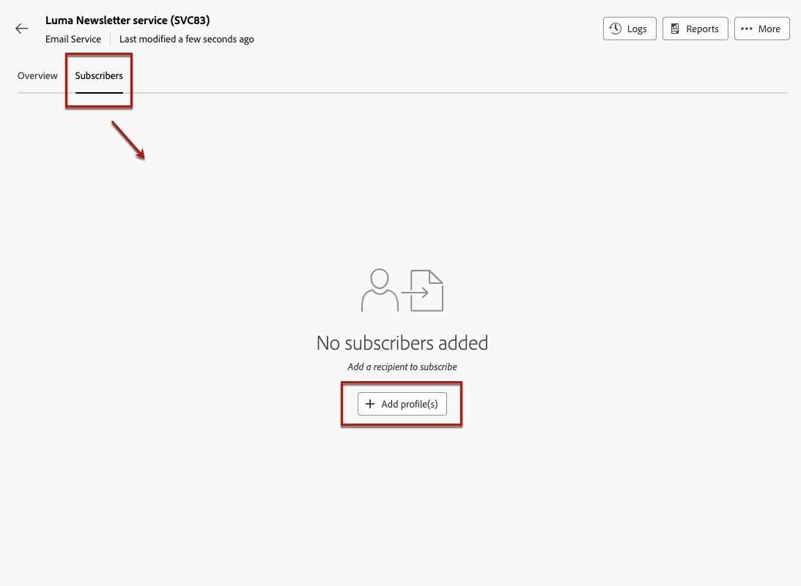
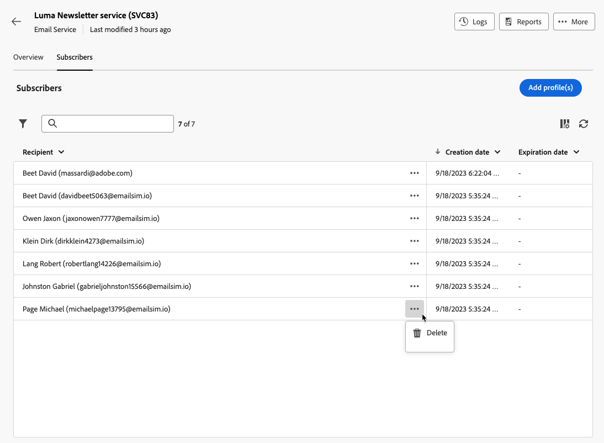

# Administración de los suscriptores {#manage-subscribers}

Una vez que [haya creado un servicio](manage-services.md#create-service), puede agregar suscriptores, cancelar la suscripción de destinatarios y enviar mensajes a los suscriptores de ese servicio.

La administración de los suscriptores se detalla en esta página. Para aprender a enviar mensajes a los suscriptores, consulte [esta sección](../msg/send-to-subscribers.md).

## Añadir suscriptores a su servicio {#add-subscribers}

Para añadir suscriptores manualmente, siga los pasos a continuación.

1. Seleccione un servicio existente de la lista **[!UICONTROL Servicios de suscripción]**.

1. Vaya a la ficha **[!UICONTROL Suscriptores]** y haga clic en **[!UICONTROL Agregar suscriptores]**.

   {zoomable="yes"}

1. Seleccione los perfiles que desee agregar de la lista y haga clic en **[!UICONTROL Confirmar]**.

   {zoomable="yes"}

1. Haga clic en **[!UICONTROL Enviar]**<!--if you click cancel, does it mean that no message is sent but recipients are still subscribed, or they are not subscribed? it's 2 different actions in the console)--> para que los destinatarios seleccionados reciban la suscripción [mensaje de confirmación](manage-services.md#create-confirmation-message) que definió al [crear el servicio](manage-services.md#create-service).

   {zoomable="yes"}

   >[!NOTE]
   >
   >Si selecciona **[!UICONTROL Cancelar]**, no se enviará ningún mensaje de confirmación a los perfiles seleccionados, pero están suscritos.

Los perfiles agregados se muestran en la ficha **[!UICONTROL Suscriptores]**. Ahora están suscritos a su servicio.

## Eliminación de suscriptores del servicio {#remove-subscribers}

### Cancelar la suscripción manual de perfiles {#manual-unsubscription}

Una vez que [agregaste suscriptores](#add-subscribers) a tu servicio, puedes cancelar manualmente la suscripción de cada uno de ellos. Siga los pasos a continuación.

1. Seleccione un servicio existente de la lista **[!UICONTROL Servicios de suscripción]**.

1. Haga clic en el icono de tres puntos junto al nombre del destinatario deseado y seleccione **[!UICONTROL Eliminar]**.

   {zoomable="yes"}

1. Confirme la eliminación.

1. Haga clic en **[!UICONTROL Enviar]** para que el destinatario seleccionado reciba el [mensaje de confirmación](manage-services.md#create-confirmation-message) de baja que definió al [crear el servicio](manage-services.md#create-service).

   {zoomable="yes"}

El destinatario se eliminó de la ficha **[!UICONTROL Suscriptores]** y ya no está suscrito a su servicio.

### Cancelar automáticamente la suscripción de destinatarios {#automatic-unsubscription}

Un servicio de suscripción puede tener una duración limitada. La suscripción a los perfiles se cancela automáticamente cuando caduca el período de validez.

Este período se especificó al [crear el servicio](manage-services.md#create-service). En **[!UICONTROL Opciones adicionales]**, deshabilite la opción **[!UICONTROL Período de validez ilimitado]** y defina un período de validez para el servicio.

{zoomable="yes"}

Una vez que caduca la duración especificada, se cancela la suscripción de forma automática a todos los suscriptores de ese servicio.
