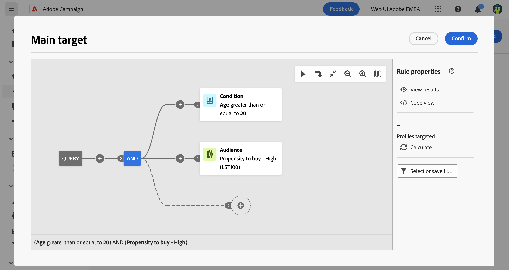

# Crear un público único {#one-time}

En esta sección se describe cómo crear una audiencia al crear una nueva entrega. En este caso, los perfiles que se incluyen en la audiencia de envío se segmentan consultando la base de datos con el modelador de consultas.

La audiencia resultante solo se utiliza una vez para este envío. No se guarda en la lista de audiencias.

Al definir el objetivo principal de una entrega, también puede:

* [Seleccionar una audiencia existente](add-audience.md) desde el **[!UICONTROL Audiencias]** lista.
* [Carga de una audiencia desde un archivo externo](file-audience.md) (solo para correos electrónicos).

Para crear una nueva audiencia directamente desde una entrega, siga estos pasos:

1. En la sección **Público** del asistente de creación de envíos, haga clic en el botón **[!UICONTROL Seleccionar el público]**.

   {zoomable=&quot;yes&quot;}

1. Seleccione **Crear la suya propia**. Se muestra el modelador de consultas. Permite definir la población objetivo de la entrega filtrando los datos contenidos en la base de datos. [Aprenda a utilizar el modelador de consultas](../query/query-modeler-overview.md)

   {zoomable=&quot;yes&quot;}

1. Una vez preparada la consulta, haga clic en **Confirmar** para utilizar la audiencia de como objetivo principal de su envío.

   También puede establecer un grupo de control para medir el impacto de sus campañas. El grupo de control no recibe el mensaje. Esto le permite comparar el comportamiento de la población que recibió el mensaje con el comportamiento de los contactos que no lo hicieron. [Más información](control-group.md)
