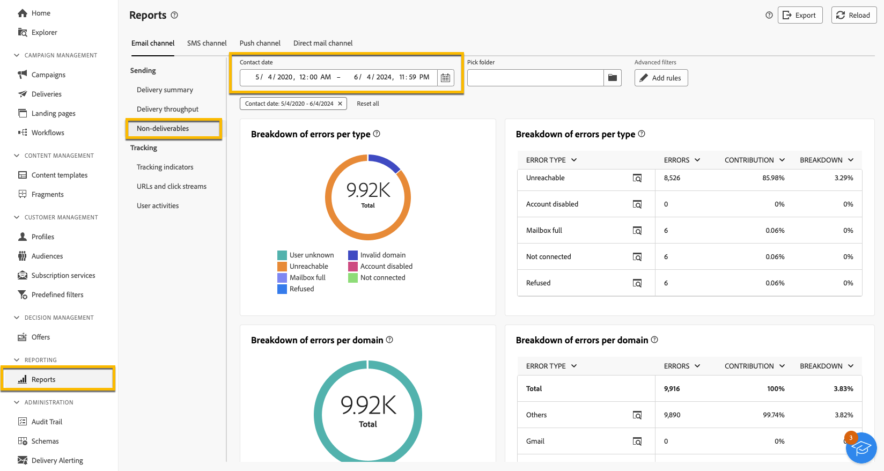

# Administración de cuarentena {#quarantines}

Adobe Campaign administra las direcciones en cuarentena de los canales de correo electrónico, push y SMS.

La cuarentena solo se aplica a una **dirección de correo electrónico**, un **número de teléfono** o un **token de dispositivo**, pero no al propio perfil. Por ejemplo, un perfil cuya dirección de correo electrónico se haya puesto en cuarentena puede actualizarse con una nueva dirección. El perfil podría volver a segmentarse con acciones de envío. Del mismo modo, si dos perfiles comparten el mismo número de teléfono, ambos se verán afectados si el número está en cuarentena.

>[!CAUTION]
>
>La cuarentena en Adobe Campaign distingue entre mayúsculas y minúsculas.

## Qué es la cuarentena {#quarantines-what}

La cuarentena es el método usado para **administrar direcciones no válidas en las entregas**.

Si una entrega tiene una alta tasa de direcciones no válidas, puede considerarse correo no deseado. Incluir en la lista de bloqueados La administración de esas direcciones con cuarentena ayuda a evitar que los proveedores de Internet las. Esto es importante para mantener su reputación.

Cuando una dirección está en cuarentena en Adobe Campaign, el perfil se excluye automáticamente del destinatario durante el análisis de la entrega.

La cuarentena reduce los costes de envío de SMS al excluir de las entregas los números de teléfono incorrectos.

Obtenga más información acerca de las cuarentenas en la [documentación de Campaign v8 (consola)](https://experienceleague.adobe.com/es/docs/campaign/campaign-v8/send/failures/quarantines){target="_blank"}.

## Por qué se envía una dirección a cuarentena {#quarantines-why}

Muchas razones pueden enviar una dirección a cuarentena:

* Para SMS, números de teléfono erróneos
* En el caso de los SMS, cuando el perfil responde a un mensaje SMS con una palabra clave como &quot;STOP&quot;
* En el caso del correo electrónico, cuando el mensaje se clasifica como correo no deseado. El mensaje se redirige automáticamente a un buzón de correo técnico administrado por Adobe. Incluir en la lista de bloqueados A continuación, la dirección de correo electrónico del usuario se envía automáticamente a la cuarentena con el estado.
* Una dirección de correo electrónico se puede poner en cuarentena, por ejemplo, cuando el buzón está lleno, si la dirección no existe o si el servidor de correo electrónico no está disponible.

Obtenga más información acerca de los errores de entrega en la [documentación de Campaign v8 (consola)](https://experienceleague.adobe.com/es/docs/campaign/campaign-v8/send/failures/delivery-failures){target="_blank"}.

## Dónde encontrar las direcciones en cuarentena {#quarantines-where}

Puede ver todas las direcciones en cuarentena de su instancia en **[!UICONTROL Explorador]** > **[!UICONTROL Administración]** > **[!UICONTROL Administración de campañas]** > **[!UICONTROL Administración de no entregables]** > **[!UICONTROL No entregables y direcciones]**. Esta sección enumera los elementos en cuarentena para los canales de correo electrónico, SMS y notificaciones push.

{zoomable="yes"}

También puede acceder a un informe sobre la cuarentena en su instancia:

{zoomable="yes"}

Para cada entrega, puede consultar el Delivery summary report. Muestra el número de direcciones en cuarentena en el destino de la entrega:

{zoomable="yes"}

Puede explorar más opciones para administrar las direcciones en cuarentena en la consola de Adobe Campaign. [Más información](https://experienceleague.adobe.com/es/docs/campaign/campaign-v8/send/failures/quarantines#access-quarantined-addresses).