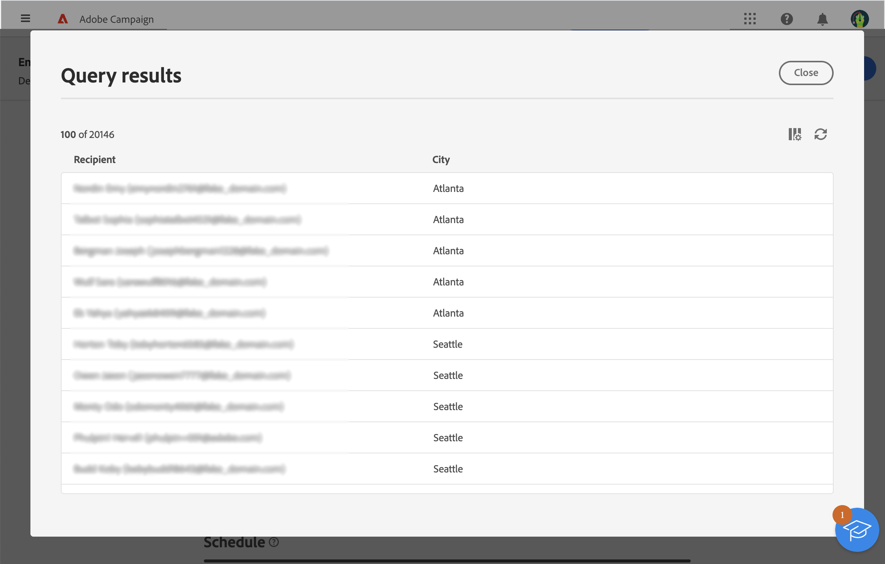

# Trabajo con el generador de reglas {#segment-builder}

>[!CONTEXTUALHELP]
>id="acw_homepage_card5"
>title="Públicos destinatarios"
>abstract="Crear un objetivo de envío nunca ha sido tan fácil. Con nuestro último generador de reglas, ahora puede definir criterios de filtrado para destinatarios o cualquier otra dimensión de segmentación de la base de datos. Aproveche la audiencia de Adobe Experience Platform para refinar aún más la audiencia de destino y maximizar el impacto de la campaña."

El generador de reglas permite definir la población objetivo de la entrega filtrando los datos contenidos en la base de datos. Puede utilizarlo para crear una audiencia a partir de un flujo de trabajo mediante una **[!UICONTROL Crear audiencia]** actividad de o directamente al crear una entrega para crear una audiencia única.

* [Obtenga información sobre cómo crear una audiencia](create-audience.md)
* [Obtenga información sobre cómo crear una audiencia única para una entrega](one-time-audience.md)

## La paleta

La paleta, situada en la parte izquierda, contiene todos los elementos que se pueden filtrar para crear una audiencia. Puede utilizar la barra de búsqueda para encontrar los elementos rápidamente. Los mosaicos contenidos en la paleta deben moverse al lienzo central para que se puedan configurar y tener en cuenta.

{width="70%" align="left"}

La paleta se divide en dos pestañas:

* **Atributos**: esta pestaña permite acceder a todos los campos disponibles del esquema. La lista de campos depende del esquema de segmentación definido en la plantilla de correo electrónico.

* **Audiencias**: esta pestaña le permite filtrar con una de las audiencias existentes definidas en la consola de Campaign Classic o desde Adobe Experience Platform. [Obtenga información sobre cómo monitorizar y administrar audiencias](manage-audience.md)

  >[!NOTE]
  >
  >Para aprovechar las audiencias de Adobe Experience Platform, debe configurar la integración con Destinos. Consulte la [Documentación de destinos de Adobe Experience Platform](https://experienceleague.adobe.com/docs/experience-platform/destinations/home.html?lang=es){target="_blank"}.

## El lienzo

El lienzo es la zona central en la que se pueden configurar y combinar las reglas basadas en los elementos agregados desde la paleta. Para agregar una regla nueva, arrastre un mosaico desde la paleta y suéltelo en el lienzo. A continuación, se le pueden presentar opciones específicas del contexto según el tipo de datos que se agreguen.

{width="70%" align="left"}

## El panel Propiedades de regla

En el lado derecho, la **Propiedades de regla** le permite realizar las acciones que se indican a continuación.

{width="70%" align="left"}

* **Ver resultados:** muestra la lista de los destinatarios a quienes se dirige la audiencia.
* **Vista de código**: muestra una versión de la audiencia basada en código en SQL.
* **Mostrar atributos avanzados**: marque esta opción si desea ver la lista completa de atributos de la paleta izquierda: nodos, agrupaciones, vínculos 1-1, vínculos 1-N.
* **Calcular**: actualiza y muestra el número de perfiles objetivo por la consulta.
* **Seleccionar o guardar filtro**: utilice un filtro predefinido para filtrar la consulta o guárdela como un nuevo filtro para su reutilización futura. [Aprenda a trabajar con filtros predefinidos](../get-started/predefined-filters.md)

  >[!IMPORTANT]
  >
  >En esa versión del producto, algunos filtros predefinidos no están disponibles en la interfaz de usuario. Aún puede usarlos. [Más información](../get-started/guardrails.md#predefined-filters-filters-guardrails-limitations)

* **Atributos**: muestra una descripción de la audiencia creada.

## Ejemplo

En este ejemplo, creamos una audiencia para dirigirla a todos los clientes que viven en Atlanta o Seattle y que nacieron después de 1980.

1. En la pestaña **Atributos** de la paleta, busque el campo **Fecha de nacimiento**. Arrastre el mosaico y suéltelo en el lienzo.

   

1. En el lienzo, elija el operador **Después** e introduzca la fecha deseada.

   

1. En la paleta, busque el campo **Ciudad** y añádalo al lienzo debajo de la primera regla.

   

1. En el campo de texto, introduzca el nombre de la primera ciudad y, a continuación, pulse Intro.

   

1. Repita esta acción para el segundo nombre de ciudad.

   

1. Haga clic en **Ver resultados** para mostrar la lista y el número de destinatarios que coinciden con la consulta. También puede añadir columnas para visualizar y comprobar los datos. En nuestro ejemplo, agregue la columna **Ciudad** y debería ver Atlanta y Seattle.

   

1. Haga clic en **Confirmar**.
