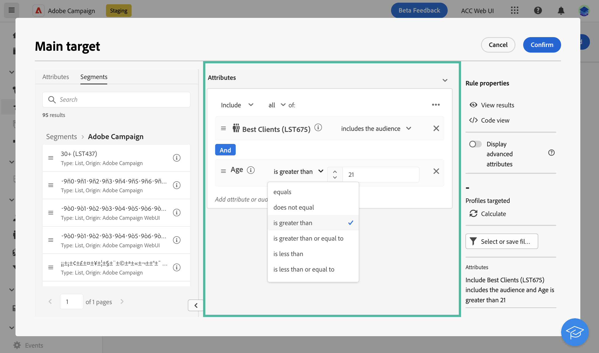

# Definir una audiencia con el generador de reglas {#segment-builder}

En esta sección se describe cómo crear una audiencia al diseñar un nuevo correo electrónico. La audiencia creada solo se puede utilizar en este correo electrónico.

El generador de reglas permite definir la población objetivo del mensaje filtrando los datos contenidos en la base de datos. Si desea seleccionar una audiencia existente, consulte esta [sección](add-audience.md).

Para obtener más información sobre el generador de reglas, consulte la [Documentación del servicio de segmentación](https://experienceleague.adobe.com/docs/experience-platform/segmentation/ui/segment-builder.html).

Para crear una audiencia nueva al diseñar un correo electrónico, siga estos pasos:

1. En el **Audiencia** del asistente de creación de envíos, haga clic en el botón **[!UICONTROL Seleccionar la audiencia]** botón.

   

1. Select **Cree sus propios**. Se muestra el generador de reglas.

   

## La paleta

La paleta, situada en la parte izquierda, contiene todos los elementos que se pueden filtrar para crear una audiencia. Los mosaicos contenidos en la paleta deben moverse al lienzo central para que se puedan configurar y tener en cuenta. La paleta se divide en dos fichas:

* **Atributos**: esta pestaña le permite acceder a todos los campos disponibles del esquema . La lista de campos depende del esquema de objetivo definido en la plantilla de correo electrónico.

   {width="70%" align="left"}

* **Audiencias**: esta pestaña le permite filtrar con una de las audiencias existentes definidas en la consola del Campaign Classic o desde Adobe Experience Platform.

   {width="70%" align="left"}

   >[!NOTE]
   >
   >Para aprovechar las audiencias de Adobe Experience Platform, debe configurar la integración con Destinations. Consulte la [Documentación de destinos](https://experienceleague.adobe.com/docs/experience-platform/destinations/home.html?lang=es).

Puede utilizar la barra de búsqueda para encontrar los elementos rápidamente.

## El lienzo

El lienzo es la zona central en la que se pueden configurar y combinar reglas basadas en los elementos añadidos desde la paleta. Para agregar una regla nueva, arrastre un mosaico desde la paleta y suéltelo en el lienzo. A continuación, se le presentarán opciones específicas del contexto según el tipo de datos que se agreguen.

{width="70%" align="left"}

## El panel de propiedades de la regla

En el lado derecho, la variable **Propiedades de regla** permite realizar las siguientes acciones:

{width="70%" align="left"}

* **Ver resultados:** muestra la lista de destinatarios a quienes se dirige la audiencia
* **Vista de código**: muestra una versión de la audiencia basada en código en SQL.
* **Mostrar atributos avanzados**: marque esta opción si desea ver la lista completa de atributos de la paleta izquierda: nodos, agrupaciones, vínculos 1-1, vínculos 1-N.
* **Atributos**: muestra una descripción de la audiencia creada.

## Ejemplo

En este ejemplo, crearemos una audiencia dirigida a todos los clientes que viven en Atlanta o Seattle y que nacieron después de 1980.

1. En el **Atributos** de la paleta, busque **Fecha de nacimiento** campo . Arrastre el mosaico y suéltelo en el lienzo.

   

1. En el lienzo, elija la opción **Después** e introduzca la fecha deseada.

   

1. En la paleta, busque **Ciudad** y añádalo al lienzo debajo de la primera regla.

   

1. En el campo de texto, introduzca el nombre de la primera ciudad y, a continuación, pulse Intro.

   

1. Repita esta acción para el segundo nombre de ciudad.

   

1. Haga clic en **Ver resultados** para mostrar la lista y el número de destinatarios que coinciden con la consulta. También puede añadir columnas para visualizar y comprobar los datos. En nuestro ejemplo, agregue la variable **Ciudad** y debería ver Atlanta y Seattle.

   

1. Haga clic en **Confirm**.

La audiencia está definida y lista para utilizarse en el correo electrónico.