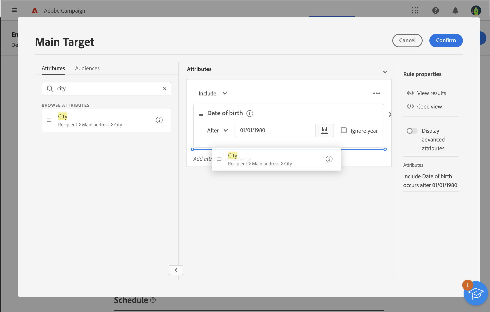

# Trabajar con el generador de reglas {#segment-builder}

El generador de reglas permite definir la población objetivo de la entrega filtrando los datos contenidos en la base de datos. Utilícelo para crear una audiencia a partir de un flujo de trabajo con una actividad **[!UICONTROL Generar audiencia]** o directamente al crear una entrega para crear una audiencia única.

* [Obtenga información sobre cómo crear y guardar una audiencia](create-audience.md)
* [Obtenga información sobre cómo crear una audiencia única para una entrega](one-time-audience.md)

## La paleta

La paleta, situada en el lado izquierdo, contiene todos los elementos por los que puede filtrar para crear su audiencia. Utilice la barra de búsqueda para buscar elementos rápidamente. Mueva los mosaicos contenidos en la paleta al lienzo central para configurarlos y tenerlos en cuenta.

{zoomable="yes"}{width="70%" align="left"}

La paleta se divide en dos pestañas:

* **Atributos**: esta ficha proporciona acceso a todos los campos disponibles del esquema. La lista de campos depende del esquema de segmentación definido en la plantilla de correo electrónico.

* **Audiencias**: esta pestaña le permite filtrar usando una de las audiencias existentes definidas en la consola de Campaign Classic o desde Adobe Experience Platform. Aprenda a monitorizar y administrar las audiencias en [esta sección](manage-audience.md).

  >[!NOTE]
  >
  >Para utilizar audiencias de Adobe Experience Platform, configure la integración con Destinos. Consulte la [documentación de destinos de Adobe Experience Platform](https://experienceleague.adobe.com/docs/experience-platform/destinations/home.html?lang=es){target="_blank"}.

## El lienzo

El lienzo es la zona central donde se pueden configurar y combinar reglas basadas en los elementos agregados desde la paleta. Para agregar una regla nueva, arrastre un mosaico desde la paleta y suéltelo en el lienzo. Las opciones específicas del contexto se presentan en función del tipo de datos que se agregan.

{zoomable="yes"}{width="70%" align="left"}

## El panel Propiedades de regla

A la derecha, el panel **Propiedades de regla** le permite realizar las acciones que se indican a continuación.

{zoomable="yes"}{width="70%" align="left"}

* **Ver resultados:** Muestra la lista de perfiles dirigidos por la audiencia.
* **Vista de código**: muestra una versión basada en código de la audiencia en SQL.
* **Mostrar atributos avanzados**: Marque esta opción para ver la lista completa de atributos en la paleta izquierda, incluidos nodos, agrupaciones, vínculos 1-1 y vínculos 1-N.
* **Calcular**: actualiza y muestra el número de perfiles objetivo por la consulta.
* **Seleccione o guarde el filtro**: use un filtro predefinido para filtrar la consulta o guárdela como un nuevo filtro para reutilizarla en el futuro. [Aprenda a trabajar con filtros predefinidos](../get-started/predefined-filters.md).

  >[!IMPORTANT]
  >
  >En esta versión del producto, algunos filtros predefinidos no están disponibles en la interfaz de usuario. Puede usarlos de todos modos. [Más información](../get-started/guardrails.md#predefined-filters-filters-guardrails-limitations).

* **Atributos**: muestra una descripción de la audiencia creada.

## Ejemplo

En este ejemplo, se crea una audiencia para dirigirse a todos los clientes que viven en Atlanta o Seattle y que nacieron después de 1980.

1. En la pestaña **Atributos** de la paleta, busque el campo **Fecha de nacimiento**. Arrastre el mosaico y suéltelo en el lienzo.

   {zoomable="yes"}

1. En el lienzo, elija el operador **Después** e introduzca la fecha deseada.

   {zoomable="yes"}

1. En la paleta, busque el campo **Ciudad** y añádalo al lienzo debajo de la primera regla.

   {zoomable="yes"}

1. En el campo de texto, introduzca el nombre de la primera ciudad y, a continuación, pulse Intro.

   {zoomable="yes"}

1. Repita esta acción para el segundo nombre de ciudad.

   {zoomable="yes"}

1. Haga clic en **Ver resultados** para mostrar la lista y el número de destinatarios que coinciden con la consulta. Añada columnas para visualizar y comprobar los datos. En este ejemplo, agregue la columna **Ciudad** para ver Atlanta y Seattle.

   {zoomable="yes"}

1. Haga clic en **Confirmar**.