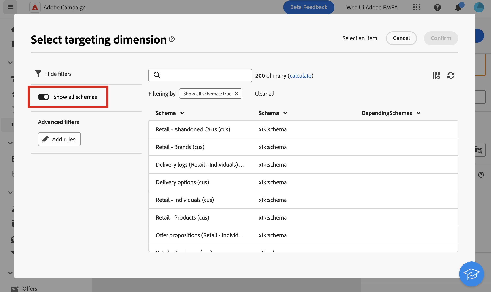

# Dimensiones de segmentación {#targeting-dimensions}

>[!CONTEXTUALHELP]
>id="acw_orchestration_build_audience_dimension"
>title="Seleccionar la dimensión de segmentación"
>abstract="La dimensión de segmentación permite definir la población a la que se dirige la operación: destinatarios, beneficiarios de contratos, operadores, suscriptores, etc. De forma predeterminada, en el caso de los correos electrónicos y SMS, el destinatario se selecciona en la tabla integrada Destinatarios. Para las notificaciones push, la dimensión de destino predeterminada son las aplicaciones del suscriptor."

La dimensión de segmentación, también conocida como. asignación de destino, es el tipo de datos que administra una operación. Permite definir la población objetivo: perfiles, beneficiarios de contratos, operadores, suscriptores, etc.

## Dimensiones de segmentación de flujos de trabajo {#workflow}

La dimensión de segmentación de un flujo de trabajo se define mediante la primera **[!UICONTROL Crear audiencia]** y se utiliza en todas las demás actividades hasta el final del flujo de trabajo. Por ejemplo, si realiza una consulta en los perfiles de la base de datos, la transición saliente contendrá datos de tipo &quot;destinatario&quot; y se transmitirá a la siguiente actividad.

Tenga en cuenta que puede cambiar la dimensión de segmentación en un flujo de trabajo mediante una [Cambiar actividad de dimensión](../workflows/activities/change-dimension.md). Esto le permite, por ejemplo, consultar la base de datos en una tabla específica, como compras o suscripciones, y luego cambiar la dimensión de segmentación a Destinatarios para realizar envíos a los perfiles correspondientes.

Al seleccionar una dimensión de segmentación (en la configuración del flujo de trabajo o en actividades como **Crear audiencia**, **Reconciliación** o **Cambiar dimensión**), se muestra una selección de los esquemas utilizados comúnmente de forma predeterminada en la lista. Para mostrar todos los esquemas disponibles, active la opción **[!UICONTROL Mostrar todos los esquemas]** botón. La selección de opciones se guarda para cada usuario.

{zoomable="yes"}

## Dimensiones de segmentación {#list}

De forma predeterminada, las plantillas de entrega de correo electrónico y SMS se dirigen a perfiles. Por lo tanto, su dimensión de destino utiliza los campos del **nms:destinatario** tabla. Para las notificaciones push, la dimensión de destino predeterminada es **Aplicaciones del suscriptor nms:appSubscriptionRcp**, que está vinculado a la tabla de destinatarios.

También puede utilizar otras asignaciones de destino integradas en los flujos de trabajo y envíos que se enumeran a continuación:

| Nombre | Usar para | Esquema |
|---|---|---|
| Destinatarios | Envío a perfiles/destinatarios (tabla de destinatarios integrada) | nms:recipient |
| Visitantes | Envío a los visitantes cuyos perfiles se hayan recopilado mediante recomendación (marketing viral) por ejemplo. | mns:visitor |
| Suscripciones | Envío a perfiles suscritos a un servicio informativo, como un boletín informativo | nms:subscription |
| Suscripciones de visitantes | Envío a los visitantes que están suscritos a un servicio de información | nms:visitorSub |
| Operadores | Envío a los operadores de Adobe Campaign | nms:operator |
| Archivo externo | Envío a través de un archivo que contiene toda la información necesaria para la entrega | No hay ningún esquema vinculado, no se ha introducido ningún destino |
| Aplicaciones del suscriptor | Envío a perfiles suscritos a una aplicación | nms:appSubscriptionRcp |

Además, puede crear una nueva asignación de destino según sus necesidades. Esta operación solo se realiza desde la consola del cliente. Obtenga más información en [Documentación de Campaign v8 (consola de cliente)](https://experienceleague.adobe.com/docs/campaign/campaign-v8/audience/add-profiles/target-mappings.html#new-mapping){target="_blank"}.
