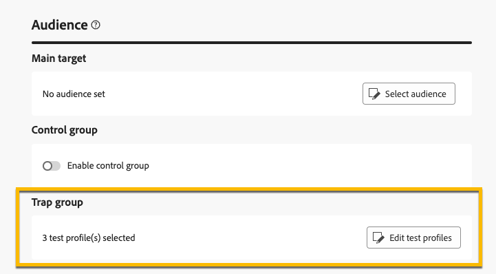

# Usar un grupo de reventado {#trap-group}

>[!CONTEXTUALHELP]
>id="acw_homepage_welcome_rn3"
>title="Grupo de reventado"
>abstract="Puede utilizar un grupo de reventado para incluir direcciones específicas en los envíos con el fin de monitorizar y verificar el proceso de distribución mediante perfiles de direccionamiento que no coinciden con los criterios de destino definidos."
>additional-url="https://experienceleague.adobe.com/docs/campaign-web/v8/release-notes/release-notes.html?lang=es" text="Consulte las notas de la versión"

Se usa un **[!UICONTROL grupo de reventado]** (también conocido como **[!UICONTROL lista semilla]**) para incluir direcciones específicas en las entregas a fin de supervisar y verificar el proceso de distribución mediante perfiles de destino que no coinciden con los criterios de destino definidos. De este modo, los destinatarios que estén fuera del alcance de la entrega pueden recibirlo como lo haría cualquier otro destinatario.

Un **[!UICONTROL grupo de captura]** es un grupo de **[!UICONTROL direcciones semilla]**, denominadas **[!UICONTROL perfil de prueba]** en la interfaz de usuario web de Campaign.

## Razones para utilizar un grupo de captura {#why-trap-group}

Puede usar **[!UICONTROL grupo de reventado]**:

1. **Como prueba**: cada miembro del **[!UICONTROL grupo de captura]** recibirá la entrega como si formara parte de la audiencia.

1. **Para proteger tu lista de correo**: al recibir lo que la audiencia recibirá, cada **[!UICONTROL perfil de prueba]** del **[!UICONTROL grupo de trampas]** recibirá una notificación si la lista de correo la usa un tercero.

>[!NOTE]
>
>Además de [enviar pruebas durante la creación de la entrega](../email/create-email.md#preview-test) y desde [grupo de control](control-group.md), agregar un grupo de captura es una buena manera de probar la audiencia.

## Grupos de reventado {#about-trap-group}

Los perfiles de prueba se excluyen automáticamente de los informes en las siguientes estadísticas de envío: **Clics**, **Aperturas**, **Cancelaciones de suscripciones**. Los informes solo tratan sobre la audiencia real.

Para una entrega por correo electrónico, solo se necesita la dirección de correo electrónico para el **[!UICONTROL grupo de reventado]**, la personalización de los demás campos se rellenará aleatoriamente mediante Campaign.

## Adición de un grupo de captura en una entrega {#trap-group-in-delivery}

Para configurar un **[!UICONTROL grupo de reventado]**, ve a la configuración de **[!UICONTROL Audiencia]** de tu entrega. Dispone de dos opciones:

* [Seleccionar perfiles de prueba](#select-test-profile)
* [Crear condición](#create-condition)

{zoomable="yes"}

### Seleccionar perfiles de prueba {#select-test-profiles}

Al elegir **Seleccionar perfiles de prueba**, puede usar el botón **Agregar perfiles de prueba** como se muestra a continuación:

{zoomable="yes"}

Al hacer clic en el botón, tiene acceso a los perfiles de prueba, a los que puede agregar su **[!UICONTROL grupo de reventado]**. Seleccione los que desee utilizar.

También puede crear nuevos perfiles de prueba. [Más información](#create-seed)

{zoomable="yes"}

Cuando confirme los perfiles de prueba, compruebe que dispone del número correcto en **[!UICONTROL Grupo de reventado]**.

{zoomable="yes"}

### Crear condición {#create-condition}

Con la opción **[!UICONTROL Crear condición]**, puede crear una consulta para definir los perfiles de prueba que desee utilizar:

{zoomable="yes"}

Su consulta se muestra en **[!UICONTROL Grupo de reventado]**.

{zoomable="yes"}

## Creación de un nuevo perfil de prueba {#create-seed}

Puede crear un nuevo **[!UICONTROL perfil de prueba]** desde la carpeta **[!UICONTROL Explorador]** > **[!UICONTROL Recursos]** > **[!UICONTROL Campaign Management]** > **[!UICONTROL Miembros semilla]**.

{zoomable="yes"}

Configure todas las opciones de su **[!UICONTROL perfil de prueba]** como para cualquier perfil:

{zoomable="yes"}
