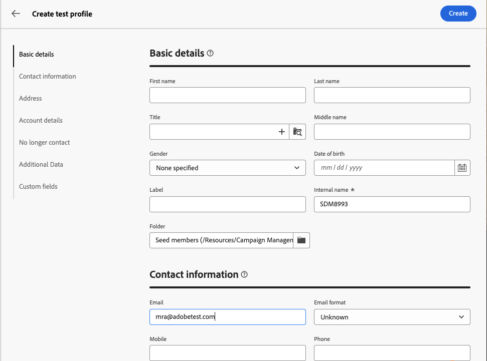

# Utilice un **[!UICONTROL grupo de reventado]** {#trap-group}

A **[!UICONTROL grupo de reventado]** se utiliza para dirigirse a los destinatarios que no coinciden con los criterios de destino definidos. De este modo, los destinatarios que estén fuera del alcance de la entrega pueden recibirlo como lo haría cualquier otro destinatario.
A **[!UICONTROL grupo de reventado]** es un grupo de **[!UICONTROL direcciones semilla]**.

## Por qué utilizar **[!UICONTROL grupo de reventado]**

Puede utilizar **[!UICONTROL grupo de reventado]** :

1. **Como prueba** : cada miembro del **[!UICONTROL Grupo de reventado]** recibirá el envío como si formara parte de la audiencia.

1. **Para proteger su lista de correo** : al recibir lo que recibirá la audiencia, cada uno **[!UICONTROL dirección semilla]** de la **[!UICONTROL Grupo de reventado]** se le notificará si la lista de correo la utiliza un tercero.

## Acerca de **[!UICONTROL Grupo de reventado]**

Las direcciones semilla se excluyen automáticamente de los informes en las siguientes estadísticas de envío: **Clics**, **Aperturas**, **Baja de suscripciones**. Los informes solo tratan sobre la audiencia real.

Para una entrega por correo electrónico, solo se necesita la dirección de correo electrónico para la **[!UICONTROL Grupo de reventado]**, la personalización de otros campos se rellenará aleatoriamente mediante Campaign.

## Cómo configurar una **[!UICONTROL Grupo de reventado]** en la entrega

Para configurar una **[!UICONTROL Grupo de reventado]**, vaya a la **[!UICONTROL Audiencia]** configuración del envío. Dispone de dos opciones:
- [Seleccionar perfiles de prueba](#select-test-profile)
- [Crear condición](#create-condition)

{zoomable="yes"}

### Seleccionar perfiles de prueba {#select-test-profiles}

Al elegir &quot;Seleccionar perfiles de prueba&quot;, tendrá la ventana de abajo a la que está invitado **[!UICONTROL Añadir perfil(es) de prueba]** :

{zoomable="yes"}

Al hacer clic en el botón, se accede a las direcciones semilla que se pueden añadir **[!UICONTROL grupo de reventado]**. Seleccione los que desee utilizar.
Se pueden crear nuevas direcciones semilla. [Más información](#create-seed)

{zoomable="yes"}

Cuando confirme las direcciones de captura, compruebe que tiene el número correcto debajo de **[!UICONTROL Grupo de reventado]**.

{zoomable="yes"}

### Crear condición {#create-condition}

Con el **[!UICONTROL Crear condición]** , obtendrá una nueva ventana donde puede personalizar una consulta para definir las direcciones semilla que desee utilizar

{zoomable="yes"}

Su consulta se mostrará en **[!UICONTROL Grupo de reventado]**.

{zoomable="yes"}

## Cómo crear un nuevo **[!UICONTROL dirección semilla]** {#create-seed}

Puede crear un nuevo **[!UICONTROL dirección semilla]** in **[!UICONTROL Explorer]** > **[!UICONTROL Recursos]** > **[!UICONTROL Campaign Management]** > **[!UICONTROL Miembros semilla]**

{zoomable="yes"}

Puede completar todos los detalles sobre el miembro semilla como si fuera un perfil de audiencia

{zoomable="yes"}