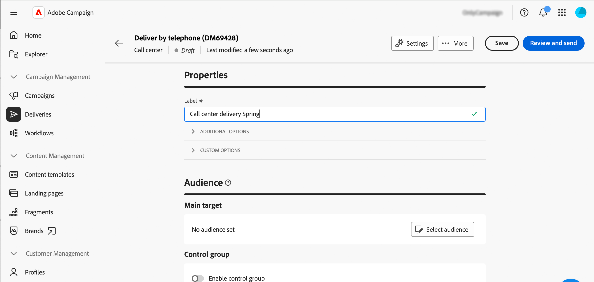

# Creación y envío de una entrega de centro de llamadas {#create-call-center}

Puede crear una entrega independiente del centro de llamadas o crear una en el contexto de un flujo de trabajo de la campaña. Los pasos siguientes detallan el procedimiento para un envío independiente (de una sola toma). Si está trabajando en el contexto de un flujo de trabajo de campaña, los pasos de creación se detallan en [esta sección](../workflows/activities/channels.md#create-a-delivery-in-a-campaign-workflow).

Para crear y enviar una nueva entrega independiente del centro de llamadas, siga estos pasos principales:

1. Cree la entrega [leer más](#create-delivery)
1. Defina la audiencia, [leer más](#select-audience)
1. Editar el contenido, [leer más](#edit-content)
1. Previsualice y envíe el envío, [leer más](#preview-send)

## Creación del envío{#create-delivery}

Siga estos pasos para crear la entrega y configurar sus propiedades:

1. Seleccione el menú **[!UICONTROL Envíos]** y haga clic en el botón **[!UICONTROL Crear envío]**.

1. Elija **[!UICONTROL Centro de llamadas]** como canal y haga clic en **[!UICONTROL Crear envío]** para confirmar.

   {zoomable="yes"}

   >[!NOTE]
   >
   >Si desea seleccionar una plantilla diferente, consulte esta [página](../msg/delivery-template.md).

1. En **[!UICONTROL Propiedades]**, escriba una **[!UICONTROL Etiqueta]** para la entrega. Las opciones adicionales se detallan en esta [sección](../email/create-email.md#create-email).

   {zoomable="yes"}

>[!NOTE]
>
>Puede programar el envío para que se realice en una fecha específica. Para obtener más información, consulte [esta sección](../msg/gs-deliveries.md#gs-schedule).

## Definición del público{#select-audience}

Ahora, debe definir la audiencia a la que se dirige el archivo de extracción.

1. En la sección **[!UICONTROL Audiencia]** de la página de entrega, haga clic en **[!UICONTROL Seleccionar audiencia]**.

   {zoomable="yes"}

1. Elija una audiencia existente o cree la suya propia.

   * [Obtenga información sobre cómo seleccionar una audiencia existente](../audience/add-audience.md)
   * [Obtenga información sobre cómo crear una audiencia nueva](../audience/one-time-audience.md)

   {zoomable="yes"}

>[!NOTE]
>
>Los destinatarios del centro de llamadas deben contener al menos sus nombres y número de teléfono. Los destinatarios con información incompleta se excluyen de las entregas del centro de llamadas.
>
>Para aprender a configurar grupos de control, consulte esta [página](../audience/control-group.md)

## Edición del contenido{#edit-content}

Ahora, vamos a editar el contenido del archivo de extracción que generará el envío del centro de llamadas.

1. En la página de envío, haga clic en el botón **[!UICONTROL Editar contenido]**.

   {zoomable="yes"}

1. Especifique el campo **[!UICONTROL Nombre de archivo]**. Para aprender a personalizar el nombre de archivo, consulte esta [página](../personalization/personalize.md).

1. Seleccione un **[!UICONTROL formato de archivo]**: **Texto**, **Texto con columnas de ancho fijo**, **CSV (Excel)** o **XML**.

   {zoomable="yes"}

   >[!NOTE]
   >
   >Las opciones de formato de extracción se detallan en esta [página](../direct-mail/content-direct-mail.md#properties).

1. Active la opción **[!UICONTROL Cantidad solicitada]** si desea restringir el número de destinatarios de su entrega.

1. En la sección **[!UICONTROL Contenido]**, haga clic en el botón **[!UICONTROL Agregar atributo]** para crear una nueva columna que se mostrará en el archivo de extracción.

1. Seleccione el atributo que desea mostrar en la columna y, a continuación, confirme la selección. Para obtener más información sobre cómo seleccionar atributos y agregarlos a favoritos, consulte esta [página](../get-started/attributes.md).

   

1. Repita estos pasos para agregar tantas columnas como sea necesario para el archivo de extracción.

   A continuación, puede editar los atributos, ordenar el archivo de extracción o cambiar la posición de las columnas. Para obtener más información, consulte esta [página](../direct-mail/content-direct-mail.md#content).

   

## Previsualización y envío de la entrega{#preview-send}

Cuando el contenido de la entrega está listo, puede previsualizarlo con perfiles de prueba y enviar pruebas. A continuación, puede realizar la entrega del centro de llamadas para generar el archivo de extracción.

Los pasos principales para obtener una vista previa y enviar el archivo de extracción son los siguientes. Hay más detalles disponibles en [esta página](../direct-mail/send-direct-mail.md).

1. En la página de contenido de la entrega, haga clic en el botón **[!UICONTROL Simular contenido]**.

   {zoomable="yes"}

1. Seleccione uno o varios perfiles de prueba para previsualizar el contenido personalizado. También puede enviar pruebas. [Más información](../direct-mail/send-direct-mail.md#preview-dm)

   {zoomable="yes"}

1. En la página de entrega, haga clic en **[!UICONTROL Revisar y enviar]**.

   {zoomable="yes"}

1. Haga clic en **[!UICONTROL Preparar]**, monitorice el progreso y las estadísticas proporcionadas y confirme.

   {zoomable="yes"}

1. Haga clic en **[!UICONTROL Enviar]** para continuar con el proceso de envío final y confirme.

Una vez entregado el envío, el archivo de extracción se genera automáticamente y se exporta a la ubicación especificada en la cuenta externa **[!UICONTROL Routing]** seleccionada en la [configuración avanzada](../advanced-settings/delivery-settings.md) de la plantilla de envío.

Rastree los datos de KPI (indicador de rendimiento clave) de su página de entrega y los datos del menú **[!UICONTROL Registros]**.

Empiece a medir el impacto del mensaje con los informes integrados. [Más información](../reporting/direct-mail.md)
