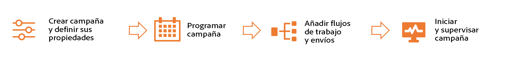

# Introducción a las campañas {#campaigns}

>[!CONTEXTUALHELP]
>id="acw_campaigns_list"
>title="Campañas"
>abstract="Examine la lista de campañas. Seleccione una campaña para ver su contenido, envíos y detalles. Puede filtrar por estado, fechas de inicio/finalización o con reglas personalizadas. También puede ver los informes de las campañas finalizadas. Haga clic en el botón **Crear campaña** para añadir una nueva campaña. Vaya a la pestaña **Plantillas** para ver y crear plantillas."

Adobe Campaign le permite organizar iniciativas de marketing segmentadas mediante la función de administración de campañas integrada. Con la capacidad de definir una programación, planifica la duración y el tiempo de las campañas para alinearlas con los objetivos estratégicos y maximizar la participación del público destinatario.

Al añadir varios flujos de trabajo y envíos específicos a la campaña, crea experiencias personalizadas en varios canales, asegurándose de que cada punto de contacto resuene con el público destinatario deseado.

Las campañas proporcionan métricas de creación de informes específicas para obtener información exhaustiva sobre el rendimiento de toda la campaña. Estas métricas ayudan a evaluar la eficacia, identificar tendencias y tomar decisiones basadas en datos para optimizar las actividades futuras. Descubra cómo acceder y conocer los informes de campaña en [esta sección](../reporting/campaign-reports.md).

Aprenda a crear, administrar y monitorizar campañas en las siguientes secciones:

* [Acceso y administración de campañas](manage-campaigns.md)
* [Cree su primera campaña](create-campaigns.md)
* [Configuración y administración del proceso de aprobación](campaign-approvals.md)
* [Examine sus informes de campaña](../reporting/campaign-reports.md).