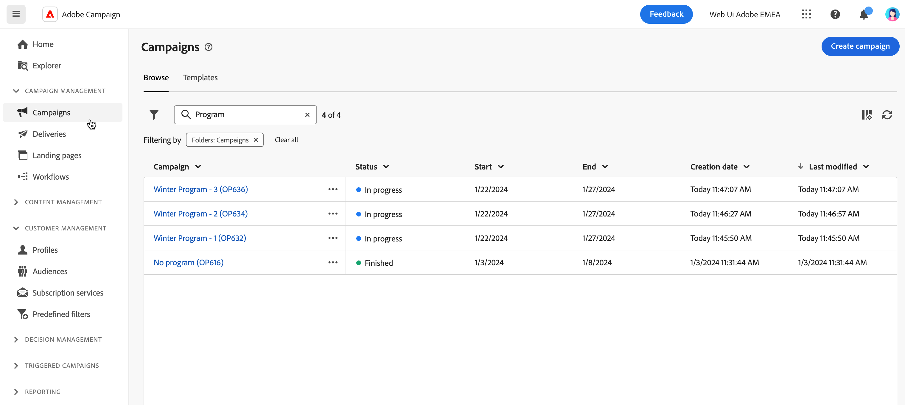

# Acceso y administración de campañas {#manage-campaigns}

>[!CONTEXTUALHELP]
>id="acw_campaign_schedule"
>title="Programación de campañas"
>abstract="Establezca o modifique la programación de campañas."

Para acceder y administrar sus campañas, haga clic en el menú **[!UICONTROL Campañas]** en el panel de navegación izquierdo.

## Lista de campañas {#access-campaigns}

En la lista de campañas, hay dos pestañas disponibles:

* La pestaña **Examinar** enumera todas las campañas existentes. Puede hacer clic en una campaña para abrir su panel de control o crear una nueva campaña haciendo clic en el botón **Crear campaña**. Consulte esta [sección](create-campaigns.md#create-campaigns).

* La pestaña **Plantillas** contiene todas las plantillas de campaña disponibles. Puede ver una plantilla existente o crear una nueva. [Más información](#manage-campaign-templates).

De forma predeterminada, cada campaña de la lista muestra información sobre su estado actual, las fechas de inicio y finalización, la fecha de creación, la última vez que se modificó, etc.

Puede personalizar las columnas mostradas haciendo clic en el icono **Configurar la columna para un diseño personalizado** situado en la esquina superior derecha de la lista. Esto le permite agregar o quitar columnas y reordenar la información en la lista de campañas.

Además, hay una barra de búsqueda y filtros disponibles para facilitar la búsqueda dentro de la lista. [Más información](../get-started/user-interface.md#list-screens).

Por ejemplo, puede filtrar la programación de su campaña. Abra el panel de filtro y utilice la sección **Fecha de inicio y de finalización**:

## Panel de control de campañas {#campaign-dashboard}

>[!CONTEXTUALHELP]
>id="acw_campaign_delivery_list"
>title="Lista de envíos en la campaña"
>abstract="La pestaña **Envíos** lista todos los envíos vinculados a la campaña actual. Haga clic en el nombre de un envío para editarlo. Utilice el botón Create envío para añadir uno nuevo para esta campaña."

>[!CONTEXTUALHELP]
>id="acw_campaign_workflow_list"
>title="Lista de flujos de trabajo de una campaña"
>abstract="La pestaña **Flujo de trabajo** enumera todos los flujos de trabajo vinculados a la campaña actual."

En la ficha **Examinar** de la lista de campañas, haga clic en el nombre de una campaña para mostrar sus detalles.

El estado y la programación de la campaña se muestran en la parte superior de la pantalla. Utilice el botón **Configuración** para actualizar las propiedades de la campaña, como la etiqueta, la carpeta y la descripción. También puede cambiar la programación de la campaña desde la pantalla de configuración. Obtenga más información acerca de la programación de campañas en [esta sección](create-campaigns.md#campaign-schedule).

Desde el panel de campañas, usa los botones **Registros** e **Informes** para monitorear tu campaña. Obtenga más información en esta [sección](create-campaigns.md#create-campaigns).

Para cada campaña, el panel muestra dos pestañas principales: Flujos de trabajo y Envíos.

* La pestaña **Flujos de trabajo** enumera todos los flujos de trabajo asociados con la campaña. Esta pestaña también le permite crear un nuevo flujo de trabajo dentro de la campaña. Consulte esta [sección](create-campaigns.md#create-campaigns).

* La ficha **Envíos** enumera todos los envíos creados en la campaña actual. También puede crear un nuevo envío dentro de la campaña. Consulte esta [sección](create-campaigns.md#create-campaigns).

>[!NOTE]
>
>La pestaña **Envíos** muestra todas las envíos vinculadas a la campaña. Sin embargo, los envíos creados en un flujo de trabajo no se pueden eliminar de allí. Para eliminar una entrega creada en el contexto de un flujo de trabajo, elimine la actividad de entrega del flujo de trabajo. [Más información](../msg/gs-messages.md#delivery-delete).

## Eliminación de una campaña {#campaign-delete}

Tiene dos formas de eliminar una campaña:

* En la lista de campañas, haga clic en el botón de puntos suspensivos y luego seleccione **Eliminar**.

  

* En la propia campaña, haga clic en el botón **Más** y luego seleccione **Eliminar**.

  

## Duplicación de una campaña {#campaign-duplicate}

Tiene dos formas de duplicar una campaña:

* En la lista de campañas, haga clic en el botón de puntos suspensivos y luego seleccione **Duplicar**.

* En la propia campaña, haga clic en el botón **Más** y luego seleccione **Duplicar**.

En ambos casos, confirme la duplicación para crear la nueva campaña. La etiqueta de la campaña es **Copia de`<label of the initial campaign>`**. Vaya a la configuración de la campaña para actualizar esta etiqueta.

## Trabajo con plantillas de campaña {#manage-campaign-templates}

Las plantillas de campaña contienen ajustes preconfigurados que se pueden reutilizar para crear nuevas campañas. Hay disponible un conjunto de plantillas integradas para ayudarle a empezar. Puede crear y configurar las plantillas de campañas y luego crear campañas a partir de estas plantillas.

Una plantilla de campaña puede almacenar la siguiente información:

* La campaña **Configuración**
* La campaña **Programar**
* Plantillas de flujo de trabajo
* Plantillas de envíos

Para crear una plantilla de campaña, siga estos pasos:

1. Haga clic en el menú **[!UICONTROL Campañas]**, vaya a la pestaña **Plantillas** y, a continuación, haga clic en el botón **[!UICONTROL Crear plantilla]**.
1. Seleccione la **plantilla** que desea utilizar. Esto le permite basar la nueva plantilla en una plantilla creada anteriormente.
1. Proporcione una etiqueta para la plantilla.
1. Si es necesario, cambie las siguientes **opciones adicionales**: nombre interno, carpeta, usuario asignado, descripción y naturaleza.
1. Defina el **Horario** de su campaña. Aprenda a establecer la programación de su campaña en [esta sección](create-campaigns.md#campaign-schedule).
1. Haga clic en **Crear**.
1. Añada flujos de trabajo y plantillas de envío a la campaña.