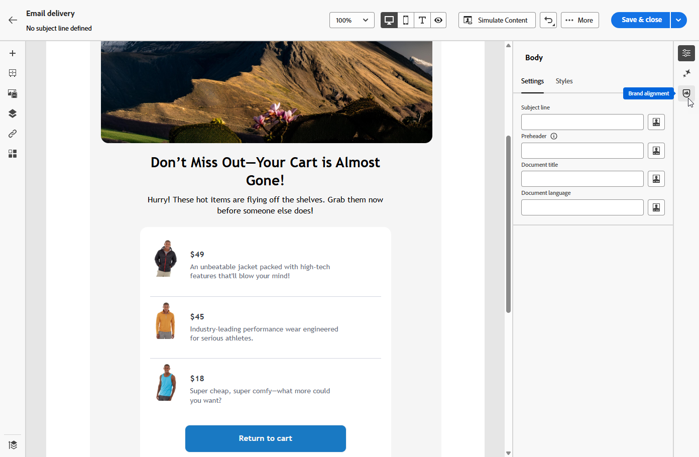

# Alineación con la marca {#brands-score}

>[!AVAILABILITY]
>
>Debe aceptar el [acuerdo de usuario](https://www.adobe.com/legal/licenses-terms/adobe-dx-gen-ai-user-guidelines.html){target="_blank"} para poder usar el Asistente para IA. Para obtener más información, póngase en contacto con su representante Adobe.

La función Alineación de marca se ha creado para ayudarle a crear, revisar y administrar contenido que se ajuste a las directrices de marca. Garantiza coherencia en el tono, la mensajería y la identidad visual en todas las campañas de correo electrónico, a la vez que sirve como una comprobación de calidad antes de que el contenido se publique.

## Validar el contenido con la alineación de marca {#validate-content}

Una vez [configurada y publicada su marca](brands.md), evalúe la puntuación de alineación de marca directamente dentro de su campaña de correo electrónico para asegurarse de que el contenido se ajuste a las directrices de marca:

1. Cree su [campaña de correo electrónico](../email/create-email.md).

1. Abra el menú **[!UICONTROL Alineación de marca]** en el diseñador de correo electrónico.

   El contenido se evaluará automáticamente en función de la marca predeterminada. [Aprenda a asignar una marca predeterminada](brands.md).

   

1. Para evaluar con una marca diferente, selecciónela en el menú desplegable **[!UICONTROL Marca]** y haga clic en **[!UICONTROL Volver a evaluar la puntuación]**.

   

1. Examine la **puntuación de alineación de marca** (alta, Medium, baja) y revise los comentarios detallados.

1. Haz clic en el icono  para ver más información sobre tu puntuación.

   

1. Seleccione cualquier directriz marcada para ver comentarios y sugerencias específicos.

   

1. Edite el contenido en función de las recomendaciones para mejorar la alineación de la marca.

1. Volver a evaluar manualmente el contenido después de realizar cambios para actualizar la puntuación de alineación.
