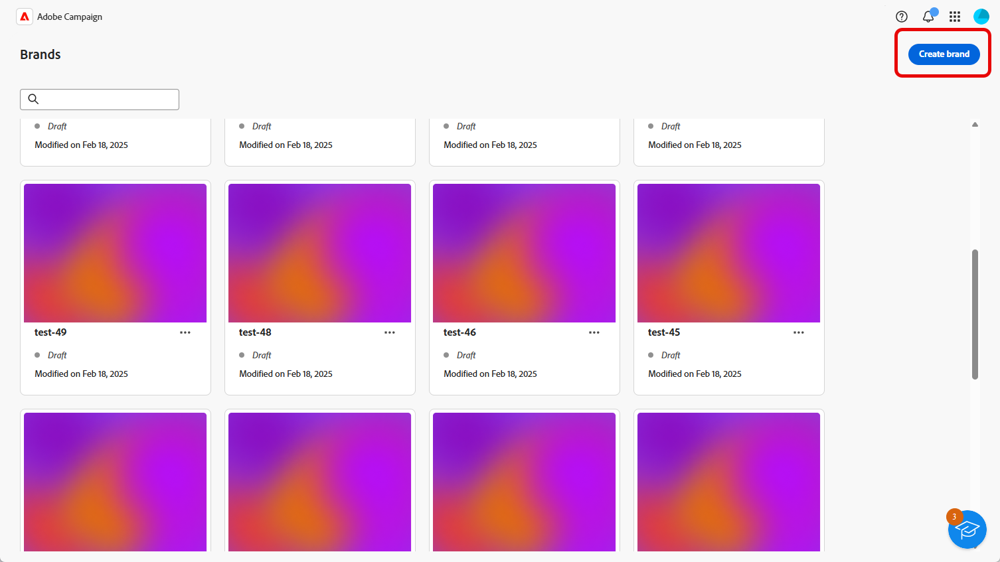
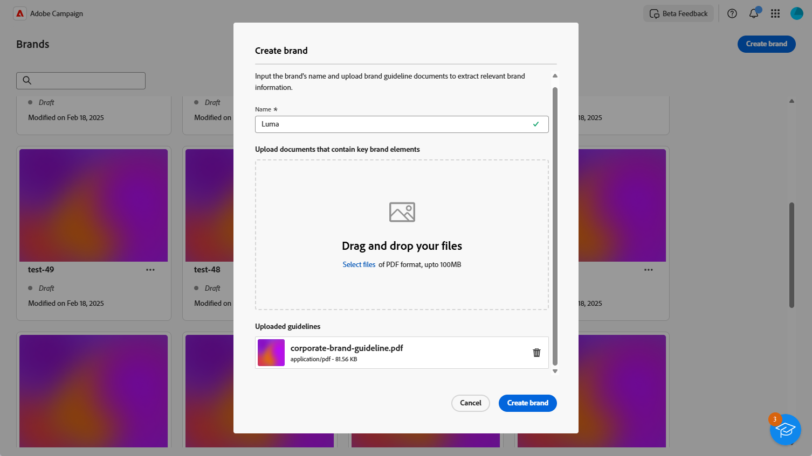

# Creación y administración de sus marcas {#brands}

Las directrices de marca son un conjunto completo de reglas y estándares que definen la identidad visual y verbal de una marca. Sirven como referencia para garantizar una representación de marca coherente en todos los canales de marketing y comunicación.

En [!DNL Adobe Campaign Web], los usuarios pueden escribir y organizar manualmente la información de marca o cargar documentos de directrices de marca para la extracción automática de datos.

## Acceso a marcas {#generative-access}

Para acceder al menú **[!UICONTROL Marcas]** en [!DNL Adobe Campaign Web], los usuarios deben tener asignados los perfiles de producto **[!UICONTROL Administrador (administrador)]** y **[!UICONTROL Kit de marca]** para crear y administrar marcas. Para obtener acceso de solo lectura, los usuarios necesitan el perfil de producto [!UICONTROL Asistente de IA]. [Más información](https://experienceleague.adobe.com/en/docs/campaign/campaign-v8/admin/permissions/manage-permissions)

+++ Aprenda a asignar permisos relacionados con la marca

1. En la página de inicio de [Admin Console](https://adminconsole.adobe.com/enterprise), acceda a su producto de Campaign.

   

1. Seleccione **[!DNL Product profile]** según el nivel de permisos que desee otorgar al usuario.

   

1. Haga clic en **[!DNL Add users]** para asignar el perfil de producto seleccionado.

   

1. Escriba el nombre, el grupo de usuarios o la dirección de correo electrónico del usuario.

1. Haga clic en **Guardar** para aplicar los cambios.

Los permisos de los usuarios que ya están asignados a esta función se actualizan automáticamente.

+++

## Cree su marca {#create-brand-kit}

Para crear y administrar las directrices de marca, siga los pasos a continuación.

Los usuarios pueden introducir los detalles manualmente o cargar un documento de directrices de marca para extraer la información automáticamente:

1. En el menú **[!UICONTROL Marcas]**, haga clic en **[!UICONTROL Crear marca]**.

   

1. Escriba un **[!UICONTROL Nombre]** para su marca.

1. Arrastre y suelte o seleccione el archivo para cargar las directrices de marca y extraer automáticamente la información de marca relevante. Haga clic en **[!UICONTROL Crear marca]**.

   Ahora comienza el proceso de extracción de información. Tenga en cuenta que puede tardar varios minutos en completarse.

   

1. Los estándares de creación visual y de contenido ahora se rellenan automáticamente. Examine las diferentes pestañas para adaptar la información según sea necesario. [Más información](#personalize)

1. Desde el menú avanzado de cada sección o categoría, puede añadir referencias para extraer automáticamente información de marca relevante.

   Para quitar el contenido existente, usa las opciones **[!UICONTROL Borrar sección]** o **[!UICONTROL Borrar categoría]**.

   

1. Una vez configurada, haz clic en **[!UICONTROL Guardar]** y luego en **[!UICONTROL Publicar]** para que la guía de marca esté disponible en el Asistente de IA.

1. Para hacer modificaciones a tu marca publicada, haz clic en **[!UICONTROL Editar marca]**.

   >[!NOTE]
   >
   >Esto crea una copia temporal en el modo de edición y reemplaza la versión activa una vez publicada.

   

1. En el panel **[!UICONTROL Marcas]**, abra el menú avanzado haciendo clic en el icono  para:

   * Ver marca
   * Editar
   * Marcar como marca predeterminada
   * Duplicar
   * Publicación
   * Cancelar publicación
   * Eliminar

   

Ahora se puede acceder a las directrices de marca desde la lista desplegable **[!UICONTROL Marca]** del menú Asistente de IA. Esto permite al asistente de IA generar contenido y recursos alineados con las especificaciones. [Más información sobre el Asistente de IA](../content/generative-gs.md)

También puede utilizar las directrices de marca para evaluar la calidad del contenido y la alineación de la marca. [Más información acerca de la validación de calidad del contenido](brands-score.md#validate-quality)

### Establecer una marca predeterminada {#default-brand}

Puede designar una marca predeterminada para que se aplique automáticamente al generar contenido y calcular las puntuaciones de alineación durante la creación de la campaña.

Para establecer una marca predeterminada, ve a tu panel **[!UICONTROL Marcas]**. Abra el menú avanzado haciendo clic en el icono  y seleccione **[!UICONTROL Marcar como marca predeterminada]**.

