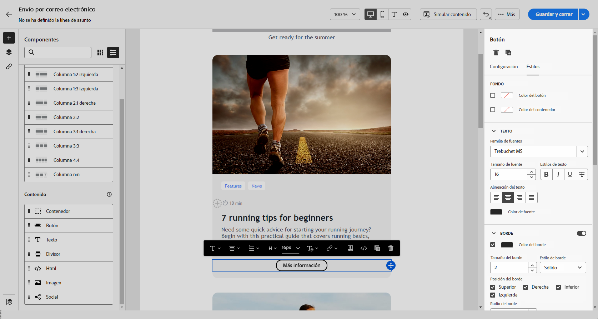
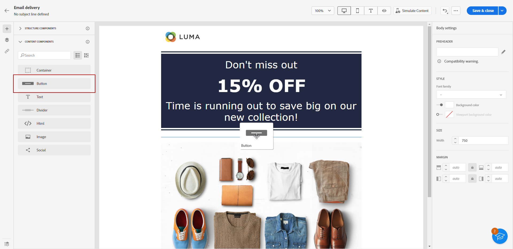
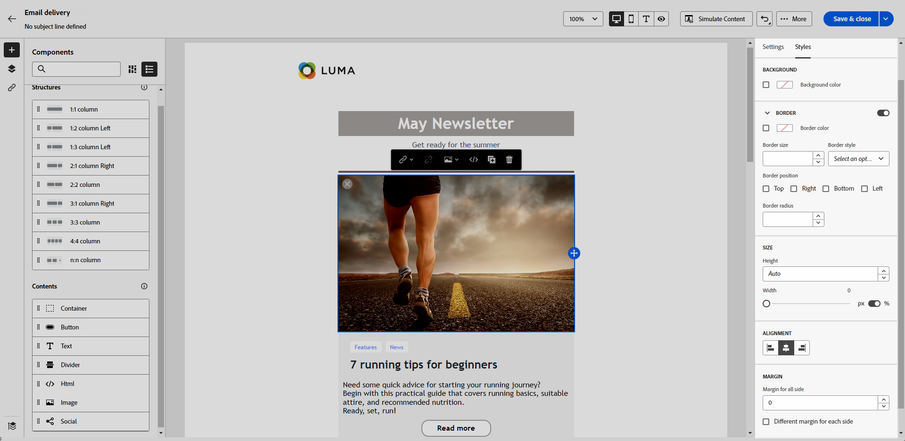

# Uso de los componentes de contenido del diseñador de correo electrónico {#content-components}

>[!CONTEXTUALHELP]
>id="ac_content_components_email"
>title="Acerca de los componentes de contenido"
>abstract="Los componentes de contenido son marcadores de posición de contenido vacíos que se pueden utilizar para crear el diseño de un correo electrónico."

>[!CONTEXTUALHELP]
>id="ac_content_components_landing_page"
>title="Acerca de los componentes de contenido"
>abstract="Los componentes de contenido son marcadores de posición de contenido vacíos que se pueden utilizar para crear el diseño de una página de aterrizaje."

>[!CONTEXTUALHELP]
>id="ac_content_components_fragment"
>title="Acerca de los componentes de contenido"
>abstract="Los componentes de contenido son marcadores de posición de contenido vacíos que se pueden utilizar para crear el diseño de un fragmento."

>[!CONTEXTUALHELP]
>id="ac_content_components_template"
>title="Acerca de los componentes de contenido"
>abstract="Los componentes de contenido son marcadores de posición de contenido vacíos que se pueden utilizar para crear el diseño de una plantilla."

## Añadir componentes de contenido {#add-content-components}

Para añadir componentes de contenido al correo electrónico y ajustarlos a sus necesidades, siga los pasos a continuación.

1. En el Diseñador de correo electrónico, utilice un contenido existente o arrastre y suelte un **[!UICONTROL Estructura]** en el contenido vacío para definir el diseño del correo electrónico. [Descubra cómo](create-email-content.md)

1. Arrastre y suelte el **[!UICONTROL Contenido]** de su elección dentro de los componentes de estructura relevantes.

   

   >[!NOTE]
   >
   >Puede añadir varios componentes en un único componente de estructura y en cada columna de un componente de estructura.

1. Ajuste los atributos de estilo de cada componente mediante la variable **[!UICONTROL Configuración]** y **[!UICONTROL Estilo]** pestañas. Por ejemplo, puede cambiar el estilo, el relleno o el margen del texto de cada componente. [Obtenga más información sobre la alineación y el relleno](alignment-and-padding.md)

   

Al crear el contenido del correo electrónico desde cero, **[!UICONTROL Contenido]**  componentes le permite personalizar aún más su correo electrónico con componentes sin procesar y vacíos que puede utilizar una vez colocados en un correo electrónico.
Puede añadir tantas como desee **[!UICONTROL Contenido]** componentes que necesita dentro de un **[!UICONTROL Estructura]** que define el diseño del correo electrónico.

## Contenedor {#container}

Puede añadir un contenedor simple dentro del cual añadir otro componente de contenido. Esto le permite aplicar un estilo específico al contenedor, que es diferente del componente utilizado adentro.

Por ejemplo, agregue el componente **[!UICONTROL Contenedor]** y el componente [Botón](#button) dentro de ese contenedor. Puede utilizar un fondo específico para el contenedor y otro para el botón.

## Botón {#buttons}

Utilice el componente **[!UICONTROL Botón]** para insertar uno o varios botones en el correo electrónico y redirigir la audiencia de correo electrónico a otra página.

1. Desde el **[!UICONTROL Contenido]** , arrastre y suelte el **[!UICONTROL Botón]** componente en una **[!UICONTROL Estructura]** componente.

   

1. Haga clic en el botón recién añadido para personalizar el texto y tener acceso a la **[!UICONTROL Configuración]** y **[!UICONTROL Estilos]** pestañas.

   

1. Desde el **[!UICONTROL Configuración]** pestañas, en el **[!UICONTROL URL]** , añada la dirección URL a la que desee redirigir al hacer clic en el botón.

1. Elija cómo se muestra el contenido con la lista desplegable **[!UICONTROL Destinatario]**

   * **[!UICONTROL Ninguna]**: abre el vínculo en el mismo marco en el que se hizo clic (predeterminado).
   * **[!UICONTROL En blanco]**: abre el vínculo en una nueva ventana o pestaña.
   * **[!UICONTROL Propio]**: abre el vínculo en el mismo marco en el que se hizo clic.
   * **[!UICONTROL Principal]**: abre el vínculo en el marco principal.
   * **[!UICONTROL Superior]**: abre el vínculo en todo el cuerpo de la ventana.

   

1. Puede personalizar aún más el botón cambiando atributos de estilo como **[!UICONTROL Borde]**, **[!UICONTROL Tamaño]**, **[!UICONTROL Margen]**, etc. de **[!UICONTROL Configuración]** y **[!UICONTROL Estilos]** pestañas.

## Texto {#text}

Utilice el componente **[!UICONTROL Texto]** para insertar texto en el correo electrónico y ajustar el estilo (borde, tamaño, relleno, etc.) uso del **[!UICONTROL Configuración]** y **[!UICONTROL Estilos]** pestañas.

1. Desde el **[!UICONTROL Contenido]** menú, arrastrar y soltar **[!UICONTROL Texto]** en un **[!UICONTROL Estructura]** componente.

   

1. Haga clic en el componente recién agregado para personalizar el texto y tener acceso al **[!UICONTROL Configuración]** y **[!UICONTROL Estilos]** pestañas.

1. Cambie el texto con las siguientes opciones disponibles en la barra de herramientas:

   

   * **[!UICONTROL Cambiar estilo de texto]**: aplicar negrita, cursiva, subrayado o tachado al texto.
   * **Cambiar alineación**: elegir entre alineación izquierda, derecha, centro o justificada para el texto.
   * **[!UICONTROL Crear lista]**: añadir viñetas o listas numéricas al texto.
   * **[!UICONTROL Definir encabezado]**: añadir hasta seis niveles de encabezado al texto.
   * **Tamaño de fuente**: seleccionar el tamaño de fuente del texto en píxeles.
   * **[!UICONTROL Editar imagen]**: añadir una imagen o un recurso al componente de texto.
   * **[!UICONTROL Mostrar el código fuente]**: mostrar el código fuente del texto. No se puede modificar.
   * **[!UICONTROL Duplicar]**: añadir una copia del componente de texto.
   * **[!UICONTROL Eliminar]**: eliminar el componente de texto seleccionado del correo electrónico.
   * **[!UICONTROL Añadir personalización]**: añadir campos de personalización para personalizar el contenido de los datos de perfiles.
   * **[!UICONTROL Habilitar contenido condicional]**: añadir contenido condicional para adaptar el contenido del componente a los perfiles de destino.

1. Ajuste los demás atributos de estilo, como el color del texto, la familia de fuentes, el borde, el relleno, el margen, etc. desde el **[!UICONTROL Configuración]** y **[!UICONTROL Estilos]** pestañas.

   

## Divisor {#divider}

Utilice el componente **[!UICONTROL Divisor]** para insertar una línea divisoria y organizar el diseño y el contenido del correo electrónico.

Puede ajustar atributos de estilo, como el color de línea, el estilo y la altura, desde el **[!UICONTROL Configuración]** y **[!UICONTROL Estilos]** pestañas.

## HTML {#HTML}

Utilice el componente **[!UICONTROL HTML]** para copiar y pegar las diferentes partes del HTML existente. Esto le permite crear componentes de HTML modulares gratuitos para reutilizar contenido externo.

1. Desde **[!UICONTROL Componentes]**, arrastre y suelte el **[!UICONTROL HTML]** componente en una **[!UICONTROL Estructura]** componente.

   

1. Haga clic en el componente recién agregado y, a continuación, seleccione **[!UICONTROL Mostrar el código fuente]** de la barra de herramientas contextual para añadir el HTML.

   

>[!NOTE]
>
>Para hacer que un contenido externo sea compatible con el Diseñador de correo electrónico, Adobe recomienda crear un mensaje desde cero y copiar el contenido del correo electrónico existente en los componentes.

## Imagen {#image}

Utilice el componente **[!UICONTROL Imagen]** para insertar un archivo de imagen desde el equipo en el correo electrónico.

1. Desde el **[!UICONTROL Contenido]** menú, arrastrar y soltar **[!UICONTROL Imagen]** en un **[!UICONTROL Estructura]** componente.

   

1. Haga clic en **[!UICONTROL Examinar]** para elegir un archivo de imagen de sus recursos.

1. Haga clic en el componente recién agregado y configure las propiedades de la imagen con la variable **[!UICONTROL Configuración]** y **[!UICONTROL Estilos]** pestañas:

   * **[!UICONTROL Título de la imagen]** permite definir un título para la imagen.
   * **[!UICONTROL Texto alternativo]** permite definir el pie de ilustración vinculado a la imagen. Esto corresponde al atributo HTML alt.

   

1. Ajuste los demás atributos de estilo como margen, borde, etc. o añadir un vínculo para redirigir la audiencia a otro contenido.

## Social {#social}

Utilice el componente **[!UICONTROL Social]** para insertar vínculos a páginas de redes sociales en el contenido del correo electrónico.

1. Desde el **[!UICONTROL Componentes]** , arrastre y suelte el **[!UICONTROL Social]** componente en una **[!UICONTROL Estructura]** componente.

1. Haga clic en el componente recién añadido.

1. En el **[!UICONTROL Social]** del campo **[!UICONTROL Configuración]** pestaña, elija qué medios sociales desea agregar o eliminar.

   

1. Elija el tamaño de los iconos en el campo **[!UICONTROL Tamaño de las imágenes]**.

1. Haga clic en cada uno de sus iconos de redes sociales para configurar la **[!UICONTROL URL]** a la que se redirige su audiencia.

   

1. También puede cambiar los iconos de cada una de sus redes sociales si es necesario en el campo **[!UICONTROL Imagen]**.

1. Ajuste los demás atributos de estilo como estilo, margen, borde, etc. desde el **[!UICONTROL Configuración]** y **[!UICONTROL Estilos]** pestañas.
