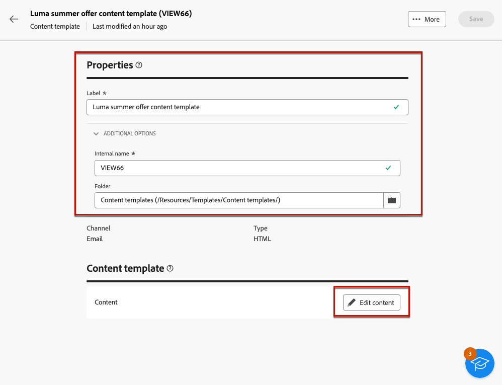
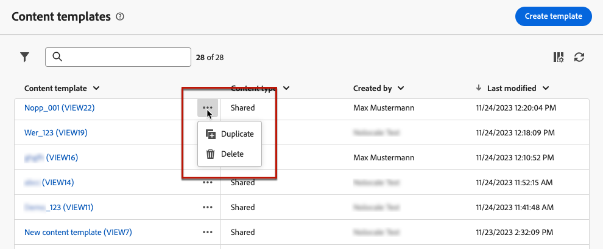
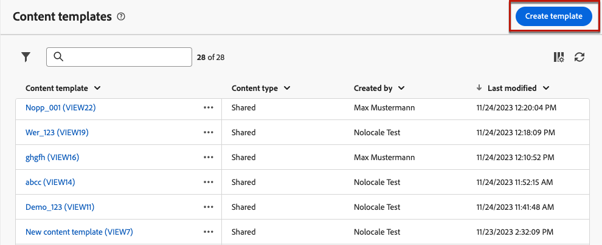
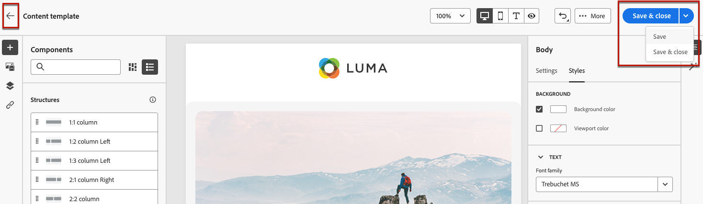
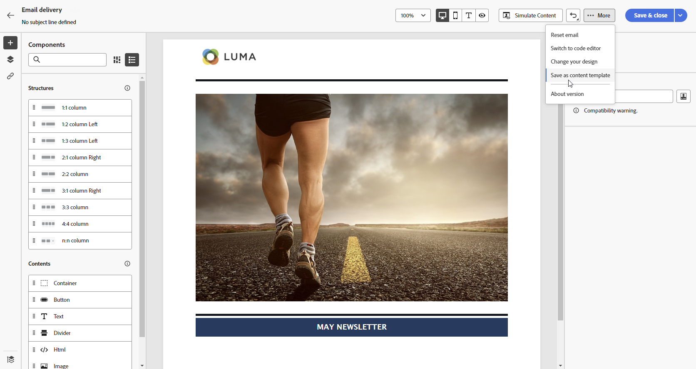

# Trabajo con plantillas de contenido {#content-templates}

>[!CONTEXTUALHELP]
>id="acw_contenttemplate_menu"
>title="Defina su propio contenido"
>abstract="Cree una plantilla personalizada independiente desde cero para que el contenido se pueda reutilizar en varios correos electrónicos."

Para un proceso de diseño acelerado y mejorado, puede crear plantillas independientes para reutilizar fácilmente el contenido personalizado en [!DNL Adobe Campaign].

Esta funcionalidad permite a los usuarios orientados a contenido trabajar en plantillas independientes para que los usuarios de marketing puedan reutilizarlas y adaptarlas dentro de sus propias campañas de correo electrónico.

>[!NOTE]
>
>Solo actualmente **email** se admiten las plantillas de contenido.

## Acceso y administración de plantillas {#access-manage-templates}

>[!CONTEXTUALHELP]
>id="acw_contenttemplate_edition"
>title="Editar el contenido de la plantilla"
>abstract="Haga clic en **Editar contenido** para actualizar el contenido con el Diseñador de correo electrónico."

Para acceder a la lista de plantillas de contenido, seleccione **[!UICONTROL Gestión de contenido]** > **[!UICONTROL Plantillas de contenido]** en el menú de la izquierda.

Todas las plantillas creadas, ya sea desde un correo electrónico con el [Guardar como plantilla](#save-as-template) , ya sea desde la opción **[!UICONTROL Plantillas de contenido]** menú: se muestran.

<!--You can sort content templates by creation or modification date. You can also choose to display only the items that you created or modified.-->

Puede filtrar por un [carpeta](../get-started/permissions.md#folders) mediante la lista desplegable o agregue reglas utilizando [modelador de consultas](../query/query-modeler-overview.md).

Para editar el contenido de una plantilla, haga clic en el elemento que desee en la lista. Puede hacer lo siguiente:

* Edite sus propiedades.

* Haga clic en **[!UICONTROL Editar contenido]** para actualizar el contenido con el [Diseñador de correo electrónico](get-started-email-designer.md).

Para eliminar una plantilla, seleccione la opción correspondiente en la **[!UICONTROL Más acciones]** menú.

>[!NOTE]
>
>Cuando se elimina una plantilla, los envíos creados con esta plantilla no se ven afectados.

## Crear plantillas de contenido {#create-content-templates}

>[!CONTEXTUALHELP]
>id="acw_contenttemplate_design"
>title="Diseño de plantilla de contenido"
>abstract="Diseño de plantilla de contenido"

>[!CONTEXTUALHELP]
>id="acw_contenttemplate_selection"
>title="Selección de plantilla de contenido"
>abstract="Selección de plantilla de contenido"

Existen dos formas de crear plantillas de contenido:

* Cree una plantilla de contenido desde cero mediante el carril izquierdo **[!UICONTROL Plantillas de contenido]** menú. [Descubra cómo](#create-template-from-scratch)

* Al diseñar un correo electrónico, guarde su contenido de correo electrónico como plantilla. [Descubra cómo](#save-as-template)

Una vez guardada, ya se haya creado desde cero o desde un correo electrónico anterior, ahora puede utilizar esta plantilla al crear cualquier [email](../email/create-email.md) dentro [!DNL Adobe Campaign]. [Descubra cómo](use-email-templates.md)

>[!NOTE]
>
>* Los cambios realizados en las plantillas de contenido no se propagan a los correos electrónicos.
>
>* Del mismo modo, cuando las plantillas se utilizan en un mensaje de correo electrónico, las ediciones que realice en el contenido del correo electrónico no afectarán a la plantilla de contenido utilizada anteriormente.

### Crear plantilla desde cero {#create-template-from-scratch}

>[!CONTEXTUALHELP]
>id="acw_contenttemplate_properties"
>title="Defina las propiedades de la plantilla"
>abstract="Al crear una plantilla desde cero, defina sus propiedades para recuperar es fácil cuando sea necesario."

Para crear una plantilla de contenido desde cero, siga los pasos a continuación.

1. Acceda a la lista de plantillas de contenido a través de **[!UICONTROL Gestión de contenido]** > **[!UICONTROL Plantillas de contenido]** menú izquierdo.

1. Seleccionar **[!UICONTROL Crear plantilla]**.

   

1. Rellene los detalles de la plantilla.

   

   >[!NOTE]
   >
   >Actualmente solo el **Correo electrónico** canal y **HTML** se admiten los tipos de.

1. Seleccione la carpeta en la que desea almacenar la plantilla. De forma predeterminada, las plantillas de contenido se almacenan en un nodo específico de la jerarquía de Adobe Campaign: **[!UICONTROL Explorer]** > **[!UICONTROL Recursos]** > **[!UICONTROL Plantillas]** > **[!UICONTROL Plantillas de contenido]**. [Obtenga información sobre cómo crear carpetas](../get-started/permissions.md#folders)

1. Clic **[!UICONTROL Crear]** y elija cómo desea diseñar la plantilla entre las distintas opciones:

   * [Diseñe su correo electrónico desde cero](create-email-content.md) mediante la interfaz del Diseñador de correo electrónico.

   * [Codifique o copie y pegue el HTML sin procesar](code-content.md) directamente en el Diseñador de correo electrónico.

   * [Importación de contenido de HTML existente](existing-content.md) desde un archivo o una carpeta .zip.

   * Utilice contenido existente de una lista de plantillas integradas o personalizadas. Los pasos para utilizar una plantilla de contenido en un correo electrónico se describen en [esta sección](use-email-templates.md).

   

1. El [Diseñador de correo electrónico](get-started-email-designer.md) muestra. Edite el contenido según sea necesario, del mismo modo que lo haría para cualquier correo electrónico, según la opción seleccionada.

   <!--You can test your content if needed. [Learn how](#test-template)-->

1. Una vez preparada la plantilla, haga clic en **[!UICONTROL Guardar]**.

   Si es necesario, haga clic en la flecha situada junto al nombre de la plantilla para volver al **[!UICONTROL Detalles]** y editar la plantilla.

   

Esta plantilla ya está lista para utilizarse al crear cualquier correo electrónico en [!DNL Adobe Campaign]. [Descubra cómo](use-email-templates.md)

## Guardar contenido de correo electrónico como plantilla {#save-as-template}

Una vez que [diseño de un correo electrónico](create-email-content.md), puede guardar este contenido como una plantilla para su reutilización futura. Las plantillas guardadas están disponibles para todos los usuarios de su entorno de Adobe Campaign.

Para guardar un contenido de correo electrónico como plantilla, siga los pasos a continuación:

1. En el diseñador de correo electrónico, haga clic en **[!UICONTROL Más]** en la parte superior derecha de la pantalla.

1. Seleccionar **[!UICONTROL Guardar como plantilla de contenido]** en el menú desplegable.

   

1. Introduzca un nombre para esta plantilla y guárdela.

   

Ahora puede utilizar esta plantilla para crear un nuevo contenido: está disponible en el **[!UICONTROL Plantillas guardadas]** del Diseñador de correo electrónico. [Descubra cómo](use-email-templates.md)

La plantilla se guarda en el **[!UICONTROL Plantillas de contenido]** , accesible desde el [!DNL Adobe Campaign] menú específico. Se convierte en una plantilla de contenido independiente a la que se puede acceder, editar y eliminar como cualquier otro elemento de la lista. [Más información](#access-manage-templates)

>[!NOTE]
>
>Los cambios realizados en esa nueva plantilla no se propagan al correo electrónico del que procede. Del mismo modo, cuando el contenido original se edita dentro de ese correo electrónico, la nueva plantilla no se modifica.

<!--
Test your content template {#test-template}

You can test the rendering of any email content template, whether created from scratch or from an email. To do so, follow the steps below.

1. Access the content template list through the **[!UICONTROL Content Management]** > **[!UICONTROL Content Templates]** menu and select any template.

1. Click **[!UICONTROL Edit content]** from the **[!UICONTROL Template properties]**.

1. Click **[!UICONTROL Simulate Content]** and select a test profile to check your email rendering. You can choose the desktop or mobile view. [Learn more](../content-management/preview-test.md)

    

1. You can send a proof to test your content and have it approved by some internal users before using it in a journey or a campaign.

    * To do so, click the **[!UICONTROL Send proof]** button and follow the steps described in [this section](../content-management/proofs.md).
    
    * Before sending the proof, you must select the [email surface](../configuration/channel-surfaces.md) that will be used to test your content.

        

>[!CAUTION]
>
>Currently tracking is not supported when testing email content templates, meaning that tracking events, UTM parameters and landing page links will not be effective in the proofs that are being sent from a template. To test tracking, [use the content template](
use-email-templates.md) in an email and [send a proof](../content-management/preview-test.md#send-proofs).-->

