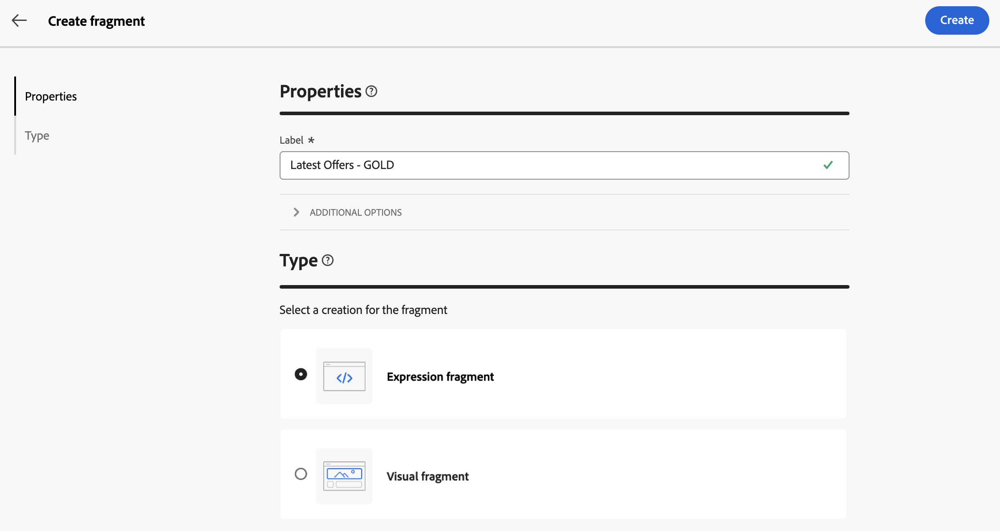

# Crear fragmentos de contenido {#fragments}

>[!CONTEXTUALHELP]
>id="acw_fragments_create"
>title="Defina sus propios fragmentos de contenido"
>abstract="Defina las propiedades de los fragmentos y el tipo de fragmento que desea crear. A continuación, puede utilizar el diseñador de correo electrónico o el editor de expresiones para configurar el contenido del fragmento."

<!-- pas vu dans l'UI-->

>[!CONTEXTUALHELP]
>id="acw_fragments_properties"
>title="Propiedades de fragmentos"
>abstract="Introduzca la etiqueta del fragmento.  Si es necesario, puede definir opciones adicionales, como el nombre interno del fragmento, su carpeta y una descripción."

>[!CONTEXTUALHELP]
>id="acw_fragments_type"
>title="Tipo de fragmento de contenido"
>abstract="Seleccione el tipo de fragmento que desea crear. **Los fragmentos visuales** son bloques visuales predefinidos que se pueden reutilizar en varios envíos de correo electrónico o en plantillas de contenido. **Los fragmentos de expresión** son expresiones predefinidas que están disponibles en una entrada dedicada en el editor de expresiones."

Existen dos formas de crear fragmentos de contenido:

* Cree un fragmento desde cero mediante el menú específico **[!UICONTROL Fragmentos]**. [Descubra cómo](#create-from-scratch)
* Al diseñar contenido, guarde una parte del contenido como fragmento. [Descubra cómo](#save-as-fragment)

  >[!NOTE]
  >
  >Esta funcionalidad solo está disponible para fragmentos visuales. Los fragmentos de expresiones se crean exclusivamente a partir del menú **Fragmentos**.

Una vez guardado, el fragmento de contenido está disponible para su uso en cualquier entrega o plantilla de contenido.

## Creación de un fragmento de contenido desde cero {#create-from-scratch}

Para crear un fragmento de contenido desde cero, siga los pasos a continuación.

1. [Acceda a la lista de fragmentos](#access-manage-fragments) a través del menú de la izquierda de **[!UICONTROL Administración de contenido]** > **[!UICONTROL Fragmentos]** y seleccione **[!UICONTROL Crear fragmento]**.

   

1. Introduzca la etiqueta del fragmento.  Si es necesario, puede definir opciones adicionales, como el nombre interno del fragmento, su carpeta y una descripción.

1. Elija el tipo de fragmento que desea crear: **Fragmento visual** o **Fragmento de expresión**. [Conozca las diferencias entre los fragmentos visuales y de expresión](fragments.md)

   

   >[!AVAILABILITY]
   >
   >Los fragmentos visuales requieren una actualización de Campaign v8.6.4. Obtenga más información en las [notas de la versión de la consola del cliente de Campaign v8](https://experienceleague.adobe.com/es/docs/campaign/campaign-v8/releases/release-notes).

1. Haga clic en el botón **Create**.

   * Para **fragmentos visuales**, se muestra [Email Designer](../email/get-started-email-designer.md). Edite el contenido según sea necesario, tal como lo haría con cualquier correo electrónico dentro de una campaña y, a continuación, haga clic en el botón **Guardar y cerrar**. Puede añadir imágenes, vínculos, campos de personalización y contenido dinámico.

     

   * Se abre el Editor de expresiones para **fragmentos de expresiones**. Aproveche sus capacidades de personalización y creación para crear su contenido y haga clic en **Confirmar**. [Aprenda a trabajar con el editor de expresiones](../personalization/personalize.md)

     

1. Una vez que el contenido esté listo, haz clic en **Guardar**.

El fragmento de contenido ya está listo para usarse al crear cualquier entrega o [plantilla de contenido](../email/use-email-templates.md) en Campaign. Aprenda a utilizar fragmentos visuales y de expresión en estas secciones:
* [Añadir fragmentos visuales a los correos electrónicos](use-visual-fragments.md)
* [Añadir fragmento de expresión al editor de expresiones](use-expression-fragments.md)

## Guardar contenido como fragmento visual {#save-as-fragment}

>[!CONTEXTUALHELP]
>id="acw_fragments_save"
>title="Guardar como fragmento"
>abstract="Para guardar contenido como fragmento visual, seleccione los elementos que desee incluir en el fragmento, incluidos los campos de personalización y el contenido dinámico. Solo se pueden seleccionar secciones adyacentes entre sí. No se puede seleccionar una estructura vacía u otro fragmento de contenido. Este contenido será entonces un fragmento independiente, que se añade a la lista de fragmentos y al que se puede acceder desde el menú dedicado. Este fragmento se podrá utilizar al generar cualquier correo electrónico o plantilla de contenido dentro de Campaign."

<!--pas vu dans l'UI-->

Cualquier contenido del correo electrónico se puede guardar como fragmento visual para su reutilización futura. Al diseñar una [plantilla de contenido](../email/use-email-templates.md) o un envío de [correo electrónico](../email/get-started-email-designer.md), puede guardar una parte del contenido como fragmento visual. Para realizar esto, siga los pasos a continuación:

1. En [Email Designer](../email/get-started-email-designer.md), haga clic en el botón **Más** en la parte superior derecha de la pantalla.

1. Seleccione **[!UICONTROL Guardar como fragmento]** en el menú desplegable.

   

1. Se muestra la pantalla **[!UICONTROL Guardar como fragmento]**. Seleccione los elementos que desee incluir en el fragmento, incluidos los campos de personalización y el contenido dinámico.

   >[!CAUTION]
   >
   >Solo se pueden seleccionar secciones adyacentes entre sí. No puede seleccionar una estructura vacía u otro fragmento de contenido.

   

1. Haga clic en **[!UICONTROL Crear]**. Rellene el nombre del fragmento y guárdelo.

   

   Este contenido es ahora un fragmento independiente , agregado a la [lista de fragmentos](#manage-fragments) y accesible desde el menú dedicado. Ahora puede usar este fragmento al crear cualquier [correo electrónico](../email/get-started-email-designer.md) o [plantilla de contenido](../email/use-email-templates.md) en Campaign. [Descubra cómo](../content/use-visual-fragments.md)

>[!NOTE]
>
>Cualquier cambio en ese nuevo fragmento no se propaga al correo electrónico o a la plantilla de los que proviene. Del mismo modo, cuando el contenido original se edita dentro de ese correo electrónico o plantilla, el nuevo fragmento no se modifica.—>

## Administrar los fragmentos de contenido {#manage-fragments}

Puede editar, actualizar, duplicar o eliminar un fragmento de contenido de la lista de fragmentos.

### Edición y actualización de un fragmento de contenido {#edit-fragments}

Para editar un fragmento de contenido, siga los pasos a continuación.

1. Haga clic en el nombre del fragmento para editarlo desde la lista **[!UICONTROL Fragmentos]**.
1. Haga clic en el botón **Editar contenido** para abrir el contenido de este fragmento.

   

1. Realice los cambios necesarios y guarde las modificaciones.

>[!CAUTION]
>
>Cualquier cambio en un fragmento se propaga a las entregas o plantillas que lo utilizan.

### Eliminar un fragmento de contenido {#delete-fragments}

Para eliminar un fragmento de contenido, siga estos pasos:

1. Vaya a la lista de fragmentos y haga clic en el botón **[!UICONTROL Más acciones]** que está junto al fragmento que desea eliminar.
1. Haga clic en **Eliminar** y confirme.

   

>[!CAUTION]
>
>Al eliminar un fragmento, se actualizan las entregas y las plantillas que lo utilizan: el fragmento se elimina del contenido, pero se sigue haciendo referencia a él. Para mantener el contenido del fragmento en esas entregas y plantillas, debe interrumpir la herencia antes de eliminar el fragmento [, tal como se detalla en esta sección ](use-visual-fragments.md#break-inheritance).

### Archivar un fragmento de contenido {#archive}

Puede limpiar la lista de fragmentos de los fragmentos que ya no son relevantes para su marca. Para ello, haga clic en el botón **[!UICONTROL Más acciones]** que está junto al fragmento deseado y seleccione **[!UICONTROL Archivar]**. El fragmento se eliminará de la lista de fragmentos, lo que impedirá que los usuarios lo utilicen en futuros correos electrónicos o plantillas.

Para acceder a los fragmentos archivados, utilice el panel de filtrado para mostrarlos. Para desarchivar un fragmento, haga clic en el botón **[!UICONTROL Más acciones]** y seleccione **[!UICONTROL Desarchivar]**.

>[!NOTE]
>
>Si archiva un fragmento que se utiliza en un contenido, ese contenido no se ve afectado.

### Duplicación de un fragmento de contenido {#duplicate-fragments}

Puede duplicar fácilmente un fragmento de contenido para crear uno nuevo. Para duplicar un fragmento existente, siga estos pasos:

1. Examine la lista de fragmentos y haga clic en el botón **[!UICONTROL Más acciones]** que está junto al fragmento que desea duplicar.
1. Haga clic en **Duplicar** y confirme.
1. Introduzca la etiqueta del nuevo fragmento y guarde los cambios.

   El fragmento se agregará a la lista de fragmentos de contenido. Puede editarlo y configurarlo según sea necesario.
