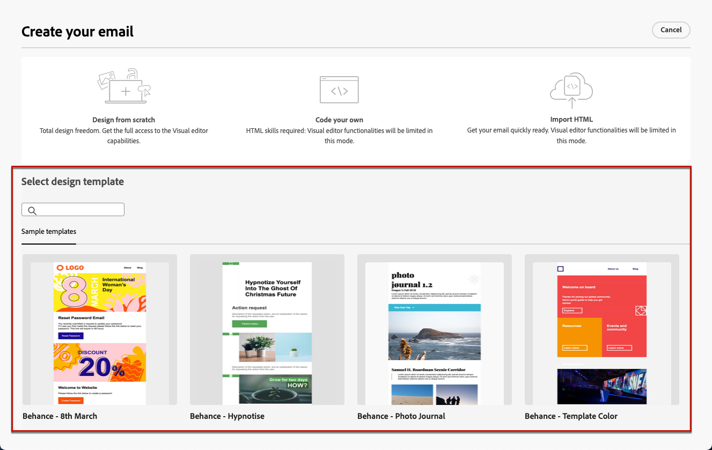

# Trabajo con plantillas de correo electrónico {#email-saved-content-templates}

Cuándo [creación de un correo electrónico](../email/create-email.md), use el **[!UICONTROL Seleccionar plantilla de diseño]** de la sección **[!UICONTROL Cree su correo electrónico]** para empezar a crear contenido a partir de una plantilla.

Campaign viene con un conjunto de plantillas integradas que puede elegir.

Para empezar a crear contenido con una de las plantillas de ejemplo, siga los pasos a continuación.

1. Abra el [Diseñador de correo electrónico](create-email-content.md).

1. En el **[!UICONTROL Cree su correo electrónico]** pantalla, la lista de **[!UICONTROL Plantillas de muestra]**  muestra.

1. Seleccione una plantilla de la lista para mostrar su contenido.

1. Utilice las flechas derecha e izquierda para desplazarse entre las plantillas.

   

1. Clic **[!UICONTROL Usar esta plantilla]** en la parte superior derecha de la pantalla.

1. Edite el contenido como desee mediante el Diseñador de correo electrónico. [Más información](create-email-content.md)
